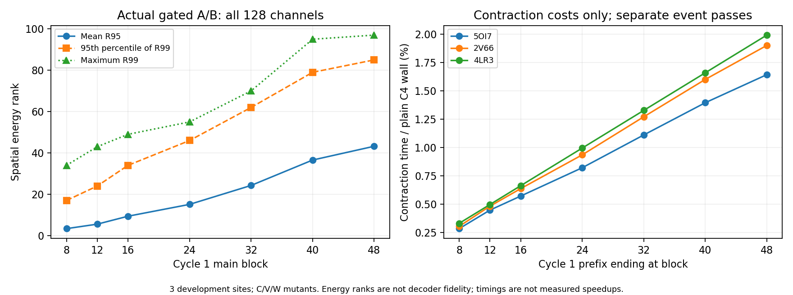

# Base C4 差分窗口与 contraction 成本：完成报告

本批已完成并通过独立审计。**首轮存在低能量秩窗口，但在当前短链配置下，它覆盖的内部 contraction 成本很小；现有证据不足以支持把早期低秩差分 kernel 作为主要 C4 加速投入。** 不启动新的训练、截断执行或 kernel 批次。

协议：[base_delta_window_v1.md](base_delta_window_v1.md)。原始结果、执行终态、独立复核与图表见 [归档目录](../reports/base_delta_window_2026-10-06/README.md)。运行名沿用 2026-10-06，报告于 2026-10-07 收口。

## 范围与完整性

使用官方 Base_default_v0.5.0、368.09M 参数、原生 FP32、C4、每轮48个主 Pairformer block。输入为 query-only 单行 MSA；模型内部 MSA 更新保留。不是官方默认 C10/多步 diffusion 质量协议，也不是之前 Mini 的实验。

固定三个开发上下文：5OI7 A50（L88）、2V66 T75（L111）、4LR3 T4（L164）；各取 WT 与 C/V/W，共12个冻结输入，其中9个 mutant。包含既有 T4W 压力案例。全部复用上一批输入包，不生成新的 ESM、MSA、原生特征或 teacher 标签。

每个输入执行3次普通计时、1次观测、2次事件计时；每个 WT 再重复观测；另有1次预热。共 **76 C4、304 recycle、0 S1、0更新**。每次观测保存66个完整张量：首轮 B8/12/16/24/32/40/48、后续轮 B1 的 block 输入/输出与实际门控后 outgoing/incoming A/B，以及后续轮 MSA 输入/输出。

所有非预热输出的完整 `s_inputs/s/z` 哈希均与上一批 native 归档一致，执行 RNG 检查通过；WT 观测张量重复的完整字节哈希一致。独立 CPU 审计从全张量重新计算 **76,032 个谱**，使用 Gram 特征值复核原 SVD 的能量与 R90/R95/R99。128个 channel 全覆盖，不再是上一批八个 channel 抽样。源码、输入、权重和快照哈希核验通过。8项本地聚焦测试通过。

控制器耗时264.15秒，worker259.16秒；模型加载44.13秒，报告所记加载后工作200.79秒。完整快照留在 DiamondHill，提交压缩后的逐 channel 统计，不把大张量复制进 Git。

## 实际 A/B 的窗口与尾部

下表合并每个深度的 outgoing/incoming × A/B × 9 mutant ×128 channel。每行4608个观测是相关的 channel/候选观测，**不是4608个独立蛋白**。R95/R99 是达到相应平方谱能量的维数，不是精确代数秩。

| 首轮深度 | A/B 平均 R95 | R99 的 P95 | 最大 R99 | R32 保留能量 P05 | block 输出 z 平均 R95 |
|---|---:|---:|---:|---:|---:|
| B8 | 3.376 | 17 | 34 | 99.733% | 3.248 |
| B12 | 5.546 | 24 | 43 | 99.471% | 4.662 |
| B16 | 9.390 | 34 | 49 | 98.889% | 7.945 |
| B24 | 15.109 | 46 | 55 | 97.528% | 12.298 |
| B32 | 24.275 | 62 | 70 | 92.448% | 23.255 |
| B40 | 36.558 | 79 | 95 | 86.843% | 39.420 |
| B48 | 43.221 | 85 | 97 | 84.591% | 44.379 |

低秩不是只出现在最初一个算子；它延续到首轮中前段。但只看平均值会漏掉 channel 尾部。例如 B16 平均 R95 约9.39，最坏 R99 已49；B24 的最小 R32 保留能量仅95.48%，B48为78.81%。固定小 rank 并没有统一覆盖所有实际操作数。

block 输出 z 的谱与内部 A/B 也不相同，不能用前者替代后者。上述固定观察点不保证所有中间未观察 block 或 attention/transition 中间量都满足同样结构。

后续 recycle 没有重启一个同样的低秩窗口：

| cycle | MSA 入口 z 平均 R95 | B1 A/B 平均 R95 | B1 A/B 最大 R99 |
|---|---:|---:|---:|
| 2 | 43.173 | 37.698 | 89 |
| 3 | 45.038 | 38.275 | 104 |
| 4 | 43.977 | 37.295 | 104 |

本批与上一批候选数量、channel 覆盖不同，不能把两批平均数之差解释为执行变化。

## 成本：整个 TriMul 与内部乘法不能混算

每个输入以3次普通 C4 的中位数计时，再按父蛋白汇总四个输入。普通模型 C4 均值分别为0.9577、0.9784、1.6318秒。计时从已准备好的设备输入开始；不含模型加载、输入准备/H2D、CPU SVD、文件写入，也不含 diffusion。

另用两次事件计时分开记录主 Pairformer 的整个 TriMul 与内部 `_combine_projections` contraction。每次有384个 contraction 和384个包围它们的 TriMul 记录。**父子两层重叠，绝不能相加；同一层内部各调用互不重叠。** 下表为首轮前缀内部 contraction 的毫秒数，以及它与普通 C4 wall time 的量级比值。

| 前缀 | 5OI7 ms / C4占比 | 2V66 ms / C4占比 | 4LR3 ms / C4占比 |
|---|---:|---:|---:|
| B1–8 | 2.731 / 0.285% | 2.990 / 0.306% | 5.414 / 0.332% |
| B1–12 | 4.294 / 0.448% | 4.726 / 0.483% | 8.120 / 0.498% |
| B1–16 | 5.481 / 0.572% | 6.241 / 0.638% | 10.827 / 0.664% |
| B1–24 | 7.871 / 0.822% | 9.152 / 0.935% | 16.240 / 0.995% |
| B1–32 | 10.638 / 1.111% | 12.433 / 1.271% | 21.657 / 1.327% |
| B1–40 | 13.360 / 1.395% | 15.655 / 1.600% | 27.066 / 1.659% |
| B1–48 | 15.728 / 1.642% | 18.585 / 1.900% | 32.486 / 1.991% |

整个四轮主 Pairformer 内部 contraction 合计约占普通 C4 的 **6.61% / 7.57% / 7.96%**；整个 TriMul 则约为 **35.34% / 36.48% / 34.71%**。后者包含归一化、投影、门控、布局等开销，不能全部归为低秩乘法展开可省的成本。首轮 B1–16 整个 TriMul 占比也仅约2.89%–3.13%，内部 contraction 约0.57%–0.66%。

事件计时有扰动：profile/plain wall 比值平均 **1.0472**，范围1.0083–1.1253。以上是不同计时执行的描述性量级比较，不是严格可加总的 Amdahl 上限，更不是实测加速。两次 profile 重复不足以给出精密性能置信区间。普通执行每次原始时间均保留，中位数降低首次新形状预热影响。

最大记录设备 allocation 为1,910,111,232字节；这是本批短链串行执行，不是20候选并行峰值或压缩节省。没有测 HBM 流量或 occupancy。

## 决策与仍未回答的问题

本批明确支持早期实际操作数的结构化差分，也明确显示：在所测短链 C4 下，低秩较强的前段所覆盖的内部乘法成本不到1%；延伸到更多计算时，所需 rank 及最坏 channel 尾部已明显增加。第二、三轮没有提供新的低秩起点。

因此本批收口，**不把早期低秩 contraction kernel 晋升为当前主要加速路线**。正确性单元原型仍可作为独立研究选择，但本结果没有支持自动投入完整差分引擎。也不自动开启长度、rank 或候选搜索。

这不是证明所有 delta execution 都无效：这里只覆盖3个开发上下文、L88–164、单行 MSA、Base C4。更长链、其他 MSA 或其他算子的成本比例可能不同，需要单独证据。模型整体执行优化也不等于 contraction 优化。

本批没有在线产生/维护因子，没有测重新压缩、修正项和 materialization 成本，没有截断执行、dense fallback 或 S1 质量结果。能量保留不能替代结构、排序及几何保真；上一批 Mini 的 R32 功能结果也不能替 Base 填上这一空白。原生回放一致仅验证观测/计时未改变结果，不能当成尚未实现的差分执行已通过验收。
