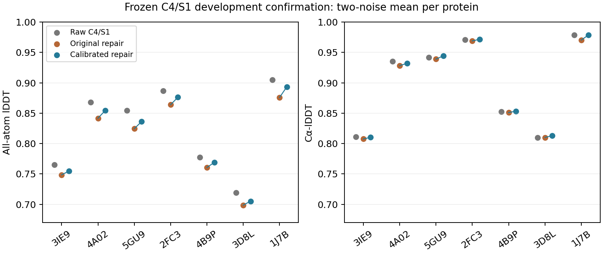

# C4/S1确认：校准连接目标保留几何改善，并追回部分结构精度

2026-09-30，DiamondHill。**冻结上一轮方法后，在实际C4/S1输入上得到正面的配对
结果：AA-lDDT提高0.010629、Cα-lDDT提高0.004062，14/14预测及7/7蛋白两项均改善。**
两种修正均保留零严重碰撞、全部所检查手性正确和整体位移预算通过。

但校准结果的AA仍比raw低0.012459，旧联合验收14/14→0/14；两份原始分支与实验
GT不一致的情况没有被纠正。**这是减少几何修正质量损失的开发证据，不是部署通过。**

## 冻结范围与执行

按[预先协议](mini_c4_connection_confirmation_v1.md)，保留历史8来源与两个固定噪声
12345/54321。3CR6存在不支持的共价拓扑，2个预测槽、4个修正槽继续跳过，未换样本。
7条支持蛋白分别使用7个MI250 GCD；每条重新计算原生ESM2-3B、四轮conditioning，
两枚身份绑定噪声各执行一次diffusion。FP32、固定图、无MC dropout、身份增强，
实际schedule为[2560,0]，gamma0=0、lambda=eta=1，stable Euler。K=1，不选最优噪声。

每条额外重放第一枚噪声一次，7/7逐位一致；该重放共用conditioning，不是完整
ESM及Pairformer的独立重跑。钩子记录每条4次Pairformer、2次预测加1次重放的
diffusion调用。模型权重前后SHA一致；原生化学身份/顺序、坐标有限性和配置核查通过。
模型预测不读取实验GT；修正仅以raw、化学参考和固定目标为输入，GT用于评分。

两种修正采用相同原始坐标、零位姿初始化、三阶段各60次L-BFGS上限、CPU FP64、
两个单线程worker、每任务900秒外部上限。校准文件、局部化学构造、尾部碰撞项、
求解器及CalibratedConnectionObjective与上一轮哈希一致；cis选择规则保持不变。
28/28支持任务成功，4个来源跳过槽完整保留，流水线和审计exit0。

这是同7条开发蛋白上的C4确认，**不是新的独立蛋白验证**。历史C1输入与本轮的
噪声构造和采样细节也不同，不能把两批raw分数差全部归因于增加recycle。

## 质量与几何

| 指标 | C4/S1 raw | 原连接目标 | 校准连接目标 |
|---|---:|---:|---:|
| AA-lDDT | 0.825157 | 0.802069 | **0.812698** |
| Cα-lDDT | 0.900142 | 0.896529 | **0.900591** |
| 严重非键合原子对总数，距离<1 Å | 28 | 0 | **0** |
| 零严重原子对实例 | 8/14 | 14/14 | **14/14** |
| 全部所检查Cα及ILE/THR手性正确 | 9/14 | 14/14 | **14/14** |
| 整体位移预算通过 | 基准 | 14/14 | **14/14** |
| 旧联合验收通过 | 0/14 | 14/14 | **0/14** |
| 最大穿透，14实例最坏值 Å | 2.76138 | 1.86482 | **1.79503** |
| 与GT不一致的连接分支实例数 | 2 | 2 | **2** |

先对每条蛋白两枚噪声求平均，再对7条蛋白等权汇总。新旧差为AA+0.010629、
Cα+0.004062；与raw相比，新AA−0.012459、Cα+0.000449。后者不代表每条蛋白
Cα都超过raw，也不是达到全原子0.9。约追回旧修正AA损失的46.0%，这是描述性
比例，不是对全部误差来源的因果分摊。

| 蛋白 | 校准−原目标 AA | 校准−原目标 Cα | 校准−raw AA |
|---|---:|---:|---:|
| 3IE9 | +0.006062 | +0.002737 | −0.010163 |
| 4A02 | +0.012517 | +0.003677 | −0.013939 |
| 5GU9 | +0.011491 | +0.005344 | −0.018523 |
| 2FC3 | +0.012227 | +0.002664 | −0.010758 |
| 4B9P | +0.007984 | +0.002416 | −0.008696 |
| 3D8L | +0.006560 | +0.003056 | −0.013912 |
| 1J7B | +0.017561 | +0.008542 | −0.011223 |

两种终点的旧绝对几何失败列表均为空。校准后的旧连接窗口失败数分别为CN 0、
CA–C–N角10、C–N–CA角14、omega14、羰基相位0。经验q95是目标起罚点，
**没有被改称新验收线**；旧联合失败照实保留，零严重碰撞也不代表完全无范德华重叠。

两份分支不一致均来自4B9P的两枚噪声：P122–P123，连接索引121（从0计）。
补充读取保存坐标确认raw与两种终点均为cis-like，实验GT为trans-like；旧联合
通过也不能认证分支与GT一致。原分支规则未被改动，未用GT替换求解分支。

## 剩余质量损失与成本

共有局部初始化的AA为0.802942，raw→初始化下降0.022215；原目标终点0.802069，
校准终点0.812698。校准允许求解追回部分初始化损失，但尚未消除局部构造带来的
保真问题。这里是对已保存中间坐标的阶段对照，不是额外训练或新的因果实验。

平均Cα RMS位移0.28252→0.22930 Å，平均重原子RMS位移0.62511→0.52280 Å；
最大单原子位移4.71073→4.61868 Å。全局预算通过仍不代表所有原子只作极小调整。

全部28次求解均达到180迭代上限，不能称为已收敛。原目标/校准目标每例中位
求解耗时17.65/19.71秒，均值20.56/23.16秒；closure范围194–211/218–232，
峰值进程RSS约0.88/0.85 GiB。相同迭代上限不等于相同计算量。
7个raw进程各约55–56秒，包含约49秒加载、ESM、conditioning、两预测与重放；
峰值显存约11.3 GiB。这不是纯一步推理延迟基准，也未包含迭代修正成本。

## 验证、归档与决定

28份独立NumPy位姿重放最大误差2.72e−10 Å，指标复算最大误差8.33e−16，
目标值复算最大误差5.12e−13；14对输入、初始化及共享缓冲区一致。新C4输入
没有历史修正坐标可重放，该项明确为不可用；不能把它与7次前向精确重放混计。
更新后的审计脚本另在只读旧数据副本上通过此前28份结果，未覆盖历史报告。

[完整结果和锁](../reports/mini_c4_connection_confirmation_2026-09-30/)保留逐实例、
逐蛋白CSV、执行状态、原指标、审计及118文件、约3 MB的坐标/参数归档。
SSH短暂中断恢复后，归档整体与118个成员SHA均已在本地验证；没有重启实验。
启动辅助脚本曾在任务结束后误匹配自己的shell进程，错误元数据已保留并修正；
实测进程编号、终止状态及科学结果不受影响，见launcher_note.json。远端固定目录：
`/media/PM982/onestepfold/c4_connection_confirmation_v1_20260930`。

预先规定的有界开发筛选通过：AA和Cα配对蛋白均值都改善，且“零严重碰撞＋严格
所检查手性＋位移预算”计数未下降。本批到此停止，不追加噪声、候选、迭代或调参。

下一方法问题仍是**保留原折叠精度的局部化学输出**：可在单独锁定的开发对照中
检验保真局部拟合与已冻结校准目标能否兼容，同时保留分支不确定性问题。现在
不应训练本批输出的蒸馏器；当前求解器仍切断输入梯度，尚不是一步可微修正层。
独立32验证的拒绝、旧几何标准及设计效用未成立的结论均不改变。
