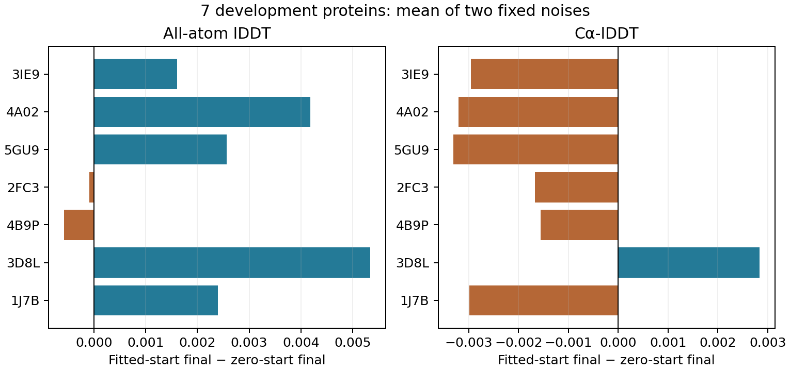

# C4/S1拟合初始化：AA小幅改善，骨架精度下降，本组合收口

2026-09-30，DiamondHill。**冻结校准目标后，改用局部保真拟合初始化，最终
AA-lDDT提高0.002203，但Cα-lDDT下降0.001837，未通过预定继续推进条件。**
两臂都保持零严重碰撞、全部所检查手性正确和整体位移预算通过。该结果是质量
取舍，不能描述成初始化全面改善，也不支持增加拟合预算或把本组合升为默认。

## 只改变初始化，复用已有对照

按[冻结协议](mini_c4_fitted_start_v1.md)，沿用bbbd3eea的7条支持开发蛋白及每条
两枚固定噪声；3CR6不支持的共价拓扑继续保留4个跳过槽。

- 14份校准目标＋零初始化终点直接复用前一批已审计的坐标、参数和评分，逐文件
  哈希核对，不重新计算，也不把复制称为独立重放。
- 新增14次局部拟合＋联合求解：先用既有等重原子MSE拟合raw模型坐标，60次
  L-BFGS上限，再将参数复制回**原始raw定义的同一套位姿变量**，用全新优化器
  执行原有三阶段各60次联合求解。
- 校准文件、参考化学、位置锚、旋转/扭转正则、碰撞项、raw选定的cis/trans
  分支和验收线均保持不变。实验GT只用于评分，没有进入拟合或联合目标。
- CPU FP64、两名单线程worker、每例900秒外部上限。无新模型推理、GPU任务、
  训练、候选搜索或独立32集合访问。

14次新增求解全部完成，14份对照成功复用；28份支持输出统一独立复算，4个
来源失败槽完整保留。流水线与审计exit0，无运行失败。额外拟合成本单独记录；
这里是相同联合求解预算，**不是相同总算力**。

## 配对结果

| 指标 | 原始C4/S1 | 校准目标＋零初始化 | 校准目标＋拟合初始化 |
|---|---:|---:|---:|
| 全原子lDDT | 0.825157 | 0.812698 | **0.814901** |
| Cα-lDDT | 0.900142 | 0.900591 | **0.898754** |
| 零严重碰撞实例 | 8/14 | 14/14 | 14/14 |
| 全部所检查手性正确 | 9/14 | 14/14 | 14/14 |
| 整体位移预算通过 | 基准 | 14/14 | 14/14 |
| 旧联合验收通过 | 0/14 | 0/14 | 0/14 |
| 最大穿透，14份最坏值 Å | 2.76138 | 1.79503 | 1.75487 |
| 与实验GT不一致的连接分支实例数 | 2 | 2 | 2 |

每个蛋白两噪声先平均，再对7条等权汇总；不选最佳噪声。拟合终点相对raw的
AA/Cα变化分别为−0.010256/−0.001387，仍未保留原始模型的全部实验结构精度。

| 蛋白 | 拟合−零初始化 AA | 拟合−零初始化 Cα |
|---|---:|---:|
| 3IE9 | +0.001611 | −0.002959 |
| 4A02 | +0.004186 | −0.003212 |
| 5GU9 | +0.002569 | −0.003309 |
| 2FC3 | −0.000092 | −0.001669 |
| 4B9P | −0.000580 | −0.001557 |
| 3D8L | +0.005338 | +0.002840 |
| 1J7B | +0.002390 | −0.002990 |

AA改善11/14预测、5/7蛋白；Cα改善仅2/14预测、1/7蛋白。两臂旧连接窗口
失败计数相同：CN0、CA–C–N角10、C–N–CA角14、omega14、羰基相位0。
旧绝对几何失败列表均为空，但不能据此改判旧联合验收或宣称全面物理化学正确。
4B9P P122–P123两枚噪声的raw选定分支与GT不一致，最终仍保留，未使用GT修正。

## 收益在哪一阶段出现、又在哪一阶段消失

| 阶段 | AA-lDDT | Cα-lDDT |
|---|---:|---:|
| 原始raw | 0.825157 | 0.900142 |
| 原局部化学构造／零起点 | 0.802942 | 0.900142 |
| 拟合后的起点 | 0.819113 | 0.898821 |
| 零起点联合终点 | 0.812698 | 0.900591 |
| 拟合起点联合终点 | 0.814901 | 0.898754 |

拟合起点相对原局部构造的AA收益为0.016171，最终两臂差只剩0.002203，约为
起点差的13.6%。这是阶段对照的描述性比例，不是对单个势能项的因果分摊。
Cα下降在进入联合求解之前已经出现：拟合使其下降约0.001321，后续同一臂
再下降约0.000067。不能把全部Cα下降归因于联合目标。

拟合平均重原子raw MSE从0.351191降到0.075093 Ų；所有14次都降低该目标。
但最终重原子RMS位移虽从0.52280降到0.43749 Å，Cα RMS位移反而从0.22930
增至0.26267 Å。最大单原子位移从4.61868降至3.53564 Å。

这些结果直接说明：**更好地拟合全部重原子raw坐标，不保证骨架或实验GT指标
同时改善。** 这与等原子权重允许位姿平移/旋转来改善更多侧链原子的机制相容；
本批未独立干预原子权重，不能宣称已经指定了唯一原因。

## 成本与核验

全部局部拟合达到60迭代上限，63–65次closure；平均2.78秒。联合求解13份
达到180次，1份为179次，closure208–233。不能据此宣称已达最优或收敛。
新臂联合求解中位18.18秒、均值22.02秒；连同局部拟合，中位21.16秒、均值
24.81秒。对照保留历史19.71/23.16秒，不构成同期计时或速度优势证据。
新臂峰值进程RSS约0.87 GiB。

28份独立NumPy位姿重放最大误差2.15e−10 Å，指标复算最大误差8.33e−16，
目标复算最大误差5.69e−13。14对raw、局部坐标定义、目标缓冲区及GT对应一致；
拟合起点MSE另用保存坐标复算。两臂起始参数不同，这是唯一允许的初始化差异。

更新后的脚本在前一C4批次只读副本上通过28份审计，601个原有汇总值完全一致。
旧C1的另一条历史基线验收路径也通过28份只读复算。新增复用标记与成本字段
没有更改旧数值。88个坐标/参数/报告归档成员及压缩包
SHA均在本地验证。见[完整产物](../reports/mini_c4_fitted_start_2026-09-30/)。
远端目录：`/media/PM982/onestepfold/c4_fitted_start_v1_20260930`。

## 方法决定

预先筛选要求AA和Cα配对蛋白均值都改善，且几何组合计数不下降。本批因Cα
下降而失败；几何保持不抵消该失败。保留上一轮零初始化的校准结果作为后续
比较基线，不把本拟合初始化升级默认，不在这批蛋白上追加权重或迭代搜索。

本批结束的是“等重原子拟合初始化＋冻结校准目标”的具体组合，不是所有局部
化学表示。它没有暴露新的backward缺陷。下一版应先明确需要保留的骨架信息
与允许的局部自由度，并将raw固定分支的不确定性单独处理，再另立协议。
现有两次优化都切断输入梯度，尚未得到一步可微修正器或有效离散设计结果。
