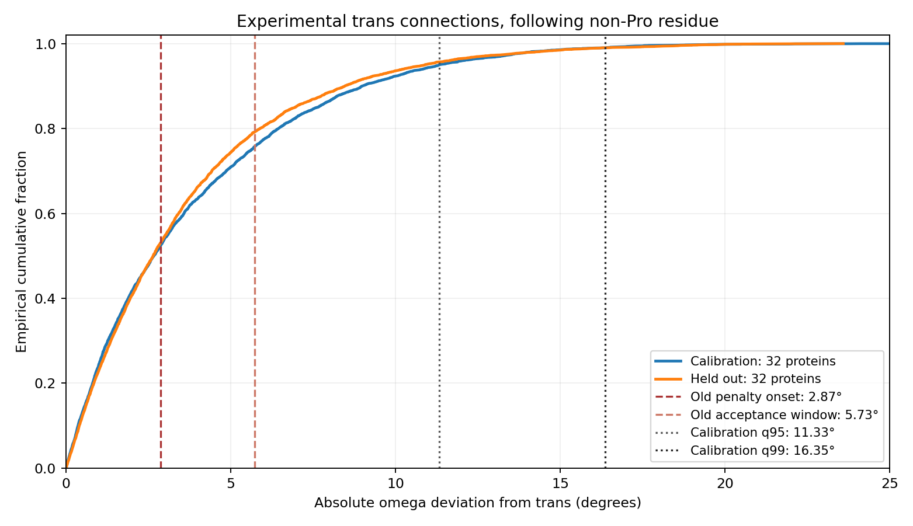

# 64条独立来源的实验连接校准：旧窗口过窄，分位数也不能直接成为化学门槛

2026-09-30，DiamondHill CPU任务全部完成。**原先7条开发GT上大量连接受罚的
现象，在序列隔离的核验半集上复现；尤其omega的旧起罚窗明显窄于所测实验变化。**
这给下一版连接目标提供了独立尺度依据，但尚未进行目标干预，也没有恢复模型
结构质量或设计效用。本轮不修改生产目标、旧验收或独立32条结果。

## 来源、隔离和冻结顺序

原29,769条TRAIN资产按来源条件筛出379条候选，同源/身份排除后保留43条：
≤1.5 Å层11条、1.5–2 Å层32条。保留这一不足记录，没有将43条改称64条。

随后读取HPC3全256分片目录的DiamondHill镜像，在≤2021-09-30发布的高分辨率
单体／同序列同源多聚体中扩展。3,001个来源序列组中按预锁SHA顺序取前1,024，
391个通过序列隔离；46个通过重复GT物化及完整骨架预检，再依次选21条补齐。
345个物化/骨架预检失败保留，没有按连接残差或修复结果换样本。

最终64条，每个分辨率层32条，分别交替分入校准／核验，各32条。其范围为：

- 序列长56–451，X射线分辨率0.92–2.0 Å；本批没有验证长链表现。
- 44个单体来源、20个同源多聚体完整单链；多聚体背景保留，不宣称是自主折叠单体。
- 与21,070条历史开发参考、保留的32条验证集及8条近期开发来源做PDB、accession、
  序列/HSP排除，并排除本批内部近同源。未声称排除Mini/ESM预训练数据。
- 扩展来源均进入高分辨率层，分辨率与组装背景并非独立；不能用本批作二者的
  因果对照。校准／核验半集分别有9／11条同源多聚体来源。

使用冻结的BLAST2.17.0、同一HSP规则和原参考有效数据库残基数5,755,138；
新增参考后实际数据库规模另行记录。无搜索stderr警告。离线审计重读26,264条
HSP，验证所有已选来源的排除关系、组内隔离和32+32角色分配。

先锁来源，再测校准半集并写入`fitted_windows.json`，随后评估核验半集。
没有依据核验覆盖率重新拟合或改选来源。

## 测量与旧窗口的复现

64/64来源测量成功，共11,058个连接。每份GT从原始mmCIF按源链、残基、原子名及
记录altloc重映射，经过单一保向刚体变换与结构包核对，最大原子差8.81e−6 Å；
独立平面法与Gemmi相位最大差9.16e−16。没有插补未观测骨架原子。

| 半集 | 蛋白数 | 连接数 | 激活至少一项旧惩罚 | 超过至少一项旧窗口 | 整链超窗 |
|---|---:|---:|---:|---:|---:|
| 校准 | 32 | 5,621 | 4,102（73.0%） | 1,882（33.5%） | 32/32 |
| 核验 | 32 | 5,437 | 4,198（77.2%） | 1,678（30.9%） | 32/32 |

核验半集各项超窗数为：C–N73、CA–C–N角238、C–N–CA角464、omega1,132、
羰基相位154。类别有重叠。实验结构不等于无误差物理真值，因此这些计数不能
全部叫误报；它们证明旧窗口与此实验构型分布不匹配，不能直接作全面化学判断。

完整骨架、无修改残基和无已注释链断裂的筛选限制了总体，可能截断特别差的
连接尾部。没有因旧几何检查失败而排除来源。允许缺失侧链与二硫键，仅用于
本次骨架分布测量，不代表这些来源全部适用于当前修复表示。

## 仅由校准半集拟合的trans区间

下表是普通非Pro后续残基的trans连接：校准5,383个连接，核验5,208个连接。
q95/q99是绝对残差的线性经验分位数，**不是新验收门槛**。

| 项目 | 校准q95 | 校准q99 | q99在核验集的覆盖率 | 按蛋白重采样95%区间 |
|---|---:|---:|---:|---:|
| C–N长度残差 Å | 0.01688 | 0.02735 | 98.10% | 96.83–99.19% |
| CA–C–N余弦残差 | 0.03753 | 0.05508 | 99.02% | 98.30–99.59% |
| C–N–CA余弦残差 | 0.04658 | 0.07062 | 99.10% | 98.55–99.49% |
| omega弦长残差 | 0.19741 | 0.28444 | 99.00% | 98.51–99.41% |
| 羰基弦长残差 | 0.07359 | 0.11796 | 98.46% | 97.19–99.35% |

omega对应偏离trans中心约11.33°／16.35°；旧起罚点为2.87°、旧窗口为5.73°。
两个角度的旧起罚残差均为0.02，也小于上述q95。相比之下，普通C–N旧起罚点
0.015 Å接近本批q95，不能据omega结果把所有项统一放宽同一倍数。

Pro后续trans连接只有校准217／核验213个，其C–N q99=0.02887 Å，核验覆盖
96.24%（蛋白重采样区间93.59–98.50%），并未达到名义99%。按蛋白等权与按连接
池化也存在差别：Pro的C–N–CA角q99分别约0.20255／0.10508。**这提醒我们，稀疏
类别和少数蛋白的尾部会影响窗口，不能把一个经验分位数直接视为可靠化学标准。**

所有窗口同时记录按蛋白等权的经验CDF版本；核验覆盖的区间用2,000次蛋白重采样，
保留整条蛋白的连接，不把连接当独立样本。某些小类观测覆盖100%时，普通bootstrap
区间也会退化为100%–100%，不能据此声称总体覆盖得到保证。

作为预定敏感性记录，仅保留占有率≥0.999且无骨架altloc的核验连接后，普通trans
omega q99覆盖99.05%，与主结果99.00%接近；这不是替换主结果或重新拟合。

## Cis仍需单独处理，不能强制所有非Pro为trans

共记录37个cis-like连接：校准21、核验16；其中后续非Pro为3／2个。
这是由实验坐标最近分支定义的描述，不等于全部经过电子密度复核。

| 来源 | label连接 | 残基对 | omega | 相关骨架最大B因子 |
|---|---|---|---:|---:|
| 1LMI | 82→83 | WQ | −33.01° | 94.65 |
| 1LMI | 83→84 | QA | −32.85° | 114.69 |
| 1QB7 | 79→80 | DA | +0.69° | 16.25 |
| 1H6L | 229→230 | PD | +0.30° | 19.29 |
| 1RMG | 225→226 | GS | −0.56° | 22.47 |

前两项伴随较大其他几何残差；后三项接近cis中心。全部保留，没有为了得到
“非Pro全trans”而删去。样本太少，不拟合稀有cis门槛，也不训练类别判定器。
这支持将连续连接偏差与分支不确定性分开建模，不能盲目保留raw分支，也不能
盲目强制非Pro为trans。

## 下一版的边界

可以据此设计一个**只改变连续连接惩罚尺度**的有界开发对照，检验此前目标是否
过度理想化并损害结构质量；cis/trans选择另列明确的不确定性处理，不与尺度
效应混成一个结论。对照必须同时报告实验精度、原窗口、新目标残差及真实碰撞／
手性，不能只把新的较宽区间当验收通过。

本轮尚未证明换目标能够追回质量；没有求解器运行、权重扫描、训练、序列优化，
也没有可微修正层或部署放行。校准64条用于分布建模，后续不能再当独立的修复
泛化验证；原独立32条继续保留，不在其上调方法。

四项针对统计隔离、蛋白权重和来源筛选的本地测试通过；三个统计测试也在
DiamondHill通过。离线核对165份归档文件、64份GT哈希、HSP隔离、CSV分母和
40项窗口/覆盖计算通过。[离线审计](../reports/mini_connection_calibration_2026-09-30/audit.json)

[原校准协议](mini_connection_calibration_v1.md) ·
[来源扩展协议](mini_connection_calibration_extension_v1.md) ·
[冻结面板](../reports/mini_connection_calibration_2026-09-30/extension/selection.json) ·
[窗口及支持度](../reports/mini_connection_calibration_2026-09-30/measurement/fitted_windows.json) ·
[完整报告](../reports/mini_connection_calibration_2026-09-30/measurement/report.json)

DiamondHill目录：`connection_calibration_v1_20260930`（原43条），
`connection_calibration_extension_v1_20260930`（补齐64条），
`connection_calibration_measure_v1_20260930`（测量与归档），均位于
`/media/PM982/onestepfold/`。本批进程均已退出。
