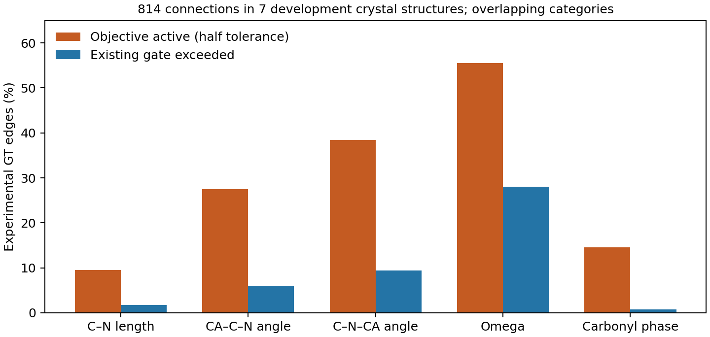

# 连接约束审计：实验构型频繁受罚，raw异构分支可把错误固定下来

2026-09-30，DiamondHill CPU，只读审计已完成。**当前几何目标同时存在窗口校准
不足与固定cis/trans分支的风险；继续提高初始化精度或追加求解迭代，不能自动
解决这些目标定义问题。** 本轮没有修改门槛、重算旧验收、优化坐标或训练模型。

## 数据和独立检查

沿用已锁定的8个开发来源，3CR6共价连接不支持继续保留；实际检查7个蛋白的
814个实验连接、14份缓存原生C1/S1预测及28份联合输出，共49份结构。GT只计一次，
不能把814个连接或两枚预测噪声当作814条独立蛋白。独立32条验证集未使用。

7份GT均按原始mmCIF的源链、label_seq_id、原子名和记录的altloc重新映射；
通过单一保向刚体变换消除组装坐标系差异后，最大原子差≤5.47e−6 Å。没有按
坐标接近程度挑原子，也没有用模型坐标填补GT。来源均为X射线结构，分辨率
0.95–2.9 Å，作者残基编号与源文件哈希已存档。

NumPy三角形边长/平面法向实现与冻结JointObjective对照，49/49通过；GT残差
最大差6.11e−16，全部结构最大差9.26e−9（来自原已失败的3D8L零初始化输出）。
Gemmi二面角的复相位最大差8.96e−16。三项独立实现测试在本地和DiamondHill通过。
这些结果验证了本轮几何测量及对应关系，不是新的模型梯度认证。

## 现有窗口在实验GT上的行为

**677/814（83.17%）实验连接至少激活一项惩罚；321/814（39.43%）至少超过一项
原验收窗口。** 五项同时合格的整链数量为0/7。GT不是无误差的物理真值，不能
把每个超窗点一概宣布为误报；但这些频率说明当前操作性标准不能直接代表
实验构型通常具有的连接变化范围。

| 项目 | 实际起罚窗口 | 原验收窗口 | GT激活数/814 | GT超验收数/814 |
|---|---:|---:|---:|---:|
| C–N长度残差 | 0.015 Å | 0.03 Å | 78 | 14 |
| CA–C–N余弦残差 | 0.02 | 0.04 | 224 | 49 |
| C–N–CA余弦残差 | 0.02 | 0.04 | 313 | 77 |
| omega相位弦长残差 | 0.05 | 0.1 | **452** | **228** |
| 羰基相位弦长残差 | 0.05 | 0.1 | 119 | 6 |

类别有重叠，不能将各行计数相加作为不同连接数。起罚阈值是验收阈值的一半，
来自实际目标代码，而非仅看验收配置。

omega的弦长残差满足 d=2|sin(Δω/2)|，所以起罚和验收分别约为偏离最近cis/trans
中心2.865°与5.732°。按池化连接计算，omega占五项当前缩放后惩罚的62.66%；
**这是目标项的算术分解，不是它造成了62.66%的lDDT损失。**

高分辨率案例也有大量超窗，不能只用较低分辨率解释：

| 来源 | 分辨率 Å | 激活连接 | 超原验收连接 |
|---|---:|---:|---:|
| 3IE9 | 2.10 | 75/104 | 35/104 |
| 4A02 | **0.95** | 154/165 | **82/165** |
| 5GU9 | 1.90 | 48/70 | 21/70 |
| 2FC3 | 1.56 | 97/123 | 38/123 |
| 4B9P | **1.182** | 145/165 | **79/165** |
| 3D8L | 2.90 | 71/90 | 29/90 |
| 1J7B | 1.80 | 87/97 | 37/97 |

## 均值常数正确，不等于惩罚尺度已经校准

本项目采用的连接均值与AlphaFold常数表相符。该表同时给出C–N标准差0.014 Å
（接Pro为0.016 Å）、两种键角余弦标准差0.0311和0.0353。当前角度起罚窗口0.02
只相当于这两个标尺的约0.64和0.57倍；不能据采用了相同均值就声称复现了其
违例配方。[固定版本常数表](https://github.com/google-deepmind/alphafold/blob/c77e5d2a8961d1a353632c462914ff0a32a950f6/alphafold/common/residue_constants.py#L494)

该版本连接违例函数的默认容差因子为12。本轮仅对长度与两个角度做12倍标准差
残差覆盖对照，GT三项均无超界；这**不是完整AlphaFold几何检查，也不覆盖omega、
羰基、碰撞或手性，更不是建议把本项目阈值直接换成12倍**。源码commit、内容
哈希及提取数值已保存。[固定版本违例实现](https://github.com/google-deepmind/alphafold/blob/c77e5d2a8961d1a353632c462914ff0a32a950f6/alphafold/model/all_atom.py#L757)

## 固定raw的cis/trans分支会放行错误的肽键类别

原目标按raw的omega余弦符号选择cis或trans，之后固定该分支。14份预测共有
1628个连接实例，其中2处与实验GT分支不同。两处都不是GT支持的cis，联合求解
却把它们进一步推向cis中心：

| 来源/噪声 | label连接（作者编号） | GT omega | Raw omega | 旧初始化终点 | 拟合初始化终点 |
|---|---|---:|---:|---:|---:|
| 4A02 /12345 | 34→35（62→63），后续Ile | −177.879° | −84.814° | +1.375° | −2.879° |
| 3D8L /54321 | 32→33（32→33），后续Glu | −178.283° | +30.451° | −2.854° | −2.844° |

**四份终点均通过旧联合验收。** 它们满足的是所选择分支附近的几何要求，而不是
证明选择了实验结构的肽键类别。4A02的raw还很接近±90°分支边界，因此固定分支
并非来自一个已经接近理想cis的输入。

同时，GT里确有两处cis-like连接：4A02 label6→7（约−21.404°）和2FC3 label55→56
（约+1.889°），后续均为Pro。**不能用强制全trans来处理这两处预测错误。**
上述2/1628不是总体错误发生率，也不足以解释全部均值损失。

## 方法判断与下一步

本轮没有发现原子映射、角度符号或单位混用导致上述现象。更明确的问题是：
当前目标鼓励较强的理想化，而且可能把raw选错的异构分支当作固定约束。
这解释了为什么“更多连接项通过”不能单独代表实验精度和化学类别都正确；
但**尚未通过目标干预量化它们对约0.02终点lDDT损失各自贡献多少**。

下一版需要先建立独立于输出成败的几何校准依据，分别定义明确违例与可容忍的
连接变化，并处理不确定的cis/trans分支。不能用这7个开发蛋白反复调窗口，也
不能仅照搬外部常数倍数。严重原子重叠与错误手性的既有证据仍成立；窗口校准
不是取消它们的理由。原32条验证和初始化配对结果保持原判。

当前审计收口，没有启动新的求解器、阈值扫描、训练或部署。研究重点从优化
初始化转向输出目标与化学验收的校准；此时仍不具备一步可微设计输出。

[冻结审计协议](mini_connection_gt_audit_v1.md) ·
[完整报告](../reports/mini_connection_gt_audit_2026-09-30/report.json) ·
[逐连接记录](../reports/mini_connection_gt_audit_2026-09-30/edges.csv) ·
[错分支实例](../reports/mini_connection_gt_audit_2026-09-30/summary.json)

远端：`/media/PM982/onestepfold/connection_gt_audit_v1_20260930`，只读CPU审计已结束。
