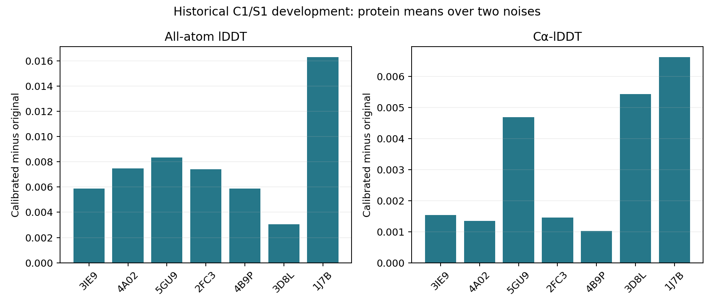

# 独立校准的连接起罚区间追回部分精度；旧联合验收仍不通过

2026-09-30，DiamondHill CPU配对实验与独立复算完成。**只改变trans连接起罚区间，
在全部14份开发预测上同时提高AA和Cα-lDDT，且没有增加严重碰撞、所检查手性
失败或整体位移预算失败。** 这是一次目标干预的正面结果，不再只是观察GT分布。

但原连接窗口保持不变，旧联合验收从13/14降为0/14；两处既有错误cis分支仍然
存在。当前输出仍是迭代求解器的结果，不是可部署的一步可微设计模型。

## 精确改变了什么

沿用8个历史来源、每条两枚固定噪声；3CR6原有共价连接不支持，4个任务槽保持
跳过。其余7个蛋白共14份缓存原生预测，两个求解臂合计28次成功运行。
**这些输入是历史C1/S1，不能称为C4/S1验证或14个独立蛋白。**

两组都从原始raw坐标建立同一个零参数残基位姿图。参考化学、位置锚、正则、
原子对、top16碰撞项、raw选定的cis/trans分支及三阶段L-BFGS预算均不变。
没有使用之前拟合好的初始化，也没有把每条蛋白的实验GT放进求解目标。

新臂仅对raw选为trans的连接，把五项起罚点替换成独立64来源中**校准半集**
拟合的pooled q95；raw选为cis的连接五项均保持原值。区间外分母仍是旧值：

\[
E_k=\operatorname{mean}\left[\max(|r_k|-w_k,0)^2/s_{k,\mathrm{old}}^2\right].
\]

| 残差项 | 原起罚点／保留分母 | 非Pro后续trans新起罚点 | Pro后续trans新起罚点 |
|---|---:|---:|---:|
| C–N长度 Å | 0.015 | 0.016883 | 0.017531 |
| CA–C–N角余弦 | 0.020 | 0.037528 | 0.049227 |
| C–N–CA角余弦 | 0.020 | 0.046577 | 0.069647 |
| omega相位弦长 | 0.050 | 0.197406 | 0.206619 |
| 羰基相位弦长 | 0.050 | 0.073591 | 0.064041 |

这保持了区间外的二次惩罚曲率，没有同时缩小其权重；五项一起改动，因此不能
单独把质量收益归给omega。经验区间仅定义本次目标，不构成新化学验收标准。

## 配对结果

| 指标 | 原始Mini坐标 | 旧起罚区间终点 | 校准起罚区间终点 |
|---|---:|---:|---:|
| AA-lDDT | 0.773584 | 0.753066 | **0.760832** |
| Cα-lDDT | 0.848037 | 0.846704 | **0.849866** |
| 严重碰撞对总数（距离<1 Å） | 58 | 0 | **0** |
| 所检查手性全部通过 | 8/14 | 14/14 | **14/14** |
| 整体位移预算通过 | 14/14 | 14/14 | **14/14** |
| 旧联合验收通过 | 0/14 | 13/14 | **0/14** |
| 最大穿透，取14份最坏值 Å | 2.97799 | 2.21670 | **1.90007** |

新旧终点均值差为AA **+0.007766**、Cα **+0.003162**；14/14预测两项均改善，
按每蛋白两枚噪声先平均后，7/7蛋白也均改善。

| 蛋白 | AA配对改善 | Cα配对改善 |
|---|---:|---:|
| 3IE9 | +0.005869 | +0.001533 |
| 4A02 | +0.007482 | +0.001345 |
| 5GU9 | +0.008335 | +0.004697 |
| 2FC3 | +0.007418 | +0.001456 |
| 4B9P | +0.005888 | +0.001028 |
| 3D8L | +0.003052 | +0.005440 |
| 1J7B | +0.016317 | +0.006633 |

按均值差额计算，追回了旧终点相对raw的AA损失约37.85%。这只是当前配对干预的
差额比例，不是对全部误差机制的贡献分解。**新终点AA仍比raw低0.012752，不能
描述成精度已经保住。** 这7条已反复用于开发，不能据7/7推断广泛泛化。

## 旧验收为何全部失败，以及没有解决什么

14份新终点仍分别有12份CA–C–N角、14份C–N–CA角、14份omega超旧窄窗口；
C–N长度和羰基相位则全部通过原窗口。没有把旧失败重命名成新通过。

同时，新臂14/14均满足旧`absolute_failures()`集合、严格已检查手性与整体位移
要求；最大bond RMSE约0.00480 Å、最大peptide MAE约0.01194 Å。该集合不包含
上面的全部连接角／相位要求，也没有完整覆盖所有物理化学条件。零严重碰撞
不等于全部范德华重叠为零，1.90 Å最大穿透仍接近现有尾部惩罚边界。

两处raw错误cis（4A02/12345 label34→35，3D8L/54321 label32→33）均保留。
旧臂3D8L/12345另产生一处分支错误，新臂没有，因此终点错分支实例总数3→2；
**这不意味着已学会纠正原始cis/trans类别。**

平均Cα RMS位移0.334→0.304 Å，重原子RMS0.761→0.695 Å，但最大单原子位移
9.000→11.045 Å，后者为3D8L/12345的label3 NZ。整体更接近raw不等于每个原子
都只微调，也不能替代局部结构精度或任务效用检查。

## 执行与可核验性

32计划槽：28成功、4原来源跳过、0执行失败。两单线程CPU worker，FP64，同样
三个阶段各60次迭代上限，未追加预算或重跑失败点。原臂13例用满180次，1例
3D8L只执行39次；新臂均为180次。这不能证明任一结果达到最优或收敛。

原／新求解墙钟中位17.37／18.29秒，均值20.52／22.53秒；新臂closure208–230次。
新实现额外计算替换目标，不能把相同迭代上限称为相同FLOPs或速度提升。峰值
进程RSS均约0.88 GiB。

- 14/14原臂终点与历史零初始化输出逐位一致。
- 14/14配对的原始坐标、初始化、局部图、GT、原子身份和共享目标buffer一致。
- 28份参数独立NumPy位姿重放，最大坐标差1.43e−10 Å。
- 独立指标复算最大差1.67e−15；新旧终点目标独立复算最大差2.73e−12。
- 两项局部目标测试在本地和DiamondHill均通过；它们不认证贯穿L-BFGS的输入梯度。
- 88份坐标／参数／报告归档的哈希往返核对通过，4个来源跳过报告也保留。

## 方法判断与下一步

预锁的“值得有界确认”条件成立：AA与Cα同时提高，零严重碰撞＋所检查手性＋
位移预算联合满足数未减少。但这不是部署条件，旧联合验收仍为0/14。

当前证据支持保留校准目标作为候选：过强的连续理想化确实是当前质量损失的一项
可干预因素。不能据此撤掉碰撞或手性要求，也不能用GT直接替换预测时的分支。

下一步优先冻结此目标，转到项目实际要求的**C4/S1输入**做有限确认，继续同时
报告原窗口、实验精度和分支错误。不要在本批上扫q90/q95/q99、权重或迭代次数。
初始化组合、类别处理及学习短计算图修正器仍是后续独立问题；本轮没有训练、
新模型推理、序列搜索或贯穿修正器的梯度实现。

[冻结协议](mini_connection_window_trial_v1.md) ·
[完整结果](../reports/mini_connection_window_trial_2026-09-30/summary.json) ·
[独立复算](../reports/mini_connection_window_trial_2026-09-30/audit.json) ·
[逐预测配对表](../reports/mini_connection_window_trial_2026-09-30/paired_predictions.csv)

远端：`/media/PM982/onestepfold/connection_window_trial_v1_20260930`，求解、复算、
汇总进程均已退出。本轮关闭，不改变原独立32条验证拒绝或整体部署状态。
