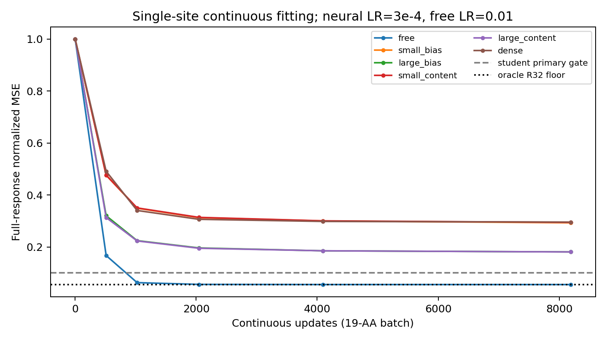
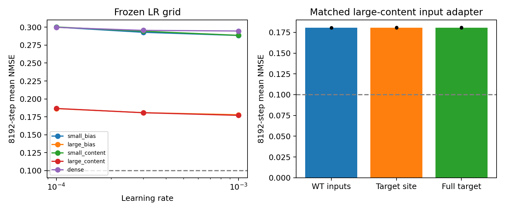
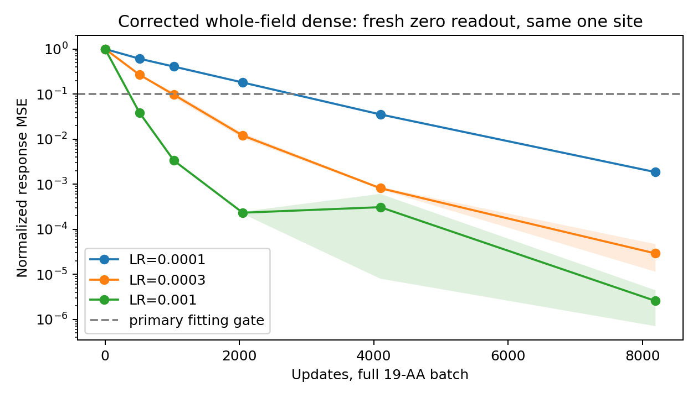

# Deep Validation v2：单个位点能学会，当前共享 factor 生成器尚未学会

本批研究对象是 **WT C4 状态＋单点 hard AA query → mutant pair response**。
没有改变 Mini、ESM、C4/S1 或已有 hard folding checkpoint；没有恢复 soft 序列优化或设计任务。

原协议 A/B 的38条连续训练及审计已完成，自由 R32 因子达到 oracle 下界附近，
但全部共享 factor student 未达到预定拟合门槛。随后发现原 dense 对照仍有共享行空间瓶颈，
因此在新结果产生前登记修订，补做整场 dense 对照。**必须同时阅读这一修订，不能直接沿用
原控制器的 `all_single_site_neural_arms_failed` 作为最终科学结论。**

协议：[原锁定协议](mini_deep_validation_v2.md)、[dense 对照修订](mini_deep_validation_v2_dense_amendment.md)。
所有数值来自本批实际运行，完整逐种子、逐 checkpoint、逐 AA 数据位于
[结果目录](../reports/mini_deep_validation_v2_2026-10-02)。

## 1. 固定数据、预算与 GPU 隔离

- 同一 TRAIN 蛋白 1W53，长度84，T37（零起始位置36），19种 non-WT 替换。
- 同一归档 hard teacher，WT `s/z` 输入，监督 `Δz = z_target − z_WT`。
- 两枚初始化种子231301/231303；每条连续8192更新、每步完整19-AA batch。
- 保留512/1024/2048/4096/8192权重、Adam状态及随机状态，另有每64步诊断。
- neural AdamW：LR=1e-4/3e-4/1e-3，weight decay=1e-4，eps=1e-8，clip=1。
  自由因子按既定控制使用LR=.01、weight decay=0，不能视为等参数量、等优化器设置比较。
- loss只有原定义的逐AA归一化 `Δz` MSE；没有S1、坐标、碰撞或手性损失。
- **所有GPU任务仅使用物理0–5，仅设置 `HIP_VISIBLE_DEVICES`；不设置
  `CUDA_VISIBLE_DEVICES`。6、7没有被本批任务分配。** worker验证只可见一张卡，并记录实际环境。

原A阶段32条：自由因子2条，加5个neural架构×3LR×2seed。B阶段6条：
匹配large-content架构，WT/site/full `s_inputs` 三种输入×2seed，统一LR3e-4。
补充dense6条。训练标签均来自一个已参与开发的位点，**没有跨蛋白泛化证据**。

## 2. 自由 factor 的优化可以逼近 R32 表示下界

两枚种子平均曲线：

| 更新 | 自由R32 factor NMSE |
|---:|---:|
| 512 | 0.16694 |
| 1024 | 约0.06256 |
| 2048 | 约0.05575 |
| 4096 | 约0.05521 |
| 8192 | **0.05515** |

本位点 oracle R32 floor为 **0.05513569**；自由参数控制两枚种子均满足≤0.075。
因此，在这些标签、初始化和优化预算下，`UVᵀ/√32` 这个乘积并未形成不可逾越的优化障碍。
这也修正了此前仅512步、NMSE约0.167时对优化上限的疑问。

自由因子有13,074,432参数，逐候选独立；它的成功不证明共享生成器一定容易训练，
也不能单凭这一对照断言 gauge 完全无影响。

## 3. 容量有帮助；本次 pair-content 与 oracle input 没有救活 factor student

下表为8192步两枚种子均值，所有LR保留，没有只展示最好曲线。

| 架构 | 参数量 | LR1e-4 | LR3e-4 | LR1e-3 |
|---|---:|---:|---:|---:|
| small bias，width128×2 blocks | 1,598,592 | 0.300124 | 0.292883 | 0.288486 |
| small content | 1,598,462 | 0.300317 | 0.294413 | 0.288672 |
| large bias，width256×4 blocks | 5,585,152 | 0.186457 | 0.180772 | 0.177876 |
| large content | 5,585,920 | 0.186650 | 0.180693 | **0.177042** |
| 原 row-dense 对照 | 1,928,832 | 0.299800 | 0.295614 | 0.294709 |

大模型实际约5.59M，而非事前估计的10M；实际参数量完整报告。
content版本让WT pair value经边特征投影、attention加权及query门控直接进入message，
并略缩FF宽度以匹配参数量；不是triangle update，也不是所有可能的pair-aware架构。
大/小模型同时改变宽度和深度，因此容量结论针对这一组合干预。

扩大模型带来明显拟合改善，但没有一组两枚种子同时达到primary≤0.10或secondary≤0.12。
在LR1e-3下，large-content的centered AA-specific NMSE约0.2145；
响应总能量约teacher的0.821、中心化能量约0.792。
它不是始终输出零，但仍有明显响应误差。

匹配large-content输入adapter对照（5,702,018参数，LR3e-4）：

| 额外输入 | seed231301 | seed231303 |
|---|---:|---:|
| 完整WT `s_inputs` | 0.180658 | 0.180499 |
| 仅突变位点替换为target `s_inputs` | 0.181018 | 0.180426 |
| 完整target `s_inputs` | 0.180957 | 0.180433 |

在本架构和预算中，没有观察到oracle target-input显著改善。
**不能据此证明ESM响应不重要，也不能证明WT-only信息不足。** 只有一个固定WT、
19个不同AA标签时，可辨认query本来就允许记忆查表；泛化需要另外验证。





## 4. 原 dense 对照存在输出瓶颈，必须修正其解释

原实现让每个残基的128维hidden通过同一个仿射读出产生一整行pair response。
对于19AA×84行，它等价于一个1596×10752矩阵的受限共享行空间。
虽然每个单独pair channel矩阵可以满秩，它并不是无瓶颈的整场dense生成器。

按训练loss的逐AA权重做白化，并单独处理共享bias方向，得到这个仿射读出的
**最优NMSE=0.2942386038**；显式构造最佳矩阵后重算loss得到相同值。
实际最好run是0.2946945624，只比该下界高0.00045596。
这解释了该分支为何不能达到0.1；不能用它的失败排除输出参数化瓶颈。
下界分析是事后诊断，详见[原始数据](../reports/mini_deep_validation_v2_2026-10-02/dense_readout_bound.json)。

补充对照保留small WT backbone，将全链平均节点状态＋突变节点状态投影到32个query特征，
直接读出完整84×84×128场。参数量 **30,350,752**。它改变了输出组织及容量，
因此不是仅改变一个因素的因果归因；它是检验“这个固定数据能否被WT-only生成器记住”的控制。

预检确认两枚种子的19个query特征加bias均rank19；闭式线性读出可将训练标签重建至
FP64 NMSE<6.5e-28、FP32 NMSE<1.5e-13。**该oracle读出随即丢弃；六条训练均重新初始化，
从零输出头开始，未使用闭式解初始化。** 修订在任何补充训练结果产生前锁定。

补充对照六条训练及独立重放全部完成：

| 学习率 | seed231301 NMSE | seed231303 NMSE | 两seed≤0.10 |
|---|---:|---:|---|
| 1e-4 | 0.00184279 | 0.00185724 | 是 |
| 3e-4 | 0.00001138 | 0.00004661 | 是 |
| 1e-3 | **0.000000705** | **0.000004408** | 是 |

LR1e-3的中心化AA-specific NMSE为5.24e-7 / 4.60e-6，不是只学会共有mutation均值。
其512步已达到0.03629 / 0.04084；完整保留后续曲线，包括第二枚种子4096步的一次回升，
不使用最佳中间checkpoint替代8192终点。

**该固定WT＋AA输入能够在整场dense参数化下拟合这些最终响应。**
这既不是跨位点预测，也不是可以部署的加速器；这里没有证据证明模型学会了通用突变传播。
但它明确阻止我们把原factor失败解释为“WT-only标签无法拟合”或“最终状态回归本身失败”。



补充任务墙钟188.39s（包含预检、六条训练及独立审计）；30份checkpoint哈希、12次独立重放通过。
这些固定长度模型未晋升，不执行后续迁移/functional阶段。

## 5. 阶梯终止与 blockwise 资产的边界

原协议中所有可迁移factor模型均未通过单site gate，故C新site、D跨蛋白、E16→8、
F功能损失、G功能/几何/速度验收均未执行。原H按当时结果自动捕获20个真实hard C4轨迹：
WT＋19替换，每个recycle保留4/8/12/16 block边界，共16个边界，另保留4个recycle输入。
最终状态20/20与teacher逐位重放相同。

描述性例子：C1/block4的pair response逐channel R32残差均值约0.01315，
C1/block16约0.04339，C4/block16约0.05514。不同block的响应方向和尺度变化明显；
这些数值不能建立哪个block不可学习，也不能证明blockwise student会成功。
304个mutant×boundary记录及20份轨迹哈希见
[blockwise分析](../reports/mini_deep_validation_v2_2026-10-02/blockwise_analysis.json)。

补充整场dense是固定长度、大容量拟合对照，不直接晋升为可迁移factor模型。
它的成功应撤销“所有最终状态生成器均失败”的泛化解释；原H捕获结果作为诊断资产保留，
**不据此自动训练blockwise student，也不追加8k之后的更新。**

## 6. 可复核性、成本与后续决策

原38条训练：190份checkpoint哈希核验，512与8192共76次独立forward重算，
NMSE最大差3.33e-16。small-bias两枚种子在512步与上一批checkpoint参数逐位一致。
11项focused tests通过；覆盖旧模型一致性、WT零输出、pair-content梯度、
target-site输入隔离、两seed门槛、以及修订dense读出的19标签可表示性。

原A计算墙钟840.30s，B195.05s，H540.15s；原控制器合计1590.70s。
训练阶段每条run均0次S1/0次C4；H另外执行20个C4及其原生特征/ESM重建。
GPU审计另行执行，其控制器计时含等待原实验结束，不能全部算作GPU推理耗时。
提交前GitNexus完整变更检查为HIGH（87符号、10流程），没有截断或部分结果；
新增控制器的C–G分支因gate未触发，尚无本批运行验证，不应作为已验证通用基础设施。
本批没有达到可迁移factor晋升条件，**没有新的S1 functional质量、几何通过或部署速度结论**。

当前证据支持：自由factor优化可达到表示下界；当前共享factor生成器在既定预算下拟合不足；
扩大容量有帮助，但本次edge-value与oracle-input干预没有解决它。
整场dense对照决定了不能将这种失败升级为WT-only信息不足或final-state映射不可学。
剩余问题是寻找可迁移、成本合适的生成参数化，且需用新site/新蛋白检验；
这不是本批已经完成的交付，也不值得通过继续盲目增加同一模型步数来代替。

运行产物：

```text
本机元数据：/home/husrcf/Code/onestepfold_runtime/deep_validation_v2_20261002
DiamondHill：/media/IntelSSD/onestepfold/hpc3_mirror_20261001/Folding/deep_validation_v2_20261002
补充对照：同一父目录/deep_validation_v2_global_dense_20261002
teacher：同一父目录/factor_student_pilot_v1_20261002
```

完整optimizer checkpoints及blockwise大张量保存在DiamondHill，仓库保存锁、执行终态、
逐例指标、曲线和哈希清单；本机元数据副本不意味着复制了全部teacher/checkpoint字节。
