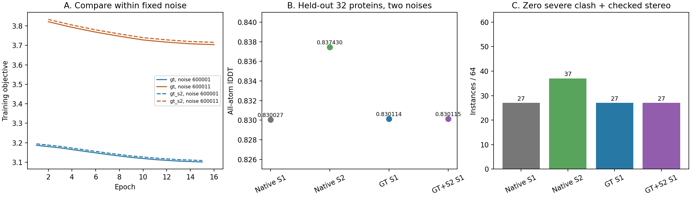

# 原生一步 diffusion 学习：首个两臂试验完成，更新有效但收益很小

2026-09-30。两臂训练、权重合并、160条配对推理及1280份预测的评分均完成。
**当前配方只带来约10⁻⁴量级的验证精度改善，没有建立化学有效性；不能放行部署，
也不能据此否定一步 diffusion、LoRA或S2辅助训练的一般可行性。**

## 固定比较与执行

依据[训练协议](mini_diffusion_learning_pilot_v1.md)和
[终点评价协议](mini_diffusion_terminal_evaluation_v1.md)，原生Mini-ESM、ESM2-3B与
四轮Pairformer保持，只有56个rank8 diffusion矩阵适配器、835,584参数可训练。
两臂从同一公开权重、同一零输出初始化开始，使用同一128条TRAIN、数据顺序和噪声。
每臂2048次蛋白曝光、512次更新；固定终点，没有验证选模型或延长训练。

| 记录 | GT＋化学 | GT＋化学＋S2辅助 |
|---|---:|---:|
| 完成更新 | 512 | 512 |
| 完成曝光 | 2048 | 2048 |
| worker墙钟 | 637.94 s | 611.38 s |
| 峰值allocated显存 | 约5.31 GiB | 约5.31 GiB |
| 被裁剪的更新 | 472/512 | 472/512 |
| 保持逐位不变的基础参数张量 | 1613 | 1613 |

两臂并行总墙钟642.01秒，均exit0。独立审计核对全部历史、角色、顺序、噪声、
学习率、损失加权、优化器步数、同初始化和终点SHA。8个推理worker均验证零初始化
原生重放与加载/合并精确一致，合并后恢复原生state-dict键。评估新调用888次diffusion，
包括56次工程探针；512份原生TRAIN输出复用已审计缓存。推理42.47秒、CPU评分27.93秒。

TRAIN为128条×2噪声×4模型=1024份；VALIDATION为32条×2新噪声×4模型=256份。
全部成功保留，没有筛掉坏目标。实验GT映射核对到原atom37，缺失GT只影响监督/质量
掩码，完整预测原子仍进入化学检查。AA/CA-lDDT逐例与独立分块稠密距离实现比较，
最大绝对差4.44×10⁻¹⁶。新增mask与化学评分测试和相关回归共5项通过。

## 新验证32条：精度提升存在，但幅度不够

以下先平均每个蛋白的两枚固定噪声，再对32个蛋白等权汇总。

| 模型 | 全原子lDDT | Cα-lDDT | 相对原生S1的AA变化 |
|---|---:|---:|---:|
| 原生S1 | 0.830027 | 0.908289 | — |
| 原生S2 | 0.837430 | 0.914862 | +0.007403 |
| GT学生S1 | 0.830114 | 0.908535 | +0.0000872 |
| GT＋S2学生S1 | 0.830115 | 0.908536 | +0.0000875 |

GT学生AA变化的配对蛋白bootstrap95%区间为[0.0000505,0.0001234]；GT＋S2学生为
[0.0000505,0.0001238]。两臂均28/32蛋白AA改善，但这只是很小的数值收益，不能
把区间不跨零写成有实用价值的成功。相较本面板S2−S1的均值差，学生追回约1.2%。

GT＋S2减GT的AA均值为+2.87×10⁻⁷，区间[−5.68×10⁻⁷,1.11×10⁻⁶]：
**本轮设置没有建立S2辅助带来额外收益。** 这不是证明更强或不同形式的教师监督无效。

GT学生AA配对P05约−0.0000675，最差5%均值约−0.0001115；Cα为−0.0000174、
−0.0000843。两学生均没有蛋白均值AA/Cα下降超过0.05。但只有32条，最差5%由
2条蛋白构成，不能据此排除普遍的稀有灾难尾部。所有逐噪声差值均保留，无best-of。

## 几何基本没变，S2也不是无条件正确的标签

| 模型 | 严重碰撞总数 | 零严重碰撞实例/64 | Cα错误中心总数 | ILE/THR错误中心总数 | 零严重碰撞＋严格所检手性/64 |
|---|---:|---:|---:|---:|---:|
| 原生S1 | 325 | 32 | 18 | 14 | 27 |
| 原生S2 | 150 | 39 | 6 | 8 | 37 |
| GT学生S1 | 323 | 31 | 18 | 14 | 27 |
| GT＋S2学生S1 | 323 | 31 | 18 | 14 | 27 |

两个学生均为11/32蛋白在两枚噪声下同时满足“零严重碰撞＋严格所检手性”，与原生S1
相同；这只是两个检查的交集，**不是完整化学或设计验收**。最大穿透仍约3.225 Å。

2Z3B的noise600043新增一处跨过1 Å严重碰撞线的原子对：残基27 CD2—残基32 CG2
由1.012735 Å变为GT的0.997070 Å、GT＋S2的0.996945 Å。保留该新增失败，不因幅度
小而改阈值。S2总体更好，但也在5个原本零严重碰撞的实例引入碰撞，4个原先严格
所检手性通过实例失去该性质，所以S2依然不能被当作干净化学真值。

旧连接窗口只作历史描述，没有进入本轮训练损失，也没有用新门槛把结果改判成功。
分类型连接残差、GT cis/trans分支差、观测GT键误差与旧参考键误差完整保留。

## TRAIN结果和实际更新幅度

TRAIN128的AA均值：原生S1 0.801185，GT学生0.801301，GT＋S2学生0.801301，
原生S2 0.814057。训练集本身的改善也很小，不能将本轮局限主要解释为验证泛化失败。
TRAIN包含更多长链与困难样本；不要把TRAIN均值低于VALIDATION解释为泛化证明。

两枚训练噪声交替，因此整条epoch loss曲线呈锯齿状。应比较相同噪声：
GT臂epoch1→15为3.18698→3.10146；epoch2→16为3.82093→3.70351。
其中噪声600001的原始clash项19.0626→18.2326，而坐标MSE63.6653几乎不变；
另一噪声clash23.2262→22.1063、坐标73.8993→73.8424。标量下降主要来自碰撞项。

离线权重检查发现，两臂适配矩阵合并改变量的总Frobenius范数/原矩阵总范数约
0.000188（0.019%）；验证重原子相对原生S1的**未对齐**RMS位移均值约0.015 Å，
最大实例约0.057 Å。实际映射只进行了很小的修改。这与GT精度和几何变化小一致，
但不能单独指定学习率、rank、预算或某个loss为唯一原因。

S2项原始均值约3.0/4.7，加权后仅约0.0075/0.0118；两个总体目标约3–4。
这是标量量级信息，**不等于已经测得各分支的梯度主导关系**。472/512次梯度裁剪
同样不能直接诊断为错误；AdamW在裁剪后的更新机制仍需具体分析。

## 本轮收口与下一步

本轮证明了缓存、mask监督、固定预算训练、终点合并及新验证可以完整执行；没有
证明实用化学修复或硬设计收益。停止本批，不追加epoch、候选或验证seed来追结果。

下一步应针对**有效更新强度和监督配比**，先利用TRAIN检查各目标的梯度贡献和
实际参数更新，再锁定一个有界的优化对照。不要重新排查旧FP32 FD，也不能用本次
弱辅助结果直接放弃S2。当前32条验证已揭晓；若据此修改方法，后续独立确认需要
新的隔离集合，不能反复在这32条上选择学习率、权重或终点而继续宣称独立验证。

最终C4/S1目标不变；本批没有测试新权重下完整soft序列梯度、硬突变效用或binder
任务，不能把参数合并重放当成设计oracle认证。

## 证据位置

- 可读汇总：`reports/mini_diffusion_learning_2026-09-30/evaluation/summary.json`。
- 复核更正：原冻结汇总把RMSD最低5%误标为最差5%；已改为最高5%，八个字段的
  旧值、新值及整份结果SHA保存在`rms_tail_correction.json`。原证据包不覆盖，全部
  逐例分数、均值、lDDT尾部、配对区间与化学结论不变；没有新增推理。
- 全逐预测简表：同目录`per_prediction.csv`；逐噪声配对差为`paired.json`。
- 训练终点与1280份坐标/完整评分以两个SHA核验的证据包保留，远端完整工件不动。
- 终点训练：`/media/PM982/onestepfold/diffusion_learning_pilot_v1_20260930`。
- 评价：`/media/PM982/onestepfold/diffusion_learning_evaluation_v1_20260930`。

训练证据包142成员、22,663,224字节，SHA256
`5092b62392c9a54a1a5efdb1ab9bb9dbbf3cfde977bbedb470bb8e2e23ca40a3`。
评价证据包1766成员、83,307,278字节，SHA256
`b877abb508e379c90df7641560c1743b8ae409aada85247fd56100e81d1def72`。
