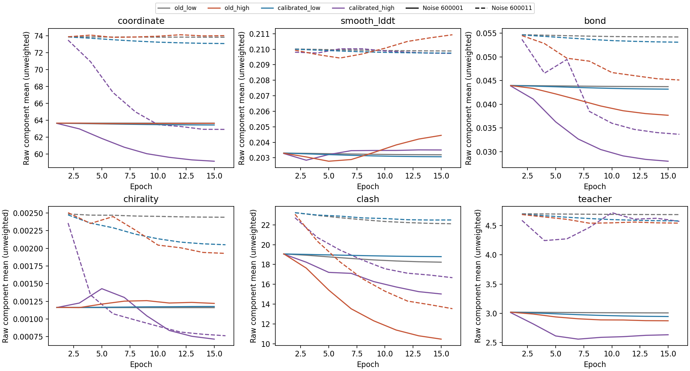

# 配比 × 学习率：TRAIN128 固定预算结果

2026-09-30。三组新增训练、终点审计、完整 TRAIN 配对评价均已完成。
**这次干预改变了实际输出，但没有建立稳健的全原子质量与化学有效性联合收益。**
本批按原预算收口，不追加 LR、epoch、候选或验证集筛选；部署目标仍未达到。

协议：[训练比较](mini_diffusion_recipe_scale_v1.md)、[终点评价](mini_diffusion_recipe_evaluation_v1.md)。
机器可读结果位于 `reports/mini_diffusion_recipe_scale_2026-09-30/`。

## 执行与可核验范围

- 原生公开 Mini 初始化，冻结 ESM2/四轮 Pairformer，保持 C4/S1。
  三臂均只训练835,584个 rank8 diffusion 适配参数；与旧低 LR 对照的初始张量完全一致。
- 复用 old_low＝上一轮 GT＋S2 的固定512终点；新增 old_high、calibrated_low、
  calibrated_high。两轴分别为原/标定配比与整个 LR 日程的1×/10×，没有继续训练旧终点。
- 同128条 TRAIN、2048次样本曝光、512次更新、累积4、两枚原训练噪声；
  曝光顺序相同。原1613个基础参数张量保持不变，所有112个Adam状态均到512。
- DiamondHill 三GCD并行墙钟640.99秒；old_high635.50秒、calibrated_low605.27秒、
  calibrated_high637.23秒，单臂峰值显存5.313GiB。全部进程退出0。
- 八GCD终点预测41.54秒；CPU评分27.53秒。六模型×128蛋白×2噪声＝1536份结果，
  新预测768次，另80次工程重放NFE。只统计缓存conditioning下的diffusion成本，
  不能解释成完整 ESM＋C4 推理延迟。
- 原生、零适配、加载/合并重放通过；AA/CA的独立dense分块复算最大差4.44e−16。
  768份复用对照的全部评分与旧TRAIN归档一致。9项指标、5种因素对比的独立CSV复算
  最大差1.78e−15。新旧配置兼容性通过旧4096曝光/1024更新审计；相关单测7项通过。
- **未重新评价已揭晓的32验证蛋白。** 所有结论都是训练集拟合证据；无新泛化结论。

## 共享指标，不比较不同配方的总 loss 数值

先在每条蛋白内平均两枚噪声，再计算质量均值；几何计数为256个实例累计。
“零严重碰撞＋严格所检手性”仅覆盖现有检查集合，不等于全面化学正确或设计通过。

| 输出 | AA-lDDT | Cα-lDDT | 严重碰撞总对数 | Cα/侧链所检错误中心 | 零碰撞＋严格所检手性 |
|---|---:|---:|---:|---:|---:|
| 原生 S1 | 0.801185 | 0.878790 | 8144 | 208 / 132 | 107/256 |
| 原生 S2 | 0.814057 | 0.891691 | 2359 | 68 / 60 | 137/256 |
| old_low | 0.801301 | 0.878946 | 8060 | 207 / 133 | 107/256 |
| old_high | 0.800168 | 0.879124 | 6310 | 200 / 125 | 130/256 |
| calibrated_low | 0.801436 | 0.879172 | 8015 | 210 / 131 | 106/256 |
| calibrated_high | 0.801327 | 0.880655 | 5834 | 171 / 84 | 123/256 |

两枚噪声均满足该有限几何组合：原生S1/old_low/calibrated_low为42/128，
old_high/calibrated_high为51/128，原生S2为58/128。
总碰撞减少不能掩盖新失败；未放宽旧碰撞、所检手性或GT精度口径。

## 两轴确实需要分开解释

下表为蛋白配对AA均值差，95%区间来自固定两噪声下的10000次蛋白bootstrap。
区间是描述性的，未作多重比较校正，不用于泛化或部署宣称。

| 对比 | AA均值差 | 95%区间 |
|---|---:|---:|
| old_high − old_low | −0.00113329 | [−0.00177886, −0.00046272] |
| calibrated_high − calibrated_low | −0.00010858 | [−0.00116629, +0.00144943] |
| calibrated_low − old_low | +0.00013474 | [+0.00005586, +0.00023578] |
| calibrated_high − old_high | +0.00115945 | [+0.00014500, +0.00258388] |
| 两轴交互 | +0.00102471 | [+0.00005310, +0.00236702] |

配比改变缓解了旧配比在高LR下的AA损失，但不能据此称为追回原生S2的质量。
B/R/T三个权重同时改变，不能把结果单独归因于其中一个。

相对原生S1，calibrated_low仅提高AA **0.00025110**，约为原生S2−S1均值差的2%；
92/128条改善，几何组合通过数却略降。calibrated_high AA差为 **+0.00014252**，
区间[−0.00099416,+0.00179698]，中位数 **−0.00081550**，仅47/128条改善；
配对最差5%均值为−0.00828076。全部配置没有蛋白均值AA下降超过0.05，
但这不等于不存在有意义的退化。

calibrated_high在原零严重碰撞输入上新增5例：5KL9/600001、6KYS/600001、
6KYS/600011、4JA8/600011、5Z2U/600001；10例失去原有严格所检手性。
old_high没有新严重碰撞，但8例失去严格所检手性；其AA均值相对原生S1降低0.00101693。
原生S2本身也有15例新碰撞、16例失去严格手性，因此仍不能当作干净化学标签。

事后描述性案例：2V66的calibrated_high蛋白均值AA提高0.080822，是本臂最强收益。
在600011上AA0.387855→0.490794、严重碰撞249→151、Cα错误8→3；仍远未化学有效，
S2对应AA0.646899、碰撞12。该例没有被追加训练或单独选作成功案例。
其较大收益与本臂负的中位数并存，不能把微小正均值描述成多数目标改善。

## 这次不再能简单归结为“参数几乎没动”

| 臂 | 裁剪更新/512 | 合并ΔW/基础W的总Frobenius比 | 对raw重原子对齐RMS均值 |
|---|---:|---:|---:|
| old_low | 472 | 0.00018784 | 0.01520 Å |
| old_high | 460 | 0.00176375 | 0.32183 Å |
| calibrated_low | 15 | 0.00028884 | 0.05293 Å |
| calibrated_high | 9 | 0.00324218 | 0.70606 Å |

对齐位移是事后描述，不新增位移验收门槛。calibrated_high对raw的未对齐重原子RMS
均值为1.05623Å，对齐后最大仍14.36972Å（2V66/600011）；不能把所有变化解释为刚体漂移。
它的实验GT对齐Cα RMSD均值4.62470→4.39821Å，观测GT键RMSE均值0.22009→0.16691Å，
说明部分结构/几何量确实改善；这些改善不能替代AA-lDDT、尾部和逐例化学检查。

同噪声epoch1→15，calibrated_high的坐标MSE63.64188→59.15777、
S2坐标MSE3.01287→2.63426；smooth-lDDT损失0.203279→0.203507并未同步改善。
old_high的碰撞项19.06966→10.46983，而坐标MSE63.66586→63.63995变化很小。
这些轨迹与最终指标一起支持“优化取舍仍不理想”，不证明某个损失项或rank是唯一原因。
裁剪频率下降本身不是质量保证，也不证明旧裁剪算法有bug。

原始分项曲线（实线/虚线分别为两枚固定噪声；不是加权总loss）：

## 收口与下一步边界

1. 这组比较完成并停止；不自动继续加LR/epoch，也不在旧验证32上挑配置。
2. 保留“标定低LR小幅质量收益”和“高LR部分几何改善”两项结果，同时保留全部退化。
   当前没有足够联合收益来直接扩成部署方案或大规模训练。
3. 后续需要重新审视结构监督与原生能力保持的对应关系；本批支持讨论这一方向，
   不足以定罪某一个权重、认定rank不足，或重新打开已收口的backward排错。
4. 任何下一版都继续保留GT、严重碰撞、所检手性与配对尾部，并在新预测前锁定协议。
   新独立确认集只在有值得确认的候选方法后使用，不拿旧已揭晓验证集循环调参。

当前结果没有建立完整soft-sequence设计效用；本批使用冻结conditioning进行适配训练，
也没有重新认证实时ESM＋C4的序列端到端梯度。合并后单步结构调用保持，但整体目标未完成。

## 产物与备份

DiamondHill训练：`/media/PM982/onestepfold/diffusion_recipe_scale_v1_20260930`。
评价：`/media/PM982/onestepfold/diffusion_recipe_evaluation_v1_20260930`。
所有训练、推理、评分和分析控制进程均已正常结束。

本地报告目录包含summary、逐预测CSV、配对统计、因素交互、参数/坐标效应、
控制重放审计与所有产物的SHA清单。训练归档160成员（33,905,015字节），
评价归档1991成员（103,910,025字节，分三片）；全部2151成员在本地逐个核对哈希。
终点/初始适配参数、优化器状态、曲线、全部坐标及运行源码均已归档；
大型共享conditioning/结构来源不重复打包，仍由既有哈希和远端路径绑定。
