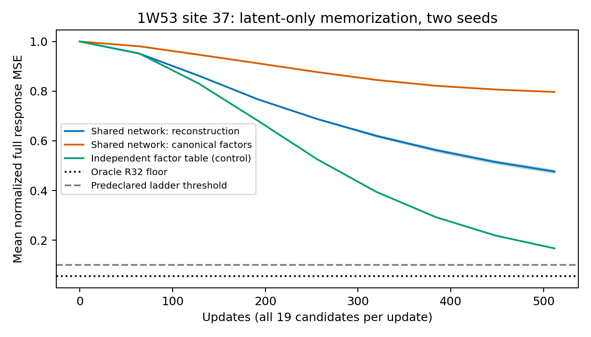
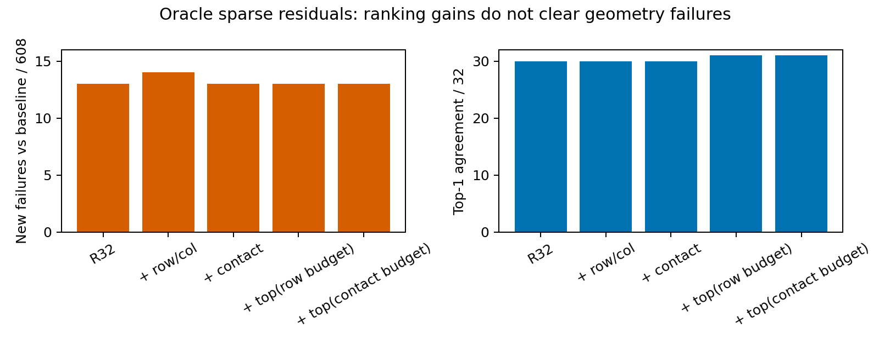

# Factor 学习诊断与 R32 残差补丁：本批完成，未晋升新模型

**这次结果收紧了两个假设：规范 SVD-factor 监督没有改善当前网络的拟合；少量局部／最大幅度残差没有消除 R32 的新增几何失败。**
原重建监督在单个位点上确实学到了部分 AA-specific 响应，不能再简单描述为完全停在零响应附近；但仍没有充分记住这 19 个 teacher。本批在预定第一档停止，未追加旧训练、未进入多蛋白阶梯、未训练更大网络或 Δs predictor。

协议：[mini_factor_learnability_v1.md](mini_factor_learnability_v1.md)。
全部机器结果、锁、逐候选数据、审计与图：[reports/mini_factor_learnability_2026-10-02](../reports/mini_factor_learnability_2026-10-02)。
上一批 `946b4287` 的 teacher、模型、几何定义及失败记录不变。

## 1. 执行范围与停止规则

两个独立问题，均复用既有 hard teacher，不新跑 ESM/C4：

1. **可学习性**：TRAIN 的 1W53，第 37 位（长度 84），全部 19 个非 WT 替换；两枚初始化种子。仅 latent/factor 监督，不使用 S1、坐标或几何损失。
2. **表示残差**：原 8 条验证蛋白、16 位点、304 个 hard mutant、两枚既有噪声 230201/230211；固定 native S1，oracle target s、WT s_inputs、原生 target chemistry。

第二组现在用于表示开发，**不再是全新的独立验证**。608 个 mutant/noise 输出来自 8 条蛋白，不是 608 个独立蛋白。其任务分数仍是固定父实验骨架的 Cα Huber 代理，不是实际突变效应、设计收益或 binder 效用。

单个位点固定 512 次更新，每次覆盖全 19 AA，共 9,728 次候选曝光；两网络方案的初始化、网络、优化器及曝光完全相同。后续阶梯仅在至少一个网络方案的两枚种子均达到平均完整 Δz NMSE≤0.1 时启动。本批没有满足，因此 1 蛋白×2 位点、4 蛋白、16 蛋白均**未执行**。0.1 是本次诊断的预登记推进条件，不是化学验收阈值。

旧训练每次只采一个候选，且涉及多个蛋白和 decoder loss；因此不能把本批误差下降与旧训练曲线直接当成等预算方法优势。

## 2. 单个位点：重建监督学到了部分响应，规范因子监督更弱

NMSE 先对每个候选的全部 pair entries/channels 求平方误差与 teacher Δz 平方范数之比，再对 19 个候选平均；保留原 1e-6 均方分母下限。

| 方案 | 种子 231301 | 种子 231303 | 参数量 | 含义 |
|---|---:|---:|---:|---|
| 初始零响应 | 1.0000 | 1.0000 | — | 起点 |
| 原网络＋Δz 重建监督 | **0.482930** | **0.469503** | 1,598,592 | 学到部分响应，未充分拟合 |
| 原网络＋规范因子监督 | 0.796304 | 0.797248 | 1,598,592 | 本配置没有解决拟合问题 |
| 独立自由因子表＋重建监督 | 0.166799 | 0.167076 | 13,074,432 | 优化可行性对照，仍未达到 R32 上限 |
| Oracle R32 | **0.055136** | 同一 teacher | — | 当前 rank 的参考误差下限 |

两网络均为原 width128、两层 FactorStudent，从新初始化开始，AdamW lr3e-4、weight decay1e-4、eps1e-8、梯度裁剪1。自由因子表从对应未训练网络的 U/V 输出初始化，独立优化每个候选的全部因子，lr0.01、无 weight decay。它参数更多、学习率也不同，**不能把它与共享网络的差异单独归因于 capacity 或 gauge**，更不是可部署预测器。

曲线在固定终点仍在下降。未做收敛证明，也没有证明给定网络永远不能拟合。当前证据支持的是：**这份固定预算下，单个位点仍有显著拟合缺口；直接换成规范因子监督没有带来预期改善。** 不据此重新怀疑已审计的 Mini backward，不追加步数寻找一个过线结果。

### 不是仅学到了“所有替换共用一个响应”

把所有 teacher 响应替换为它们的精确均值，NMSE 为 **0.765491**。原重建监督已明显低于这个 oracle 共同均值基线。

将预测与 teacher 分别去掉跨 AA 均值，独立复算 AA-specific 响应的平方误差／teacher 中心化能量：

| 方案 | 中心化响应相对平方误差，两种子 | 预测中心化能量／teacher |
|---|---:|---:|
| 重建监督 | 0.578465 / 0.565568 | 0.386565 / 0.398883 |
| 规范因子监督 | 0.829237 / 0.830790 | 0.193073 / 0.188928 |
| 自由因子表 | 0.227839 / 0.228143 | 0.712084 / 0.711697 |

这些是已有终点的描述性分解，没有用于选择 checkpoint。它们说明原网络对 AA-specific 变化有学习，但还远未恢复完整响应；不是一般排序效用或跨蛋白迁移结论。

## 3. 规范因子监督实现及其边界

每个 candidate/channel 做 FP64 SVD，奇异值降序；以左奇异向量绝对值最大元素为正，同时翻转对应右向量。构造平衡因子 P√Σ、Q√Σ。

原 `expand_pair_factors` 计算 UVᵀ/√R，因此监督因子乘以 R^(1/4)，保持原数学映射与网络不变。没有遗漏尺度，也没有改旧 student。

保留方向中，相邻奇异值相对间隙小于 1% 的连续块使用**两个因子共同的正交 Procrustes 对齐**；旋转在 loss 计算中 detached，联合旋转保持矩阵乘积。共计 3,018 个多向量块、6,082 个向量。19×128 个谱中有 **162 个**在第32/33方向间仍小于1%，这些截断边界没有被声称完全规范化。

规范因子 loss 从约1.002降至0.719/0.721，但 Δz NMSE 仍约0.797。反过来，重建监督的矩阵误差明显下降，其规范因子误差却上升到约2.12：有效矩阵拟合与指定因子坐标系拟合并不是同一个目标。

这次处理了确定符号、尺度和保留子空间内的近简并旋转；**没有证明这种因子标签跨 AA／蛋白平滑，也没有消除所有截断边界不稳定性**。因此结果不等于所有 factor supervision 都失败，但不支持将它自动晋升为下一训练目标。Gauge freedom 是数学性质；“它是旧 pilot 的主要原因”仍未获得因果证明。

## 4. R32＋少量残差：排序有微小收益，几何没有闭环

所有重建替换整个 z，s 仍为完整 target s。残差是 exact hard Δz 减去逐 channel 的 FP64 SVD R32。四种掩码在运行前固定：

- **row/col**：突变行与列的并集，2L−1 个 directed entries。
- **contact**：WT 第一枚噪声预测中，距突变 Cα≤8Å 或序列距离≤2 的残基集合 N，保留 N×N。
- **top(row budget)**：按 exact teacher residual 的跨 channel 平方范数选前2L−1个条目。
- **top(contact budget)**：同样排序，条目数匹配 N×N。

每个选中条目保留全部128channel。后两者读取真实 residual，是 oracle 存储上限，**不是能从 WT 直接获得的选择器**。没有按解码结果挑掩码、增加预算、合并掩码或选择每例赢家。

| 表示 | Δz NMSE | 平均表示／dense Δz 字节 | Spearman | Top1 /32 | 局部 RMSD均值 Å | 相对 baseline 新增几何失败 /608 |
|---|---:|---:|---:|---:|---:|---:|
| R32 | 0.063963 | 50.81% | 0.994518 | 30 | 0.043905 | **13** |
| ＋row/col | 0.063476 | 52.42% | 0.994627 | 30 | 0.043496 | **14** |
| ＋contact | 0.063214 | 51.52% | 0.994682 | 30 | 0.042548 | **13** |
| ＋top(row budget) | 0.058586 | 52.42% | **0.995669** | **31** | **0.041012** | **13** |
| ＋top(contact budget) | 0.060914 | 51.52% | 0.994846 | **31** | 0.042927 | **13** |

储存量含 FP32 因子2LCR、稀疏值及每条目8字节索引，不含共用 WT z／oracle s。与旧50位点面板的22.58% R16或45.16% R32不可直接互换：当前蛋白更短。所有补丁仍需要展开 dense z 再调用 S1，没有测得端到端加速。

全部补丁仍无局部 RMSD>1Å；但 contact 的最大局部 RMSD 从R32的0.5894Å升至0.6457Å，top(row budget)降至0.4930Å。不是所有结构指标随补回更多精确条目单调改善。

top(row budget)相对R32的蛋白均值 Spearman变化为+0.001151，8蛋白重采样95%区间[+0.000053,+0.002138]。这是重复使用开发面板上的描述性结果，不构成一般泛化或部署优势。

### 净失败数相同，不代表失败身份相同

| 补丁 | 修掉原13个新增失败中的多少 | 新破坏原R32通过实例 | 其中baseline也通过 |
|---|---:|---:|---:|
| row/col | 1 | 2 | 2 |
| contact | 1 | 1 | 1 |
| top(row budget) | 1 | 3 | 1 |
| top(contact budget) | 1 | 1 | 1 |

R32 的13个新增失败中，8个仅严重碰撞失败、4个仅所检手性失败、1个两者都有；分布在5条蛋白。这里的几何条件一直是“零严重碰撞＋严格所检手性”，不是全面化学有效。Baseline本身仅360/608通过，不能把13个新增失败当作全部不合格输出。

本批只否定了**这些固定预算与选择规则足以解除残留几何问题**的期望，没有否定所有 sparse correction。也没有证据把残余问题直接指定为某个高频方向或特定算子缺陷。

## 5. 执行、验证与归档

DiamondHill MI250：六个memorization任务并行阶段79.56秒；每任务44.75–65.73秒，峰值已分配显存0.79–0.91GB。512×19候选曝光／任务，拟合 S1/C4均为0。

Sparse oracle GPU阶段240.02秒，8worker全正常退出；4,272次S1、0次C4/ESM。CPU评分40.01秒。两批控制器合计365.02秒，不含准备、后续独立审计、传输和报告。没有把共享CPU/GPU墙钟解释成公平加速基准。

验证包括：

- 11项相关测试通过：尺度、配对符号、简并旋转、有限梯度、mask预算及旧factor/spatial资产。
- 六份最终checkpoint重新推理，独立矩阵乘积／FP64 NMSE与记录最大差1.13e-7；角色及阶梯停止规则核对通过。
- 312份坐标包、920个旧参考数组（含原R32）逐位一致；768项排序与regret独立复算；112项独立AA-lDDT完全一致。
- 304个contact掩码与储存量核对；每条蛋白一个预定案例，共8例 NumPy CPU SVD独立复算最高幅度mask及NMSE，最大误差8.8e-14。
- 完整teacher哈希、代码快照、协议锁、六份最终checkpoint及原始输出保留。审计脚本是独立后处理，未修改运行中的代码快照。

本机：`/home/husrcf/Code/onestepfold_runtime/factor_learnability_v1_20261002`。
DiamondHill：`/media/IntelSSD/onestepfold/hpc3_mirror_20261001/Folding/factor_learnability_v1_20261002`。
全conditioning继续存放在上一批 `factor_student_pilot_v1_20261002`，没有重复生成。Git中包含报告、逐例指标、审计与哈希；大坐标／权重位于上述runtime目录。

## 6. 决策

**本批收口，不晋升规范因子监督或稀疏补丁，不启动16→8泛化训练。**

可以保留的正面证据是：当前共享网络在单个位点上能学到一部分真实、AA-specific的响应；R32空间表示仍有较强oracle功能保真。没有成立的是“换成规范因子监督即可拟合”和“少量局部／大幅度残差即可补掉几何失败”。

后续若继续，应把明确的容量／pair-content干预作为新的小规模拟合对照，与本次重建监督基线匹配；不能把本次结果当作已经证实缺少pair-content就是原因。当前证据仍不能分离优化设置、有限训练预算、共享网络容量与输入使用方式。没有自动追加训练、重开AA轴压缩或进行序列设计。
