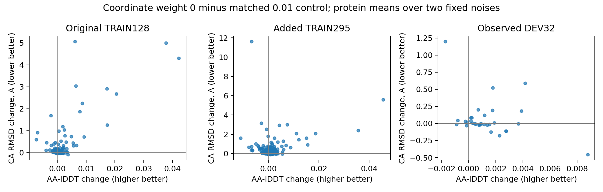

# C4/S1 坐标项消融：终点结果与下一步

本轮完成。**去掉全局对齐坐标损失，提高了局部距离精度并减少严重碰撞，
但付出了全局坐标精度代价。保留为候选，不替换研究参照，不追加权重网格。**
主线仍是 C4/S1 折叠，BindCraft、突变搜索和输出修复均未重启。

## 实验与验收范围

相同的预训练 Mini-ESM、retained512 起点、423 条 TRAIN、样本顺序、噪声、
优化器及 2048 更新／8192 次曝光；唯一干预是实验 GT 全局对齐坐标项权重
从 0.01 改为 0。不是从零初始化。GT 局部距离、化学监督以及原生 S2 辅助
监督保留；S2 预测不是实验真值。冻结 ESM2 与 C4 conditioning，只训练
288 个 diffusion 参数张量，推理仍 C4/S1/K1、原生 FP32。

455 条蛋白 × 两枚固定噪声 × 五种输出，共 4550 份完整评分。只新增候选
910 次预测及 32 次工程重放，四组旧预测复用。训练、审计、准备、八卡预测、
评分及汇总的 13 个作业均 COMPLETED 0:0。训练约 85.2 分钟。
独立稠密距离实现与主 lDDT 评分最大差 4.44e-16。

所有模型对同一实验 GT、原子对应和观测 mask 评分。每个蛋白先取两枚噪声
均值，再做蛋白级汇总／bootstrap，不选最优噪声或中间 checkpoint。
32 条已观察 validation 此时是 **DEV32**；排除于训练，但不再是全新确认集。

## DEV32 的完整比较

|输出|AA-lDDT|Cα-lDDT|Cα 对齐 RMSD，Å ↓|零严重碰撞且所检手性全对 / 64|两噪声均满足 / 32|严重碰撞总数|
|---|---:|---:|---:|---:|---:|---:|
|原生 C4/S1|0.815917|0.899536|3.489204|30|9|902|
|保留起点 retained512|0.817664|0.902912|3.461940|46|20|562|
|匹配 TRAIN423，坐标权重 0.01|0.818402|0.902915|3.453734|44|20|540|
|本轮 TRAIN423，坐标权重 0|**0.819737**|**0.905059**|3.521401|45|22|451|
|原生 C4/S2 参照|0.828004|0.910778|3.412233|37|15|353|

候选减匹配控制：

- AA-lDDT **+0.001334**，95% CI **[+0.000729,+0.002046]**，26/32 蛋白提高。
- Cα-lDDT **+0.002144**，CI **[+0.001249,+0.003255]**。
- RMSD **+0.067667 Å**，CI **[−0.015687,+0.174349]**，15/32 增加。
  平均差区间跨零，不能称 DEV 上显著全局退化，也不能称已证明不劣。
- 配对 AA 最差 5% 均值 −0.001302；无蛋白 AA 下降超过 0.05。
- 配对 RMSD 最差 5% 增量均值 **+0.894349 Å**。这是配对差上尾，
  不是两组绝对最差 5% 均值之差。
- 相对控制，新增 1 份原本零严重碰撞的失败、1 份原本严格手性通过的失败。
  总碰撞数下降并不表示逐例无损。几何条件只覆盖当前显式检查，不等于全面化学正确。

相对 retained，候选 AA +0.002072、Cα +0.002147，区间均正；但 RMSD
+0.059461 Å、新增严重碰撞 4 份、手性失败 1 份。相对原生 S1，AA +0.003820；
相对 S2 仍差 **−0.008267**，CI [−0.012280,−0.004771]。
不能据此宣称一步已经追回两步质量。

## 训练集说明这个取舍不是一个 DEV 偶然点

|候选减匹配控制|AA-lDDT Δ|Cα-lDDT Δ|RMSD Δ，Å|RMSD 增加的蛋白|严重碰撞：控制→候选|
|---|---:|---:|---:|---:|---:|
|原 TRAIN128|+0.001744|+0.002917|**+0.358695**|102/128|3874→3036|
|新增 TRAIN295|+0.000607|+0.001493|**+0.296397**|244/295|5796→4644|
|DEV32|+0.001334|+0.002144|+0.067667|15/32|540→451|

两个 TRAIN 队列 RMSD 增量区间分别为 [+0.216997,+0.522711]、
[+0.210066,+0.406919] Å。原 TRAIN128 有 62 条、新 TRAIN295 有 121 条、
DEV32 有 11 条同时发生 **AA 提高与 RMSD 变差**。lDDT 的局部距离收益
不能替代全局坐标质量。

几个描述性极端例子：新增 TRAIN 的 5TO5 RMSD +11.621864 Å，而 AA
−0.006677；5OI7 AA +0.045562、RMSD +5.591001 Å。DEV 的 3U59
RMSD +1.198920 Å，1QEX AA +0.004173 同时 RMSD +0.589778 Å。
这些是已完成结果中的事后定位，不是新独立试验，也尚不能单凭指标命名为拓扑翻转。
逐蛋白、逐噪声配对表全部保留，不只展示这些例子。

## 结论与后续边界

这轮支持“原配方的全局坐标项与局部距离学习存在取舍”，不支持“坐标监督
没有价值”或“全部问题都是参数化错误”。坐标项对 TRAIN 全局结构有明确保留
作用；简单删除不是全指标改进。因此：

1. 本轮停止于锁定终点，候选与控制都保留，不修改默认模型，不选中途探针，
   不直接开始坐标权重扫描，也不因 TRAIN lDDT 改善无限续训。
2. 下一项方法决策先针对**局部精度与全局保持如何兼顾**。可先用已保存输出
   区分最坏 RMSD 变化来自少数位置还是广泛结构重排；不需要再做前向或 backward
   排错。该分析用于选择下一种监督形式，不把事后坏例子改成确认集。
3. ESMC 是另一个独立候选接口方向。455 条配对特征已就绪，但尚未做接口拟合
   或 C4/S1 结构比较。应只用 TRAIN 拟合，固定折叠权重和预算后与原生 ESM2
   比较，不把本轮损失改变与接口改变混在一起。不能从 ESMC 的一般表示能力
   推定它直接替换后必然提升当前 Mini。
4. 已新增的 11 条隔离来源继续保留，尚未组成或运行新的确认面板；不能称
   已补齐 32 条。当前数据仍 423 TRAIN，不是 29.7k 训练。

没有新的训练或 ESMC 折叠作业在本轮收尾时启动。部署状态仍未通过；当前收获是
一个明确、可核验的目标函数取舍，下一轮不再把“局部 lDDT 涨了”单独当作成功。

## 证据与复核

[完整机器生成报告](../reports/mini_folding_coordinate_evaluation_2026-09-30/final/report.md)、
[逐蛋白 AA/Cα 配对 CSV](../reports/mini_folding_coordinate_evaluation_2026-09-30/final/paired.csv)、
[RMSD 配对与尾部](../reports/mini_folding_coordinate_evaluation_2026-09-30/final/global_structure.json)、
[本地独立算术复核](../reports/mini_folding_coordinate_evaluation_2026-09-30/final/local_acceptance.json)。

远端：`/data/user/shuang886/Folding/folding_coordinate_evaluation_v1_20260930`。
本地 `final/` 同时保存所有逐例标量与化学记录（gzip），完整连接分布仍保存在
远端 hash-bound `evaluation.json`。已核对 12 个归档文件哈希、8 项报告输入哈希、
4550 个唯一输出身份、全部模型均值／碰撞计数，以及 2730 条质量配对和
2730 条 RMSD 配对。此本地复核是评分产物的独立算术检查，不冒充坐标重评分。

候选终点 SHA256：`b5870d959a5ddcf3e85d6008fb3c41db95bace7578ae5000084809c0335c4312`。
训练锁：`81ee94ffddaacf4d9881d01d4e2b98d308ee151d20a0838e520aa1c815f684ea`。
评估锁：`65a1849e3fe9baab572d685a0cb782d7956e6c8d659d92619175ce3bc7f6255b`。
评分：`774ef171b8e69795e06f038c2caf8baa4413e4ab625b57b0f09ede4c334762ec`。
