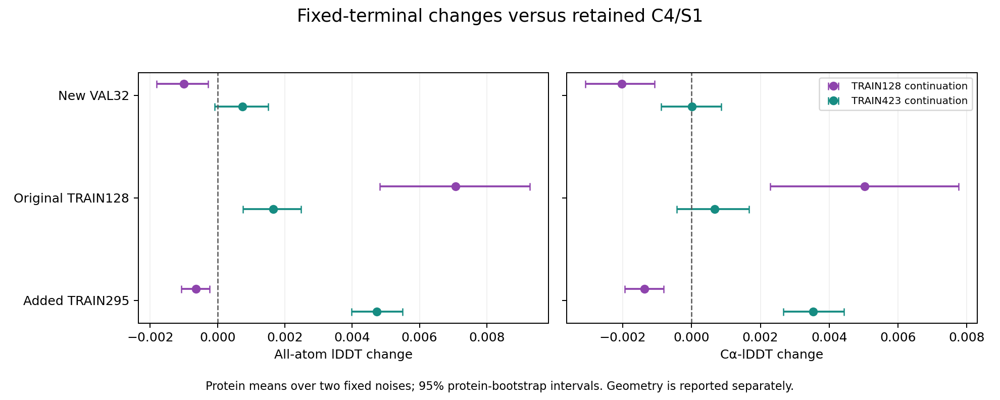

# C4/S1 折叠训练终点：扩展数据减轻退化，尚未超越保留模型

**本轮完成，不升级默认模型。** 相同新增更新预算下，TRAIN423 在新 VAL32 上
优于 TRAIN128；但相对已有保留 checkpoint，平均精度提升尚不明确，并产生新增
几何失败。TRAIN128 的训练集收益没有转化为验证集收益。下一阶段继续围绕折叠
质量改进，不回到 BindCraft、突变搜索或 backward 排错。

## 已完成与评测范围

两组从同一个已有 full-diffusion512 checkpoint 出发，固定 ESM2、C4/S1/K1、
采样规则和损失，各新增2048次更新、8192次蛋白曝光，优化器重置。仅训练原生
diffusion 的288个张量、69,777,841参数。不是从零训练，也不是30k训练。

两组训练、独立训练验收、8个预测分片、评分和报告作业全部 COMPLETED0:0。
共455个蛋白、4550份预测；实验GT原子身份、坐标、掩码和输出哈希得到核对。
AA/Cα-lDDT 独立距离复算最大绝对差为4.44e−16。每个蛋白先平均两枚固定噪声，
再计算配对统计及10,000次蛋白重抽样区间；没有 best-of-noise 或中途选 checkpoint。

新VAL32与当前修正方法开发来源按锁定规则隔离，但不能声称排除了基础模型预训练
接触。31条来自同源多聚体的完整单链，只有1条长度超过511残基。结论不代表
复合物、广泛长链或所有蛋白。该面板现在已经揭晓；若以后复用，只能作为开发比较，
不能再次称为全新独立确认。

## 新 VAL32 的主要结果

|模型|AA-lDDT|Cα-lDDT|零严重碰撞且所检手性全对|两枚噪声均满足，蛋白|严重碰撞总数|
|---|---:|---:|---:|---:|---:|
|原生 C4/S1|0.815917|0.899536|30/64|9/32|902|
|原生 C4/S2 参考|0.828004|0.910778|37/64|15/32|353|
|保留 checkpoint|0.817664|0.902912|46/64|20/32|562|
|TRAIN128 终点|0.816664|0.900883|42/64|18/32|523|
|TRAIN423 终点|0.818402|0.902915|44/64|20/32|540|

三个关键配对比较：

|比较|AA均值变化与95%区间|Cα均值变化与95%区间|
|---|---|---|
|TRAIN423 − TRAIN128|+0.001739 [0.000876, 0.002794]|+0.002032 [0.001070, 0.003189]|
|TRAIN128 − 保留模型|−0.001001 [−0.001803, −0.000281]|−0.002029 [−0.003088, −0.001084]|
|TRAIN423 − 保留模型|+0.000738 [−0.000080, 0.001503]|+0.000003 [−0.000888, 0.000863]|

因此，可以说本次扩展组优于继续集中训练128条；不能说扩展组已经明确超越起点，
也不能把跨零区间解释成两者严格等价。扩展组相对原生S1仍有AA +0.002485的
正向区间，但这不等同于本轮新增训练相对已有保留模型的增益。

几何也没有一致改善。两组相对保留模型均在6份原本零严重碰撞的预测中引入碰撞；
TRAIN128新增4份所检手性失败，TRAIN423新增1份。总碰撞数下降与新增失败可以
同时发生。零严重碰撞加所检手性也不是全面化学正确。

新VAL上两组相对保留模型都没有蛋白均值AA下降超过0.05，但尾部并非无损：
TRAIN423的配对AA P01约−0.005954，worst5%均值约−0.005071。完整逐噪声、
配对尾部、长度分层及几何表保留在机器生成报告中。

相对原生S2，TRAIN423的AA仍低0.009601，95%区间[−0.013642, −0.006038]。
当前并未补齐第二步的质量差距；S2仍是参考，不改变C4/S1部署目标。

## 训练收益与未见蛋白收益需要分开

|数据集合|TRAIN128相对保留模型 AA变化|TRAIN423相对保留模型 AA变化|
|---|---:|---:|
|原TRAIN128|+0.007065|+0.001658|
|新增TRAIN295|−0.000644|+0.004734|
|新VAL32|−0.001001|+0.000738|

TRAIN128在其训练集上提高、在两组未用于该臂训练的蛋白集合上下降，与过拟合
或能力保持不足相容。新增295条对TRAIN128臂仍使用固定TRAIN噪声，因此不能把
所有未见蛋白的退化都简单归给VAL噪声不同；但本轮没有完全分离序列与噪声效应。
扩展组在新增训练样本上确有收益，不能称为模型完全没有学习。

两组具有相同更新和总曝光，不具有相同单蛋白曝光或计算时间。TRAIN128各样本
新增64遍，TRAIN423为19–20遍；训练分别约77和104分钟。起点此前也只训练过原
128条。因此，这不是独立控制了所有因素的纯数据量因果实验。

## 下一步收敛为一个损失对照

不继续延长TRAIN128、不自动延长TRAIN423，也不把该结果解释成需要修复反向传播。
已有[保存坐标审计](mini_folding_tail_objective_findings_2026-09-30.md)表明，在一个
真实TRAIN退化案例中，全局对齐坐标项的下降能够抵消局部精度与几何项的恶化。
本轮又显示训练收益与验证收益分离。它们支持检验目标权衡，但没有证明该项就是
泛化退化的唯一原因。

下一项采用一个有界、单因素诊断：从同一保留起点、相同TRAIN423顺序/噪声和
2048更新预算出发，仅把实验GT的全局对齐坐标项系数从0.01设为0，其他损失、
优化器、采样、冻结范围均不变。直接移除该项比围绕1MV8搜索一个“刚好有效”的
系数更易解释。真实GT的smooth-lDDT与化学标签继续提供监督，原生S2仍只作为
辅助保持目标；不是把实验真值换成教师坐标。

这项消融已通过匹配预检并启动训练662470，尚无训练后质量结论，也不保证移除坐标
项会更好。见[单因素协议](mini_folding_coordinate_ablation_v1.md)与
[启动记录](mini_folding_coordinate_ablation_status_2026-09-30.md)；复用本轮冻结TRAIN423终点作
对照，不重跑同样的控制训练。当前VAL32只能用于明确标注的后续开发比较；任何
进一步保留的模型仍需新的独立确认。ESMC特征已就绪，接口比较留待此单因素
问题明确后单独开展，不同时改变条件模型与损失。

本轮默认研究参照仍为保留checkpoint；无部署、设计效用或全原子0.9放行。

## 产物

- [完整机器生成报告](../reports/mini_folding_evaluation_2026-09-30/final/report.md)
- [逐蛋白、逐噪声配对CSV](../reports/mini_folding_evaluation_2026-09-30/final/paired.csv)
- [哈希与来源记录](../reports/mini_folding_evaluation_2026-09-30/final/provenance.json)
- 分层机器数据为同目录`cohorts.json.gz`，无损压缩前SHA与来源记录一致。
- 完整419MB逐预测结果及坐标留在HPC3：
  `/data/user/shuang886/Folding/folding_scale_evaluation_v1_20260930`。
- 评分662322耗时2m11s，报告662360耗时5s。评测新增2922次预测NFE和80次
  工程探针NFE，复用缓存C4条件；这不是实时ESM/Pairformer的端到端延迟测量。
