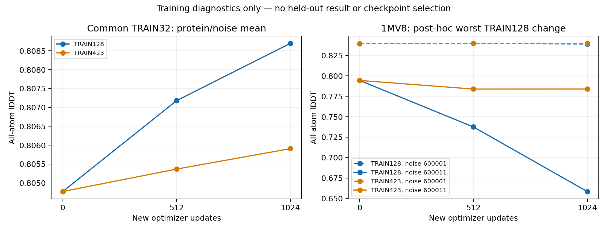

# TRAIN128 versus TRAIN423: training complete, evaluation running

This is the folding mainline, with ESM2 and C4/S1/K1 fixed. BindCraft/interface
work remains deferred; ESMC is a later matched conditioner-interface comparison.
The scientific protocol is [folding scaling cycle v1](mini_folding_scaling_cycle_v1.md).
Both training jobs and their independent execution audit have completed. The
fixed-terminal evaluation has started; new held-out quality is not yet available.

## Both fixed terminals passed execution audit

TRAIN128 job662290 completed0:0 in1h17m08s; TRAIN423 job662291 completed0:0 in
1h43m44s. Audit662294 completed0:0 in21s, confirming2048 updates and8192 exposures
per arm, exact locked sample orders and LR schedule, optimizer step counts and
settings, selected288 tensors/69,777,841 parameters, finite terminal tensors,
checkpoint hashes, all512 saved probe coordinates, and identical initial parameter
fingerprints/predictions. It also checks the training reports' unchanged-excluded-
parameter and no-validation-use assertions. Both remain fixed-terminal candidates,
not promoted models.

|Common original-TRAIN32, two training noises|Start|TRAIN128 terminal|TRAIN423 terminal|
|---|---:|---:|---:|
|AA-lDDT|0.804772891|0.811420360|0.806617040|
|Cα-lDDT|0.885653254|0.890676190|0.886600988|
|Zero severe + strict checked stereo|41/64|52/64|43/64|
|Severe pairs total|394|166|378|
|Proteins with positive mean AA change|—|30/32|28/32|
|Proteins with mean AA change < −0.05|—|0/32|0/32|
|New severe instances from initially zero|—|1|2|
|Lost strict-stereo instances|—|0|1|

The expanded arm changes AA by−0.004803 versus TRAIN128 on this original-TRAIN
probe, with only2/32 protein means positive. Conversely, its worst protein's AA
change from the retained start is only−0.005545, versus−0.047522 in TRAIN128; both
worst cases are1MV8. Mean fitting strength and tail preservation still differ.
TRAIN128 also has one protein-mean Cα loss below−0.05; expanded has none here.
These are training observations, not evidence for or against held-out data scaling.
Original samples receive64 new exposures in TRAIN128 versus19–20 in TRAIN423.

Evaluation preparation662313 completed0:0 in1m12s; first worker662314 completed0:0
in1m16s. The remaining seven workers662315–662321 have all started after that
success; independent GT scoring and reporting follow. No partial validation metrics have
been used for selection. Audit and paired terminal observations are archived in
`reports/mini_folding_training_2026-09-30/terminal/`, including a reproducible
saved-report aggregation script. Expanded terminal SHA256:
`3e6c6e1b1a493215adba31df1106efa9e30218c5f92846f4ca4d2e3a6fd17b09`.

## Earlier observation: TRAIN128 completed before the expanded arm

Job662290 completed0:0 in1h17m08s with2048 new updates and8192 exposures.
The terminal checkpoint SHA256 is
`3cabef69073f4a21aa92c25f7dfafd9ec3816fee53e27af37be1dcd0898a5e84`.
An observation audit verified the training lock, history and checkpoint hashes,
plus all256 saved coordinates across the four fixed TRAIN32 probes for exact
target/noise coverage, hashes and finite values. This is not the still-pending
joint training audit, independent GT rescoring, or new-validation evaluation.

|Common original-TRAIN32, two training noises|Start|TRAIN128 terminal|
|---|---:|---:|
|AA-lDDT|0.804772891|0.811420360|
|Cα-lDDT|0.885653254|0.890676190|
|Zero severe + strict checked stereo|41/64|52/64|
|Severe pairs total|394|166|
|Proteins with positive mean AA change|—|30/32|
|Proteins with mean AA change < −0.05|—|0/32|
|New severe collision instances from zero|—|1|
|Lost strict-stereo instances|—|0|

The previously identified1MV8/noise600011 partially recovers from AA0.658448 at
1024 to0.700772 at2048, but remains below its initial0.794474. Its severe pairs
fall from11 to2; strict checked chirality still fails, as it did initially.
Its two-noise mean AA change is−0.047522. Crossing back above the−0.05 protein-mean
threshold does not remove this substantial single-noise regression. It also shows
why the1024 observation must not be treated as the terminal result.

The report records8448 diffusion calls, no live Pairformer calls (C4 conditioning
is cached), and peak GPU allocation17,370,709,504 bytes. It reports frozen parameters
unchanged and no validation reads; full independent verification awaits audit662294.
TRAIN423 continues to the same fixed update budget; downstream jobs remain queued.
No checkpoint promotion, loss revision or model-interface switch follows from this
training-only result. Evidence and reproducible observation script:
`reports/mini_folding_training_2026-09-30/interim/train128_terminal_observation.json`
and `observe_train128_terminal.py`.

## Matched 1024-update TRAIN probe: mean and tail disagree

Both arms now have the same1024-new-update/4096-exposure probe. All384 saved
coordinate files across both arms and0/512/1024 were checked for hash/finite values
and exact target/noise coverage. The numbers below remain training diagnostics;
the final independent audit and held-out evaluation have not yet run.

|Common original-TRAIN32, two noises|Start|TRAIN128 +1024|TRAIN423 +1024|
|---|---:|---:|---:|
|AA-lDDT|0.804772891|0.808697454|0.805908770|
|Cα-lDDT|0.885653254|0.888008539|0.886087358|
|Zero severe + strict checked stereo|41/64|52/64|41/64|
|Severe pairs total|394|209|396|
|Proteins with positive mean AA change|—|30/32|26/32|
|Proteins with mean AA change < −0.05|—|1/32|0/32|
|New severe collision instances from zero|—|0|2|
|Lost strict-stereo instances|—|0|1|

The apparent mean advantage does not imply uniform quality preservation. In the
post-hoc worst case,1MV8(436residues), TRAIN128 changes AA-lDDT by−0.000269 at
noise600001 and−0.136026 at600011; the protein mean is−0.068147. Cα changes are
−0.002698/−0.168916, mean−0.085807. TRAIN423's mean AA change on that same protein
is−0.005012. This is a saved TRAIN case diagnosis, not a new validation result or
evidence identifying a structural failure mechanism.

Original proteins receive32 new exposures in the128 arm and9–10 in the423 arm
at this update. Larger-data quality cannot be judged from original-TRAIN32 alone.
Do not select a checkpoint, remove1MV8, or change the fixed terminal budget from
this observation. The predeclared held-out paired tails and new damage remain
essential. Compact evidence: `interim/matched_probe1024_observation.json` and
`interim/probe1024_worst_case.json` under the training report directory.

The subsequent [saved-output objective audit](mini_folding_tail_objective_findings_2026-09-30.md)
independently reproduces the RMSD/lDDT numbers. For the declining TRAIN128 noise,
weighted coordinate loss falls1.51348 and outweighs the worsening other terms;
total loss falls0.39450 while AA-lDDT falls0.13603. This is an observed objective
tradeoff, not a causal proof or a new loss experiment. All live settings stay fixed.

## First TRAIN128 probe: modest fitting improvement, new damage remains

At512 new updates, the locked original-TRAIN32 probe (two training noises each)
shows the following paired change. These proteins are used for training, not
validation; no checkpoint selection or budget change follows from this observation.

| Metric | Retained starting point | TRAIN128 +512 updates |
|---|---:|---:|
|All-atom lDDT|0.804772891|0.807179219|
|Cα-lDDT|0.885653254|0.887278297|
|Zero severe pairs and strict checked chirality|41/64|47/64|
|Total severe pairs|394|330|

Protein means improve for29/32 in AA and27/32 in Cα; none has mean AA loss
greater than0.05. Nevertheless,2 previously collision-free instances acquire severe
pairs, and2 previously strict-stereo instances lose that status. Better aggregate
geometry is not uniform preservation or full chemical validity. TRAIN423 has not
yet reached the same512-update probe at this observation, so no between-arm
quality comparison is available.

Both probe reports have exact locked coverage;128 saved coordinate files across
the two timepoints were checked for hashes and finite values. This is an interim
artifact check, not the final independent training audit or GT score recomputation.
Files: `reports/mini_folding_training_2026-09-30/interim/`.

## Evaluation submission and frozen protocol

The fixed-terminal pipeline is implemented and submitted under `acd_u` in a
separate frozen-code root. Training is still running: at the archived observation,
TRAIN128 had407/2048 updates and expanded423 had300/2048, with no reported errors.
These counters do not establish quality improvement.

| Job | Work | Dependency |
|---|---|---|
|662313|bind audited checkpoints and evaluation lock|audit662294|
|662314|first of eight evaluation shards|prepare662313|
|662315–662321|remaining seven evaluation shards|first shard662314|
|662322|scheduler/coverage audit, GT scoring and cohort summaries|all eight shards|
|662360|Markdown report and full paired-quality CSV|completed scoring662322|

At submission, all evaluation jobs were dependency-pending, not completed predictions.
Any failed dependency cancels downstream work. GPU workers use one H100 allocation
each; preparation/scoring reserve a hidden unused GPU as required by `acd_u`.
CPU scoring has12 single-thread workers. No active training code or scientific
budget was changed.

Compare publicS1/S2, retained512 and both fixed2048 terminals on455 proteins with
two assigned noises:4550 outputs. Reuse1692 audited TRAIN reference outputs;
2922 new prediction NFEs plus80 engineering-probe NFEs. OriginalTRAIN128,
addedTRAIN295 and newVAL32 are summarized separately with protein-level bootstrap
and paired tails; no best-of-noise. Experimental GT scoring has an independent
dense-distance check. Length and assembly subsets remain descriptive.

Three focused tests pass, including missing/duplicate-record rejection and an
adversarial two-noise case that must not become best-of-two or joint chemistry
success. The continuation loader still enforces exact terminal budget, parent,
origin lock and parameter scope before copying tensors. Actual GPU checkpoint
replay for the new terminals awaits completion of training.

Protocol: [fixed terminal evaluation](mini_folding_terminal_evaluation_v1.md).
Remote: `/data/user/shuang886/Folding/folding_scale_evaluation_v1_20260930`.
Submission, scheduler observation, deployed hashes and launcher:
`reports/mini_folding_evaluation_2026-09-30/`.

The final rendering job uses a separate code root and leaves all frozen scientific
code/locks unchanged. It checks score-job COMPLETED0:0, input hash linkage and
planned denominators before writing. Validation appears first, with AA/Cα paired
intervals, P01/P05/worst5% differences, severe quality losses and newly introduced
geometry damage; original and added TRAIN follow separately. Common-TRAIN32 curves
are clearly identified as training curves. Cost excludes live ESM/Pairformer and
is not an end-to-end folding latency claim. No model is automatically promoted.
Two focused cohort/rendering tests pass, including adverse geometry and an interval
crossing zero. Root: `/data/user/shuang886/Folding/folding_scale_reporting_v1_20260930`.
Output will be `result/report.md`, `paired.csv`, and `provenance.json`; none exists
yet while its dependency is pending. No Matplotlib dependency was added to the
active folding environment.

## Cache audit completed

Eight workers completed successfully. CPU audit662257 completed in7m11s:

-455 native C4 conditionings, comprising423 TRAIN and32 new validation;
-1692 TRAIN-only native S1/S2 reference coordinates,423 exact cache-reload replays;
-1820 Pairformer cycles and2961 diffusion calls including replay;
-55,800,460,070 bytes of cache artifacts checked by SHA256;
-684,611 observed TRAIN atoms and1895 missing atoms correctly masked;
-no validation predictions or validation supervision labels generated.

The audit independently checked observed GT coordinates, distance supervision,
neighbor normalization, bond labels, feature finite values, worker coverage and
source/model hashes. Synthetic S2 coordinates remain explicitly auxiliary labels,
not experimental GT. Conditioning never receives experimental coordinates.

## Runtime and checkpoint preflight completed

Preparation662281 completed4s; GPU preflight662283 completed1m02s on H10080GB.
The two probes are the shortest and longest original TRAIN proteins (52 and968
residues), selected before outputs. Public checkpoint predictions match their
HPC3 cache bitwise; retained trained-checkpoint reload also replays bitwise.
All288 selected diffusion tensors have finite, nonzero gradients on both probes.
All parameter values remain unchanged during this no-update preflight, and the
frozen parameters match the public model. Peak allocated memory16,763,567,616B.
The same retained parent SHA is used by both arms, with identical initial parameter
fingerprints. These are runtime/gradient-coverage checks, not new quality claims
or an end-to-end soft-sequence derivative certification.

Two focused tests passed: locked LR endpoints/update bounds, and checkpoint
metadata/scope/nonfinite rejection before any parameter copy. Existing model
implementation and public numerical backend were not changed.

## Running jobs

| Job | Work | Budget |
|---|---|---|
|662290|TRAIN128 continuation|2048 new updates,8192 exposures|
|662291|TRAIN423 continuation|2048 new updates,8192 exposures|
|662294|post-training audit|after both successful completions|

Each training arm uses one H100,4 CPUs,96GB host-memory allocation; scheduler
wallclock cap3h, scientific budget remains fixed. No auto-extension or early
checkpoint choice. The post-training audit reserves a hidden unused GPU due to
acd_u policy. Dependency failures cancel the audit rather than leave an impossible
job queued indefinitely.

Both arms reset AdamW, retain the locked schedule/loss and freeze all non-diffusion
parameters. Original TRAIN32 probe is hash-locked, with both training noises at
updates0/512/1024/2048. Coordinates, AA/Cα-lDDT, geometry and loss histories are
saved. Probe inference is reported separately from8192 training NFEs:256 additional
calls per arm. All four probe points use identical targets and scoring; none uses
new validation proteins. Same exposure budget is not equal GPU time or equal
per-protein exposure (128:64 passes;423:19 passes plus155 samples).

Independent terminal audit checks orders, optimizer steps, LR, initial fingerprints,
frozen parameters, complete probe coordinates and checkpoint provenance. New
validation evaluation is not automatically authorized by merely observing lower
TRAIN loss; it follows the locked fixed-terminal protocol and successful audit.
Full terminal TRAIN and newVAL32 comparisons are still outstanding.

Remote root:
`/data/user/shuang886/Folding/folding_scale_training_v1_20260930`

Source/cache roots and split remain those in the prior resume report. Raw lock,
cache audit and preflight reports are archived under
`reports/mini_folding_training_2026-09-30/`. Checkpoints at512/1024/2048 are retained
for provenance and training curves; only2048 is the predeclared terminal candidate.
The new checkpoint schema is `folding_scale_continuation_v1`, distinct from the
old512-update parent, so an old loader cannot silently misidentify it.
