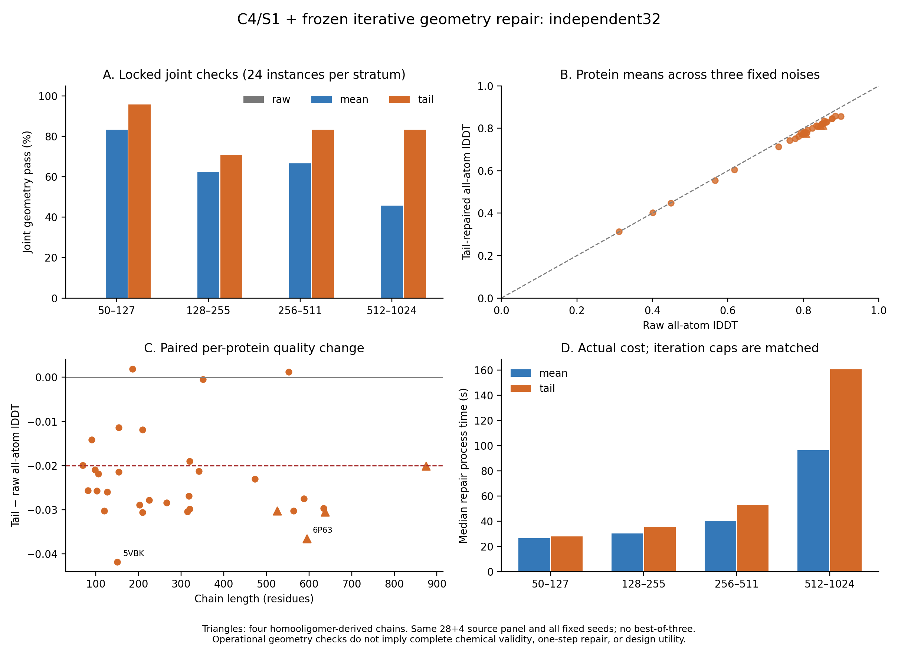

# Mini 独立32蛋白验证：几何改善，但精度保持未通过

2026-09-30，DiamondHill。**本版冻结验证已完成，继续推进门槛不通过。**
原联合目标通过62/96份，尾部目标通过80/96份；但后者只有23/32蛋白的三枚噪声
全部通过，并使实验GT全原子lDDT平均下降0.02311。没有运行失败或缺失评分。
事后对保存初始化坐标的评分进一步定位：主要精度损失已经发生在局部化学重建，
而非新增尾部惩罚。该结果支持改进局部投影的保真性，不支持立即蒸馏本版输出。

## 1. 执行与证据范围

- 冻结几何实现`2aa87043`；[原协议](mini_anchored_independent_v1.md)、
  [来源扩展和执行锁](mini_independent32_execution_v2.md)保持原阈值与预算。
- 32个蛋白、四个长度层各8条、每条三枚固定噪声；28条原单体来源，4条经用户
  允许的同源多聚体完整单链。新增3VSV-A638、5JVL-A874、3F6B-A525、6P63-C595。
  方法开发隔离不等于排除Mini/ESM预训练；多聚体链构象不等于自主单体折叠。
- 原生ESM2-3B＋Mini-ESM，FP32、C4/S1，固定图/身份噪声、无MC dropout；
  每条蛋白共享确定的四轮conditioning，三枚噪声各一次diffusion。未用ESMC替代。
- 96/96原始预测、192/192修正计算完成；batch/audit/score均exit0。
  主流水线约52.3分钟，含逐蛋白加载、GPU计算、CPU复算及评分，非纯GPU时间。
- 96/96原始预测的身份/配置/调用归档核查通过；96/96 mean/tail配对raw与初始化
  完全相同；64/64组独立CPU坐标/指标复算通过。612个冻结文件的哈希均匹配。
  文件核查不等于独立重跑模型，审计通过不等于科学门槛通过。
- 只读补充分析无错误；原始结果、失败与96实例/32蛋白分母完整保留。

## 2. 冻结门槛的逐项结果

| 原定继续推进条件 | Tail结果 | 判断 |
|---|---:|---|
| 联合通过≥80/96实例 | 80/96 | 达到 |
| 三枚噪声均通过≥24/32蛋白 | 23/32 | 未达到 |
| 原始联合合格输入不得变差 | 原始合格0份 | 无合格输入可检验；保持率N/A |
| 平均蛋白ΔAA-lDDT≥−0.005 | −0.023107 | 未达到 |
| Bootstrap 95%下界≥−0.01 | −0.026423 | 未达到 |
| 平均ΔAA-lDDT<−0.02的蛋白≤3 | 24/32 | 未达到 |

所以不能把本版描述为“只差一条蛋白”。质量损失具有广泛性；也不能因为没有
原始联合合格输入退化，就宣称证明了对好输入的保持能力。

## 3. 几何改善与残留失败

| 指标（实例分母96） | Raw | Mean联合目标 | Tail联合目标 |
|---|---:|---:|---:|
| 联合通过 | 0 | 62 | 80 |
| 原有绝对几何检查通过 | 25 | 62 | 84 |
| 全部链连接检查通过 | 0 | 88 | 80 |
| 全部被检查手性中心正确 | 49 | 96 | 96 |
| 零严重原子对（距离<1 Å） | 36 | 70 | 87 |
| 整体结构位移预算通过 | 基准 | 91 | 96 |
| 蛋白三枚噪声均联合通过 | 0/32 | 18/32 | 23/32 |

Tail相对Mean有22份由失败变通过、4份由通过变失败，净增18份。它不是逐例
单调改进：尾部排斥与连接/结构保持要求仍有取舍。两种方法都未新增被检查的
Cα或ILE/THR手性错误；这不代表所有可能的立体化学均得到覆盖。

Tail剩余16份均有连接条件失败，其中12份同时有绝对几何失败。9份严重碰撞
集中于4FMA、1N81、6N9Y，各三枚噪声；这些原始预测本来就很差，但不能因此
移出分母。另3份最大穿透失败没有距离<1 Å的原子对；4份只被连接条件拒绝。

| 目标 | Raw严重原子对（三噪声） | Mean | Tail |
|---|---|---|---|
| 4FMA | 604 / 437 / 605 | 336 / 231 / 244 | 541 / 397 / 500 |
| 1N81 | 401 / 323 / 265 | 138 / 131 / 94 | 376 / 291 / 239 |
| 6N9Y | 2704 / 3249 / 3556 | 1309 / 1823 / 1901 | 2629 / 2954 / 3577 |

这些计数说明Tail在最差几个输入上甚至不如Mean，并非“少数阈值边缘问题”。
未追溯放宽阈值、挑选更好的方法/噪声或追加迭代。完整允许原子对穿透分布、
原子身份及逐残基变化保存在归档中；零严重原子对不等于范德华重叠全部消失。

## 4. 实验GT精度与分层结果

固定观测重原子掩码、跨残基15 Å邻域及原评分实现；先求每个蛋白的三噪声均值，
再对32蛋白等权汇总。Bootstrap重采样蛋白，保留三枚噪声，不做best-of-three。

| 指标 | Raw | Mean | Tail |
|---|---:|---:|---:|
| 全原子lDDT | 0.771294 | 0.749082 | 0.748187 |
| Cα-lDDT | 0.844368 | 0.842851 | 0.841877 |
| TM（观测Cα、固定对应） | 0.862726 | 0.861781 | 0.861794 |
| 对齐Cα RMSD，Å | 3.87634 | 3.90223 | 3.89998 |

Tail−Raw全原子lDDT均值−0.023107，95%区间[−0.026423,−0.019406]；中位数
−0.025845，配对P01/P05为−0.040163/−0.033266，最差5%（2个蛋白）均值
−0.039158。Mean−Raw也为−0.022212，区间[−0.025913,−0.017893]。

绝对AA-lDDT尾部没有同幅下降：Raw/Tail的P05为0.427320/0.427918，最差5%
均值为0.356410/0.357965。绝对尾部与同目标配对变化是不同问题，不能用前者
掩盖后者；更不能与历史不同目标集的约0.8465分数直接比较。

| 长度层 | Mean联合通过 | Tail联合通过 | Tail全三噪声通过 | Tail−Raw AA-lDDT | Mean/Tail修正中位耗时，秒 |
|---|---:|---:|---:|---:|---:|
| 50–127 | 20/24 | 23/24 | 7/8 | −0.02306 | 26.27 / 27.72 |
| 128–255 | 15/24 | 17/24 | 4/8 | −0.02149 | 30.32 / 35.58 |
| 256–511 | 16/24 | 20/24 | 6/8 | −0.02243 | 40.24 / 52.91 |
| 512–1024 | 11/24 | 20/24 | 6/8 | −0.02544 | 96.29 / 160.47 |

28条单体来源Tail通过69/84，AA变化−0.02221；4条同源多聚体链通过11/12，
AA变化−0.02936。小组描述不能证明组装背景的因果影响，且来源与长度混杂。

## 5. 保存初始化坐标的事后分解：主要损失先于联合求解

这是看到最终结果后进行的[只读分解](mini_independent32_initialization_analysis_v1.md)，
不属于新增独立确认，也不改变原门槛。全部96份保存坐标，未重新预测或修正。

| 阶段 | AA-lDDT | Cα-lDDT |
|---|---:|---:|
| Raw | 0.771294 | 0.844368 |
| 每残基局部化学初始化 | 0.749192 | 0.844368 |
| Mean最终输出 | 0.749082 | 0.842851 |
| Tail最终输出 | 0.748187 | 0.841877 |

- 初始化−Raw：AA变化−0.022102，95%区间[−0.024928,−0.018930]。
- Mean−初始化：−0.000110，区间[−0.001634,+0.001490]。
- Tail−初始化：−0.001005，区间[−0.002281,+0.000228]。
- Tail−Mean：−0.000895，区间[−0.001759,−0.000242]。

初始化的Cα坐标由构造保留，其Cα-lDDT逐例不变；**这不表示其余骨架原子没有
变化**。按观测原子中心分解AA评分，初始化损失的平均贡献为骨架中心−0.006317、
侧链中心−0.015785，两者相加为总差。每个中心仍包含全部观测伙伴，因此不是
“仅骨架距离/仅侧链距离”的评分，也不能据此唯一指定某个结构机制。

代码使用原N/CA/C框架和Cα位置、提取桥接二面角相位，再放置化学参考构型。
该连续映射的局部导数正确，不保证它是距离raw最近的有效化学构型。现有证据
把主要AA精度损失定位到这一映射；尚未区分参考形状限制、框架/扭角拟合方式、
原始几何误差及其交互，不能声称理想化必然损失这些精度。

## 6. 位移、成本和结论边界

Tail的Cα RMS位移均值0.3014 Å、最大0.8724 Å，整体预算96/96通过；但最大
骨架原子位移13.506 Å、侧链原子位移17.137 Å。整体RMS合格仍允许局部大变化。
逐残基位移、实验局部lDDT变化及新手性错误检查均已保存。

Mean/Tail每次修正耗时中位33.12/41.33秒，平均51.95/77.29秒，最长210.00/
377.72秒。峰值已分配显存最大约1.25/1.92 GiB，仅指修正器，不包含Mini/ESM。
闭包调用中位192/194次；92/96和86/96次修正用满三阶段各60次迭代，不能声称
均已收敛。迭代上限匹配不等于FLOPs或时间匹配。

每蛋白模型加载约51秒，conditioning均值6.35秒；加载开销与预测计算分开记录。
本求解器仍切断输入梯度，是迭代几何基线，不是一步可微修正层或设计oracle。

**本批关闭，不追加修正、训练或阈值调整。** 可保留的成果是跨蛋白的几何改善、
无新增被检查手性翻转，以及局部初始化精度损失的明确定位。尚未得到既保持
实验精度又可靠满足几何条件的输出，更没有新的硬突变/结合设计证据。

下一版建议先在原开发案例和另行隔离的开发来源上，比较保向、化学受约束的
局部坐标拟合是否能减少初始化失真；保留原始与初始化的实验评分对照，并检查
原本可行构型的重放。先不改变已冻结的尾部项、不扩展模型训练，也不把本批32条
或其近缘序列用于拟合。具体自由度与预算应另立协议后讨论，不自动开新GPU批次。

## 7. 归档与复核入口

- 远端原始预测、坐标、状态及冻结代码：
  `/media/PM982/onestepfold/independent32_v2_20260930`。
- 独立分析与初始化评分：
  `/media/PM982/onestepfold/independent32_analysis_v1_20260930`。
- 本地[分析归档目录](../reports/mini_independent32_analysis_2026-09-30/)：
  `validation_metadata.tar.gz`含逐例报告/锁/独立审计和最终评分；
  `descriptive_results.tar.gz`含完整描述性JSON及逐残基CSV；对应manifest逐文件
  记录原字节哈希，压缩包已逐项回读验证。坐标与优化状态保留远端，未混称已打包。
- `geometry_instances.csv`、`initialization/report.json`、三份只读审计JSON、PNG/PDF
  图均单独保留。补充脚本未改动原实验运行目录，所有事后分析明确标注。
