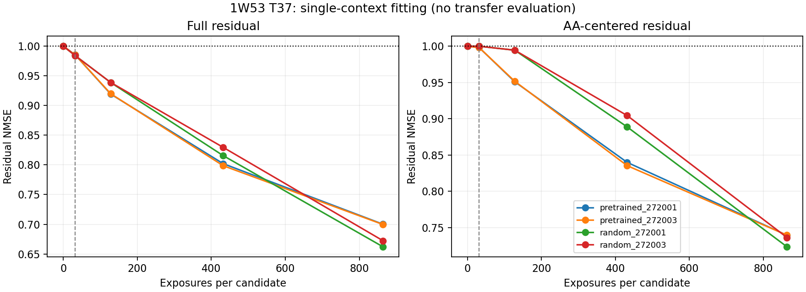

# 单位点候选拟合：学到了正确对应，仍未充分恢复残差

按[锁定协议](mini_pair_candidate_fit_v1.md)完成1W53 T37的四条全新训练与全部固定评测。本批收口，不晋升、不自动延长。当前两层恢复器在单个位点上能够学到实质的AA特异pair修正，并产生解码收益；但终点仍保留约72%–74%的AA残差误差，选择没有改善。结果不能唯一归因为容量不足或优化不足，也没有检验迁移。

这是重新训练特征生成过程的候选拟合诊断，不是又一次冻结H的读出求解，也没有实现新的过程监督架构。旧的两层恢复器和解析读出结论不追溯更改；固定single＋oracle pair的恢复空间仍然成立。

**数据和预算。** 位点固定为旧TRAIN清单与预检中的首个位点p3_s37，1W53 T37，归档长度84；不是根据本批结果挑选。19个非WT候选，预训练／随机×272001／272003，共四条新运行。架构、1331972参数、原loss、原q=31.3238202670、AdamW lr1e-4、clip1及两候选batch均保持不变。每条8208更新，所有候选各864次曝光。0／304／1216／4104／8208全部保存、解码，以8208为主终点。没有保留蛋白评测或单蛋白bootstrap；19AA×2噪声不是38个独立环境。

原生B_inputs／B_s／B_z与WT3缓存冻结，训练目标仍为target_C4_z−B_z；只有恢复器参数更新。Mini参考、S1、目标及输入缓存没有变化。没有C4／原生recycle／输入编码调用、没有S1反向、没有新teacher／ESM／MSA准备、没有额外结构／几何／排序／中心化loss。两种旧噪声只用于评测。每候选的完整B是预测器输入，target只用于损失。

**匹配曝光量时，单点并没有立即比联合训练更好。** 下表均为这个位点的AA中心化残差NMSE，不是旧27位点平均。零修正为1。

| 初始化／种子 | 旧联合终点：32曝光 | 新单点304步：32曝光 | 新1216步：128曝光 | 新4104步：432曝光 | 新8208步：864曝光 |
|---|---:|---:|---:|---:|---:|
| 预训练／272001 | .996803 | .998083 | .951057 | .839794 | .739258 |
| 预训练／272003 | .996562 | .998065 | .951712 | .835278 | .739381 |
| 随机／272001 | .996213 | .999955 | .994566 | .888734 | .723352 |
| 随机／272003 | .996276 | .999957 | .994536 | .904366 | .736183 |

新304步在四组中都没有超过旧联合终点。去掉其他26个位点并没有在相同本位点曝光下立即改善AA拟合，因此本批不支持“主要是其他环境挤掉了这个位点”的简单解释。但两者优化器历史和更新交错不同，不能由此宣布没有梯度干扰。

到固定终点，完整残差NMSE分别为.700078／.699599／.662042／.672285，AA残差消去约26.1%–27.7%。十九个候选的逐候选完整残差NMSE均小于1；各运行内部最大值约.784–.800，改善不是只来自一个已经拟合好的AA。终点与旧联合终点总更新数相同，但本位点曝光多27倍，不能把巨大差异全部归功于减少上下文或单独归功于曝光。

预训练组在1216和4104节点的AA拟合更快；终点随机组的完整残差更低、AA残差略低。不能按中途成绩选赢家，也没有形成预训练终点优势。

**候选对应在这个训练位点上有实际作用。** 终点正确残差的AA方向余弦为.512／.512／.530／.523；预测AA能量约为目标AA能量的18.0%–22.9%。固定换成下一AA的残差，接收者自己的B、化学和噪声保持原样，AA残差NMSE升到1.210906／1.218276／1.210705／1.167098。正确对应确实比错配合适。

预测增量的共同能量占比降到约32.9%／33.3%／41.5%／43.3%；该位点teacher所需共同项约23.8%。因此不能把本批终点描述成几乎只有共同偏移。它仍然没有充分恢复AA差异，且这不是因果证明AA embedding本身承担了全部作用：候选B也含有真实候选信息。

**解码收益比此前的小幅读出收益更明显，但仍限于训练位点。** 表中Spearman为两噪声分数先均值再排序；结构响应RMSE为两枚噪声的中心化CA距离响应误差均值。

| 条件 | Spearman | AA响应RMSE / Å | 旧选新评regret | 旧噪声选择 |
|---|---:|---:|---:|---|
| Exact C4 | 1.0000 | 0 | .092423 | S |
| 无修正B | .4421 | .423960 | .167167 | R |
| 固定B_s＋oracle pair | .9649 | .067371 | .092423 | S |
| 预训练／272001 | .7351 | .279804 | .167167 | R |
| 预训练／272003 | .7596 | .276803 | .167167 | R |
| 随机／272001 | .7579 | .251254 | .167167 | R |
| 随机／272003 | .7228 | .270333 | .167167 | R |

正确修正相对B降低AA结构响应RMSE约34.0%–40.7%；错配则为.473825／.474741／.497974／.479120Å，全部差于正确与B。错配Spearman只有.2491／.2404／.2982／.1912。因而不能说新学到的内容仅在latent内存在、decoder完全没有利用。

然而四条终点都继续选R，regret与B完全相同；两噪声均分Top1也均未命中。排序和结构响应改善没有改变最终选择。Exact自身的旧选新评regret不是0，不能将.167167全称为学生额外误差；额外差距仍为约.074744。本任务仍是父参考骨架距离代理，不是实验突变效用。

**结构尾部改善，没有完整几何优势。** 偏移相对同噪声Exact输出，不是相对实验mutant。

| 条件 | 几何通过 / 38 | B通过→失败／修复 | >1Å | P95 / Å | 最大 / Å | 严重碰撞对 | 错误手性中心 |
|---|---:|---:|---:|---:|---:|---:|---:|
| B | 19 | 0／0 | 2 | .8908 | 1.0536 | 10 | 19 |
| 预训练／272001 | 17 | 3／1 | 0 | .6008 | .6953 | 25 | 17 |
| 预训练／272003 | 16 | 3／0 | 0 | .6114 | .7051 | 29 | 18 |
| 随机／272001 | 19 | 2／2 | 0 | .4497 | .5249 | 41 | 17 |
| 随机／272003 | 16 | 4／1 | 0 | .5274 | .6278 | 39 | 17 |

Exact为9/38通过、100个严重碰撞对；oracle为10/38、67对。因此贴近teacher与减少碰撞不保证一致。当前学生的极端偏移和错误手性数量有所改善，但严重碰撞增加，净通过数也不稳定，不能只用零个>1Å宣布质量通过。所有输出的具体失败中心与连续有符号体积在原始评分文件中保留。

**仍不能判定容量已经到顶。** 末三个304步窗口的训练平均loss，预训练①为.7146→.7084→.7026，预训练②.7134→.7077→.7014；随机①.6833→.6746→.6649，随机②.6976→.6888→.6794，仍持续下降。只凭终点没有充分拟合，不能证明更长优化也不会下降；本批按预算收口，不据此自动续训。

各分支从第二步起存在非零梯度，固定节点的参数组均有变化；不是发现了全程断梯度。第一步零输出层使上游梯度为零是预期初始化行为。早期AA query梯度很小，但候选B本身有AA信息，不能仅据范数归因为query失效。

预训练两组共有631／654步触发裁剪，约7.7%／8.0%；随机只有42／21步，约.51%／.26%。原训练配方确实产生了不同优化轨迹，但随机组几乎不裁剪仍未充分拟合，不能统一把残余误差归因于clip。梯度连通也不等于优化充分。

本批最直接的更新是：原架构能够学习这个位点相当一部分有正确对应的响应，并且继续降低训练误差；但即使集中到一个环境、增加其曝光，仍未实现充分残差恢复。多环境干扰不是解释该缺口所必需的条件。特征形成方式、有效容量和优化效率仍未被因果分离。数据多样性对迁移的作用完全没有由本批否定或验证。

**执行与复核。** HIP0–3四个独立worker，其他任务未改动。共32832更新、65664训练候选前向、396评测／重建前向、912次S1；原生recycle、C4、输入编码均0。控制器560.10秒，各worker489.71–524.16秒，峰值GPU分配1.881GiB。时间是缓存单点诊断成本，不是部署速度。

初始v1因打包遗漏两份既有测试，在模型构建前停止；v1b补入原测试后从头执行，未改科学设置。初次失败日志、协议和锁保留。11项本地相关测试、6项远端预检通过。90份源文件SHA验证；20节点完整张量独立FP64重算通过；252项相关性、84项regret、60项历史参照、全部曝光和3192条含重复对照的输出记录通过独立复核。全部19候选的初始双噪声B回放、终态候选顺序与模型重建逐位检查通过，输入／参考不变，Mini无梯度。

完整[分析](../reports/mini_pair_candidate_fit_2026-10-10/analysis.json)、[独立复核](../reports/mini_pair_candidate_fit_2026-10-10/verification.json)、[张量复核](../reports/mini_pair_candidate_fit_2026-10-10/tensor_verification.json)、[哈希清单](../reports/mini_pair_candidate_fit_2026-10-10/manifest.json)与[证据说明](../reports/mini_pair_candidate_fit_2026-10-10/README.md)均已归档。当前收口保留工程与正确候选对应证据；不将单点训练收益当作迁移或可用加速，不自动启动过程监督、架构扩容或更长训练。
