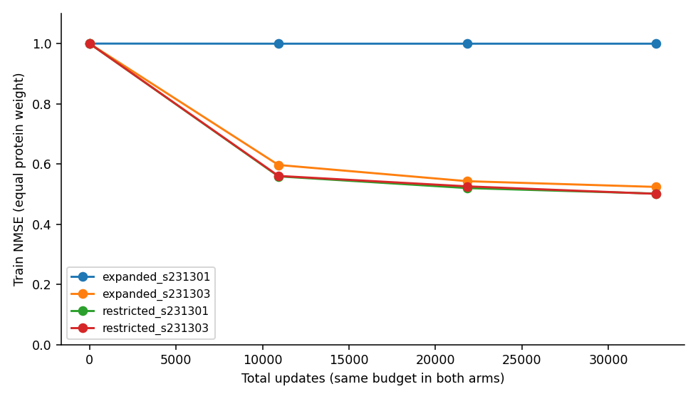
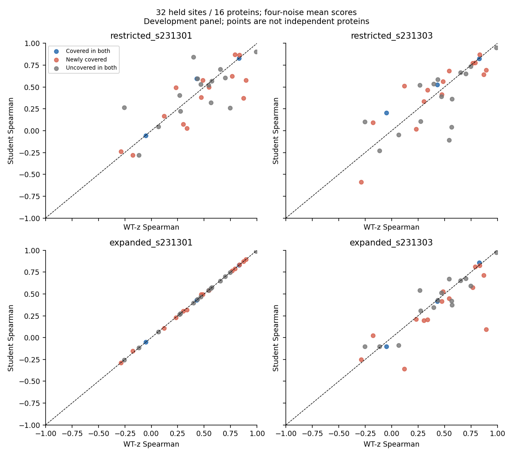
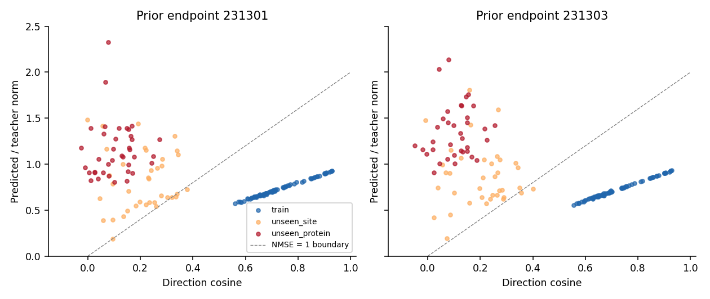

# 出发 AA 覆盖对照：匹配蛋白、固定预算的完整开发评测

本批训练、48 位点终点解码、评分及独立审计均已完成。原四上下文实验保持收口；
本轮没有追加它的更新。当前结果仍是 **oracle target s 存在时的 Δz 组件评测**，
不构成完整“一次 WT → 多 mutant”的加速器，也不放行设计或部署。

**结论：在当前模型与固定训练预算下，这一级别的覆盖扩展没有建立稳定的跨蛋白收益。**
受限组仍能学习自身训练排序（ρ0.948/0.937）；扩展组一枚种子学到训练排序（ρ0.899），
另一枚未产生AA-specific响应。共同16条未训练蛋白上，WT-z的ρ为0.428，受限组
0.404/0.409，扩展组0.429/0.370。不能把近乎WT-z的种子当作学会迁移。

扩展组有效学习的种子Top1为12/32，高于WT-z的8/32，但旧选新评regret为0.152，
差于WT-z的0.104；几何与结构尾部也未恢复。新增L/D/V/I子集相对受限组的regret
较小是一项保留观察，但仍未稳定超过该子集的WT-z，因此不能据此晋升。

两个同蛋白保留位点上存在有限正面信号，主要来自出发S仍未覆盖的S34；这同样不支持
把“出发AA是否见过”当成唯一解释。当前限制包括训练稳定性、位点环境混杂和覆盖规模，
**既不能宣布数据覆盖无效，也不能宣布WT-only信息不足、final-state回归或共享网络不可学。**

## 1. 实际对照与数据范围

[冻结协议](mini_pair_coverage_v1.md)。只复用 `factor_student_pilot_v1_20261002`，
没有新 C4、ESM、结构下载或 teacher 收集。可用 T/Y/A/N 训练来源只有10个位点，
因此采用10位点而非示例12位点。两组完全匹配8条蛋白、每蛋白位点数与链长分布：

| 蛋白 | L | 受限组 | 扩展组 |
|---|---:|---|---|
| 1W53 |84|T37/Y84|T37/Y84|
| 1JHG |101|A2|A2|
| 1A7G |82|N65|N65|
| 2P7T |103|A44/T86|A44/T86|
| 5GPE |129|A11|D72|
| 1DZR |183|A179|L13|
| 2ED6 |170|T90|V137|
| 4HUT |191|A44|I25|

受限类型 T/Y/A/N；扩展类型 T/Y/A/N/D/L/V/I。S 仍未覆盖：若纳入S128就必须更换
匹配蛋白，S34又是指定保留位点，本轮没有这样做。1JHG N25、1A7G S34、整个4PT4及
原验证蛋白都不进入更新。24个归档蛋白的序列组件身份互异，但不能由此声称未进入
预训练；历史开发接触也仍然存在。出发AA和位点环境仍同时变化，不能唯一归因于AA类型。

全部48位点均评测；两组共同保留34位点，其中2个位于已训练蛋白、32个位于16条
未训练蛋白。未训练蛋白内：两组均覆盖的出发AA为3位点/3蛋白；新增覆盖为14位点/
10蛋白；两组均未覆盖为15位点/11蛋白。蛋白可跨类型小组，不可把小组蛋白数相加。
只被其中一组训练的8个位点不混进共同保留集。原8条验证蛋白及其余未更新归档蛋白
都只是当前方法的开发评测，不是全新独立确认。

[完整清单](../reports/mini_pair_coverage_2026-10-03/inventory.csv)记录原始角色、序列组件、
出发AA、位置、长度、五残基窗口与实验GT观测Cα的8Å邻居数；邻居数不是SASA。
每组190个不同non-WT响应标签，种子/重复曝光不增加标签数量；两组标签并集266个。

## 2. 训练条件与终态

原 `NonlinearResponseReadout('pair')`、3,627,904参数、raw Δz监督均未修改。
AdamW lr1e-3/wd1e-4/eps1e-8，clip1，无scheduler。两枚新初始化种子231301/231303
在两组之间逐位配对；不是继续旧模型。每组每种子32760更新，10上下文轮转、每次19AA，
每位点3276次曝光。保存10920/21840/32760，终点固定32760；中间节点仅报告训练latent曲线，
没有选最好checkpoint。与上一轮32768总更新接近但单点曝光更少，因此旧4→新10不是严格配对。

| 训练终点 | 蛋白等权 NMSE | 中心化 AA-specific NMSE | 时间(s) | 峰值分配GiB |
|---|---:|---:|---:|---:|
| restricted_s231301 | 0.501699 | 0.545137 | 682.15 | 6.474 |
| restricted_s231303 | 0.500878 | 0.544051 | 676.87 | 6.474 |
| expanded_s231301 | 0.999642 | 1.000000 | 680.38 | 6.474 |
| expanded_s231303 | 0.523843 | 0.582055 | 680.37 | 6.474 |

扩展组231301的全部训练位点中心化预测能量均为0，整体响应能量仅约teacher的
1.5e-5至1.1e-3；这是没有恢复AA-specific响应的实际终点，非NaN或作业未完成。
保留该种子，不替换、不延长、不从组均值中删除。另一种子能学习，因此不能把该结果
认定为最终映射不可表达，也不能把两组差距全部归因于新来源AA上的迁移能力。

## 3. 功能评测口径

Exact=target s_inputs/s/z；Baseline=WT s_inputs+target s/z。学生、WT-z、oracleR32
均保留 **target s、WT s_inputs、target原子图与化学参考**。排序主参照是Baseline，
Exact对照另外完整保留。任务仍是父序列实验骨架Cα距离Huber代理，不是真实突变效果。
旧噪声230201/230211、新噪声270101/270103是沿用前轮的开发分组，均非此次全新确认。

下表ρ/Top1基于4枚噪声的逐候选任务均分。连续指标先在蛋白内平均位点，再对蛋白等权；
Top1数按位点。旧选新评=只用旧两噪声选择，再评价相同候选在新两噪声的teacher均分，
regret参照新teacher最优，同时另存相对teacher旧选候选的额外regret。不能新噪声重新挑AA。
WT与19个non-WT分别保留；排名只包含19个non-WT。所有分数尺度、MAE/RMSE与top3/5也存档。

本轮所有逐候选teacher能量均未触发1e-6 floor，所以WT-z NMSE恰为1；oracleR32的latent floor未另行统计，表中以“—”标记。

### 全部共同未训练蛋白：16蛋白/32位点

| 方法 | ρ | Top1/位点 | 同噪声 regret | 旧选新评 regret | Δz NMSE |
|---|---:|---:|---:|---:|---:|
| wt_z | 0.428125 | 8/32 | 0.070179 | 0.104054 | 1.000000 |
| oracle_r32 | 0.987061 | 29/32 | 0.000073 | 0.003215 | — |
| restricted_s231301 | 0.403728 | 7/32 | 0.052522 | 0.116080 | 1.457335 |
| restricted_s231303 | 0.408991 | 8/32 | 0.060611 | 0.093508 | 1.431663 |
| expanded_s231301 | 0.428947 | 8/32 | 0.070179 | 0.104054 | 0.999785 |
| expanded_s231303 | 0.369682 | 12/32 | 0.046818 | 0.152233 | 1.211132 |

### 各自训练集合的功能结果：各8蛋白/10位点

| 训练集合 | 方法 | ρ | Top1 | 旧选新评regret | 局部最大Å | 新增几何失败 |
|---|---|---:|---:|---:|---:|---:|
| restricted | wt_z | 0.259101 | 2/10 | 0.218056 | 6.6597 | 17/760 |
| restricted | restricted_s231301 | 0.948465 | 8/10 | 0.024147 | 2.1930 | 21/760 |
| restricted | restricted_s231303 | 0.937171 | 7/10 | 0.024241 | 2.5899 | 17/760 |
| expanded | wt_z | 0.314803 | 4/10 | 0.190260 | 6.6597 | 23/760 |
| expanded | expanded_s231301 | 0.318531 | 4/10 | 0.190260 | 6.6594 | 23/760 |
| expanded | expanded_s231303 | 0.898684 | 6/10 | 0.030316 | 6.5752 | 20/760 |

### 旧保留4PT4：1蛋白/2位点（开发回归，不代表全体）

| 方法 | ρ | Top1/位点 | 同噪声 regret | 旧选新评 regret | Δz NMSE |
|---|---:|---:|---:|---:|---:|
| wt_z | 0.568421 | 1/2 | 0.013584 | 0.012107 | 1.000000 |
| oracle_r32 | 0.993860 | 2/2 | 0.000000 | 0.018571 | — |
| restricted_s231301 | 0.470175 | 1/2 | 0.013584 | 0.042453 | 1.205509 |
| restricted_s231303 | 0.603509 | 1/2 | 0.013584 | 0.013386 | 1.132201 |
| expanded_s231301 | 0.568421 | 1/2 | 0.013584 | 0.012107 | 1.000931 |
| expanded_s231303 | 0.513158 | 1/2 | 0.013584 | 0.013386 | 1.062380 |

### 共同保留的同蛋白新位点：N25和S34

| 方法 | ρ | Top1/位点 | 同噪声 regret | 旧选新评 regret | Δz NMSE |
|---|---:|---:|---:|---:|---:|
| wt_z | 0.558772 | 1/2 | 0.011671 | 0.018002 | 1.000000 |
| oracle_r32 | 0.999123 | 2/2 | 0.000000 | 0.022876 | — |
| restricted_s231301 | 0.670175 | 1/2 | 0.010378 | 0.013001 | 1.382095 |
| restricted_s231303 | 0.650877 | 1/2 | 0.012930 | 0.018002 | 1.264429 |
| expanded_s231301 | 0.558772 | 1/2 | 0.011671 | 0.018002 | 1.000603 |
| expanded_s231303 | 0.576316 | 1/2 | 0.026233 | 0.000000 | 1.032210 |

共同保留位点的合并ρ改善主要来自 **1A7G S34**：WT-z0.267，受限组0.458/0.453，
扩展组有效种子0.347；S在两组均未作为出发类型训练。1JHG N25的WT-z已为0.851，
受限组0.882/0.849。前者仍有>5Å的局部尾部，不能只由排序改善称为可靠预测。

### 按来源AA分开的固定跨蛋白子集

**两组均覆盖：3位点/3蛋白**

| 方法 | ρ | Top1/位点 | 同噪声 regret | 旧选新评 regret | Δz NMSE |
|---|---:|---:|---:|---:|---:|
| wt_z | 0.402924 | 2/3 | 0.410464 | 0.627935 | 1.000000 |
| oracle_r32 | 0.997076 | 2/3 | 0.000716 | 0.001738 | — |
| restricted_s231301 | 0.457895 | 1/3 | 0.264808 | 0.268002 | 1.034816 |
| restricted_s231303 | 0.519883 | 1/3 | 0.041609 | 0.034765 | 1.022033 |
| expanded_s231301 | 0.402924 | 2/3 | 0.410464 | 0.627935 | 1.001179 |
| expanded_s231303 | 0.392398 | 2/3 | 0.030919 | 0.678084 | 1.000235 |

**只在扩展组新增覆盖：14位点/10蛋白**

| 方法 | ρ | Top1/位点 | 同噪声 regret | 旧选新评 regret | Δz NMSE |
|---|---:|---:|---:|---:|---:|
| wt_z | 0.420351 | 4/14 | 0.014692 | 0.014391 | 1.000000 |
| oracle_r32 | 0.993421 | 14/14 | 0.000000 | 0.002852 | — |
| restricted_s231301 | 0.329737 | 4/14 | 0.023076 | 0.027021 | 1.328909 |
| restricted_s231303 | 0.422895 | 4/14 | 0.020755 | 0.021553 | 1.308732 |
| expanded_s231301 | 0.423333 | 4/14 | 0.014692 | 0.014391 | 0.999235 |
| expanded_s231303 | 0.327018 | 6/14 | 0.014365 | 0.018809 | 1.198361 |

**两组均未覆盖：15位点/11蛋白**

| 方法 | ρ | Top1/位点 | 同噪声 regret | 旧选新评 regret | Δz NMSE |
|---|---:|---:|---:|---:|---:|
| wt_z | 0.382217 | 2/15 | 0.067482 | 0.105490 | 1.000000 |
| oracle_r32 | 0.974801 | 13/15 | 0.000008 | 0.003573 | — |
| restricted_s231301 | 0.392903 | 2/15 | 0.047630 | 0.223843 | 1.597504 |
| restricted_s231303 | 0.332616 | 3/15 | 0.131904 | 0.227296 | 1.542169 |
| expanded_s231301 | 0.382297 | 2/15 | 0.067482 | 0.105490 | 0.999974 |
| expanded_s231303 | 0.378070 | 4/15 | 0.106942 | 0.227809 | 1.190116 |

两种子先平均，再对相同蛋白配对；下面只是开发蛋白bootstrap描述区间，条件于这两枚
训练种子，并不包含训练种子总体不确定性，也不构成新独立确认或AA因果效应：

| 固定子集 | 扩展−受限ρ | 描述95%区间 | 扩展−受限旧选新评regret | 描述95%区间 |
|---|---:|---|---:|---|
| common_unseen_protein | -0.007045 | [-0.07609786184210528, 0.0611588541666666] | 0.023350 | [-0.006002293723851331, 0.06985180216158918] |
| unseen_source_covered_both | -0.091228 | [-0.15000000000000002, 0.015789473684210575] | 0.501626 | [0.0, 0.9348481052607825] |
| unseen_source_newly_covered | -0.001140 | [-0.08400438596491228, 0.0823695175438596] | -0.007687 | [-0.014633551456704195, -0.0006115587005358566] |
| unseen_source_uncovered_both | 0.017424 | [-0.09206638755980862, 0.12149322169059007] | -0.058920 | [-0.18578177656802478, 0.009674373711106885] |

新增覆盖子集的两种子平均regret差为−0.007687（描述区间未跨零），但扩展组两种子
分别0.014391/0.018809，WT-z为0.014391。第一枚几乎是不产生响应的模型，第二枚仍差于
WT-z。这里“比受限组少退化”与“生成了有用的新响应”必须分开。

全体跨蛋白regret均值有明显蛋白尾部贡献：扩展组有效种子的2EBE蛋白均值为1.9420，
6ZRW为0.2622；其16蛋白中位数约0.01464，WT-z约0.01315。预锁定的均值不改为中位数，
但同时披露分布，避免用12/32 Top1掩盖少量错误选择的高代价。

完整各位点、各蛋白、各噪声结果在[selection.csv](../reports/mini_pair_coverage_2026-10-03/selection.csv)
和[groups.csv](../reports/mini_pair_coverage_2026-10-03/groups.csv)。分层表按每组真实训练类型定义；
同一位点可能从受限的“未覆盖”变成扩展的“已覆盖”，故主对照使用上述固定子集。

## 4. 几何与结构尾部

不是以低NMSE拦截功能评测，也不是以高ρ豁免几何。以下共同未训练蛋白分母为
32位点×19AA×4噪声=2432，不是2432条独立蛋白。几何只指零非键合<1Å严重近重合+
严格所检CA/ILE/THR手性，**不是全面化学正确**。新增/恢复均相对同候选同噪声Baseline。
局部位移是对Baseline全局CA对齐后的突变邻域CA RMSD；它不是相对实验mutant GT误差。

| 方法 | 绝对通过 | 新增失败 | 恢复 | 局部P95 Å | P99 Å | 最大 Å | >1Å数 |
|---|---:|---:|---:|---:|---:|---:|---:|
| baseline | 1112/2432 | 0 | 0 | 0.0000 | 0.0000 | 0.0000 | 0 |
| wt_z | 1059/2432 | 147 | 94 | 2.5117 | 5.2992 | 6.8131 | 325 |
| oracle_r32 | 1095/2432 | 29 | 12 | 0.1423 | 0.3102 | 5.7390 | 3 |
| restricted_s231301 | 1036/2432 | 166 | 90 | 2.4762 | 5.1291 | 6.7940 | 321 |
| restricted_s231303 | 1014/2432 | 178 | 80 | 2.5090 | 5.1767 | 6.7981 | 312 |
| expanded_s231301 | 1057/2432 | 151 | 96 | 2.5152 | 5.2989 | 6.8129 | 326 |
| expanded_s231303 | 1039/2432 | 167 | 94 | 2.5486 | 5.1702 | 6.7833 | 317 |

新的固定尾部包括 **6ZRW P80L/noise270101**：oracleR32局部RMSD5.739Å，
WT-z6.813Å，三个有学习响应的学生约6.78–6.80Å。该候选Baseline本身已有13个所检
错误手性中心，所以“new_failure=false”仅表示没有从通过转为失败，绝不是几何有效。
另有4HUT I25P/noise270103在受限种子231303下7.727Å；这一位点只由扩展组训练。
R32仍有很高平均排序保真，但本轮不支持无尾部风险的普遍表示保证，也不因此自动改rank。

T37N/noise230211的Thr25侧链手性回归仍在：Baseline最小定向归一化体积+0.03637，
受限组−0.06790/−0.07125，扩展组−0.08966/−0.06621；四模型都新增失败，阈值未修改。

训练及同蛋白新位点的对应尾部也存于groups.csv，所有失败中心身份、有符号体积、
参考比例及归一化体积保留于逐例report.json.gz。T37N保留全部中心而非仅符号失败。
Baseline过符号门槛不等于体积远离零；没有改变阈值。6UFE92未在本批覆盖。

## 5. 旧checkpoint：错误响应不只是幅度失准

全部6个旧checkpoint×8位点×19AA=912条逐候选分析，没有S1/C4调用。
实际均未触发分母floor；每条直接检验NMSE=1+r²−2rc，保留一般带floor公式及零向量标记。
下面是旧固定终点，先蛋白内平均再等权：

| 旧种子 | 分组 | NMSE | 幅度比r | 方向余弦c | teacher最佳逐候选缩放后NMSE |
|---|---|---:|---:|---:|---:|
| e8192_s231301 | train | 0.426420 | 0.752037 | 0.750098 | 0.426372 |
| e8192_s231301 | unseen_site | 1.620089 | 0.871942 | 0.202744 | 0.948642 |
| e8192_s231301 | unseen_protein | 2.166938 | 1.151575 | 0.106630 | 0.983484 |
| e8192_s231303 | train | 0.436044 | 0.745385 | 0.743168 | 0.436018 |
| e8192_s231303 | unseen_site | 1.692285 | 0.915912 | 0.199100 | 0.949454 |
| e8192_s231303 | unseen_protein | 3.042229 | 1.442358 | 0.102893 | 0.984881 |

4PT4上r约1.15/1.44而c仅约0.10；即使用真实teacher决定每个候选的最佳缩放，误差
仍约0.983/0.985，接近零响应的1。这不能解释为单纯“方向正确但幅度过大”。
缩放值包括负值，全部仅作oracle诊断，未用于任何输出、选择或校准。新终点的同样分析
另存[polar.csv](../reports/mini_pair_coverage_2026-10-03/polar.csv)，旧分析见prior_polar.csv。

## 6. 完整性、成本与产物

控制器墙钟2220.43s；另行独立审计100.89s。这些包含加载、I/O、四worker并行训练与多参照评测，不能当部署速度。
29376次S1=29184mutant/arm/noise +96WT +96新噪声重放；30720条评分包含复用WT。
3696份旧Exact/Baseline/WT坐标重放与96次新Baseline重放逐位一致。0新C4/ESM。

审计通过：4个从头初始化、两组同种子初始化逐位匹配、12个checkpoint/曝光计数/AdamW步数；3072项排名、2304项均分选择、3072项独立NumPy坐标任务、3072项lDDT、25939个手性符号、160项旧参照、912项旧NMSE重放；936份坐标包哈希。15项针对性测试通过。

- [协议](mini_pair_coverage_v1.md)
- [机器可读分析](../reports/mini_pair_coverage_2026-10-03/analysis.json)
- [独立审计](../reports/mini_pair_coverage_2026-10-03/independent_audit.json)
- [完整逐例结果](../reports/mini_pair_coverage_2026-10-03/report.json.gz)
- 本机坐标/元数据：`/home/husrcf/Code/onestepfold_runtime/pair_coverage_v1_20261003`
- DiamondHill完整checkpoint/坐标：`/media/IntelSSD/onestepfold/hpc3_mirror_20261001/Folding/pair_coverage_v1_20261003`

本批到此停止。没有新模型晋升、自动延长、增加rank、blockwise转换或Δs predictor。
压缩表示、功能排序、几何与跨上下文迁移继续分开解释。
