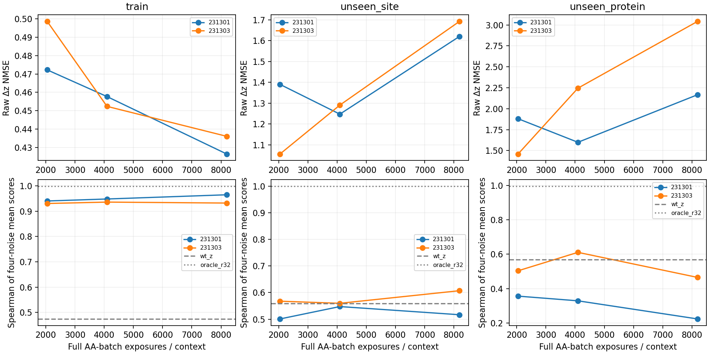

# Raw pair 多上下文 v1：训练排序可共同学习，稳定迁移尚未成立

**本批已完成并收口。** 两个seed从头训练，每个32768次更新、四个上下文各8192次完整
19-AA曝光；三个固定checkpoint全部解码，没有再用NMSE≤0.10作为功能评测入口。

训练上下文的候选排序明显优于WT-z；同蛋白新位点的收益不一致；在未参与本轮更新的
4PT4上，两个终点的四噪声聚合Spearman均低于WT-z，跨噪声选择regret也更高。
**这将主要问题推进到跨上下文迁移与结构尾部，不支持晋升模型或自动追加训练。**

[预先锁定协议](mini_pair_multicontext_v1.md) ·
[完整机器可读结果](../reports/mini_pair_multicontext_2026-10-03) ·
[上一批同位点终点审计](mini_readout_endpoint_decode_findings_2026-10-02.md)

## 1. 实际执行范围

共享pair架构不变：WT encoder width256×4 blocks，非线性pair读出width128，
3,627,904参数。输入WT s/z、位点和离散AA query；纯raw hard Δz矩阵监督。
AdamW lr1e-3、wd1e-4、eps1e-8、clip1；没有S1、排序、碰撞或手性训练loss。
种子231301/231303均从随机初始化开始，未继承T37单点checkpoint。

| 用途 | 原生输入位点 |
|---|---|
| 训练，按此顺序循环 | 1W53 T37、Y84；1JHG A2；1A7G N65 |
| 同蛋白保留位点 | 1JHG N25；1A7G S34 |
| 未参与本轮更新的蛋白 | 4PT4 L10、D17 |

保存global update8192/16384/32768，对应每上下文2048/4096/8192曝光。
六个checkpoint全部评测，32768终点为主结论，未挑选中途最好结果。
训练目标每update覆盖19个non-WT，两个seed共1,245,184次候选曝光，**不是新增这么多teacher**。
所有conditioning来自既有归档，0次新ESM/C4。

旧噪声230201/230211，新噪声270101/270103，运行前锁定。
四枚噪声对每个候选共享同一checkpoint响应；每个候选独立重建原生原子图与参考化学。
干预保留**oracle target s、WT s_inputs**，仅替换z；Exact保留全部target conditioning，
Baseline使用WT s_inputs和完整target s/z。主比较是对Baseline，Exact结果同时归档。
这里检验一个z组件，**仍不是一次WT就替代完整mutant trunk的加速器**。

八个位点全部来自已经参与开发的资产。4PT4“未训练”仅指没有进入本轮student参数更新，
不等于独立确认集或未被Mini/ESM预训练看过。新噪声也不使旧开发蛋白变成独立蛋白。

## 2. 终点排序：训练恢复，迁移没有形成可靠优势

表内先对每个候选在指定噪声组的任务分数取算术平均，再对19个AA计算Spearman/Top1/regret。
不是平均rank，也不挑最有利噪声。集合均值先在蛋白内平均位点，再对蛋白等权；
训练集合里1W53的两个位点不会让它占两条蛋白的权重。Top1是位点计数，分母另列。

| 集合 | 方法 | 旧噪声ρ | 新噪声ρ | 四噪声ρ | 四噪声Top1 / 位点 | 四噪声regret |
|---|---|---:|---:|---:|---:|---:|
| 训练上下文（3蛋白/4位点） | WT-z | 0.439766 | 0.545322 | 0.473977 | 2/4 | 0.020203 |
| 训练上下文（3蛋白/4位点） | seed231301 | 0.936257 | 0.932164 | 0.965205 | 4/4 | 0.000000 |
| 训练上下文（3蛋白/4位点） | seed231303 | 0.930994 | 0.930409 | 0.932456 | 3/4 | 0.005656 |
| 已训练蛋白新位点（2蛋白/2位点） | WT-z | 0.651754 | 0.589474 | 0.558772 | 1/2 | 0.011671 |
| 已训练蛋白新位点（2蛋白/2位点） | seed231301 | 0.650877 | 0.585088 | 0.516667 | 1/2 | 0.001848 |
| 已训练蛋白新位点（2蛋白/2位点） | seed231303 | 0.676316 | 0.492105 | 0.607018 | 1/2 | 0.026233 |
| 未训练蛋白4PT4（1蛋白/2位点） | WT-z | 0.435965 | 0.757018 | 0.568421 | 1/2 | 0.013584 |
| 未训练蛋白4PT4（1蛋白/2位点） | seed231301 | 0.242982 | 0.445614 | 0.223684 | 1/2 | 0.013584 |
| 未训练蛋白4PT4（1蛋白/2位点） | seed231303 | 0.471930 | 0.506140 | 0.464912 | 1/2 | 0.026850 |

Oracle R32的四噪声聚合ρ，在训练/新位点/4PT4分别约0.9985、0.9991、0.9939。
因此这些上下文中压缩表示本身仍有很好的decoder保真，不能将student的迁移失败归为R32
表示已普遍失败；当前pair模型本身也没有被强制输出R32因子。

- **训练上下文：**两seed终点四噪声ρ为0.9652、0.9325，均明显优于WT-z的0.4740；
  Top1为4/4、3/4。当前共享网络可以同时学习多个已训练位点的选择信息。
- **同蛋白新位点：**两seedρ为0.5167、0.6070，对比WT-z 0.5588，一低一高；
  regret也一好一差。1JHG N25的四噪声ρ为0.8702/0.8947（WT-z0.8509），但两seed
  在该位点新噪声ρ均低于WT-z；1A7G S34的四噪声ρ仅0.1632/0.3193。
  不能把一个聚合指标的提高概括成稳定新位点迁移。
- **4PT4：**两seed终点四噪声ρ为0.2237、0.4649，均低于WT-z0.5684。
  不是所有单项都失败：seed231303在新噪声聚合Top1为2/2、regret=0；但新噪声ρ仍
  低于WT-z，旧噪声选出的候选在新噪声上的结果更差，见下节。这一正面单项不被删去，
  也不足以构成可靠替代优势。这里只有1条保留蛋白，不能推广为所有蛋白都无法迁移。

[逐噪声排序](../reports/mini_pair_multicontext_2026-10-03/per_noise_rankings.csv)、
[噪声聚合选择](../reports/mini_pair_multicontext_2026-10-03/mean_noise_selection.csv)保留全部
checkpoint、位点、噪声与两类参照，以及Top3/5 recall和teacher最优AA是否进入student Top3/5。

## 3. 重建误差与学习曲线

按同样的蛋白等权口径：

| 集合 | WT-z NMSE | Oracle R32 NMSE | seed231301 NMSE | seed231303 NMSE |
|---|---:|---:|---:|---:|
| 训练上下文（3蛋白/4位点） | 1.000000 | 0.029086 | 0.426420 | 0.436044 |
| 已训练蛋白新位点（2蛋白/2位点） | 1.000000 | 0.026255 | 1.620089 | 1.692285 |
| 未训练蛋白4PT4（1蛋白/2位点） | 1.000000 | 0.020343 | 2.166938 | 3.042229 |

保留位点NMSE>1意味着在这项归一化矩阵误差上甚至不如零响应，不表示所有功能指标都
严格更差。训练位点NMSE仍远高于旧0.10，排序却已经恢复，继续支持分开评价这两件事。
旧单点latent失败不追溯改判；本轮没有预设新的功能pass阈值。



横轴为**每个上下文**的完整19-AA曝光量，不是global updates。
训练NMSE继续下降，但保留位点/蛋白误差并未同步改善。
4PT4 seed231303在4096曝光节点的四噪声ρ曾为0.6105，高于WT-z；预定终点降到0.4649。
这项中途观察保留，但**没有据此改选checkpoint**。也不能仅凭曲线断言唯一原因是容量、
优化或数据量；本批未做这些因素的匹配干预。

## 4. 跨噪声选择与分数准确性

仅用旧两枚噪声的均分选AA，锁住选择，再用新两枚噪声的Baseline均分评价。
下面是相对新噪声最优AA的regret，仍为蛋白等权，越低越好：

| 集合 | WT-z | seed231301 | seed231303 |
|---|---:|---:|---:|
| 训练 | 0.022848 | 0.002146 | 0.009520 |
| 同蛋白新位点 | 0.018002 | 0.002294 | 0.027506 |
| 4PT4 | 0.012107 | 0.042453 | 0.046006 |

4PT4中，相对“旧噪声Baseline自己选出的AA”，两个student在新噪声的额外regret分别为
+0.023882、+0.027434。主要例子是D17：student按旧噪声选择H或P，Baseline按旧噪声选择E；
新噪声仍偏好E。不能用student在新噪声上重新选出的正确AA，替代这项先选后验证的结果。

分数也没有被排序指标自动校准。四噪声均分的任务MAE：

| 集合 | WT-z | seed231301 | seed231303 |
|---|---:|---:|---:|
| 训练 | 0.059985 | 0.024827 | 0.023302 |
| 同蛋白新位点 | 0.046927 | 0.061009 | 0.061371 |
| 4PT4 | 0.024286 | 0.023434 | 0.028549 |

训练集合的centered score scale ratio约0.801/0.850；4PT4约1.487/1.390。
归档同时保存bias、RMSE和仿射斜率；未引入事后温度或声称恢复了校准的20-AA概率分布。
任务仍是相对父序列实验Cα距离的Huber代理，不是突变实验结构、突变效用或生物学分数。

## 5. 几何和结构尾部是独立限制

相对Baseline、四枚噪声，局部RMSD采用原协议全局Cα刚体对齐与固定邻域：

| 集合 | 方法 | P95 / Å | P99 / Å | 最大 / Å | >1Å | 新增失败 | 恢复 | 绝对通过 |
|---|---|---:|---:|---:|---:|---:|---:|---:|
| 训练上下文（3蛋白/4位点） | baseline | 0.0000 | 0.0000 | 0.0000 | 0/304 | 0 | 0 | 152/304 |
| 训练上下文（3蛋白/4位点） | oracle_r32 | 0.0643 | 0.0893 | 0.1128 | 0/304 | 0 | 1 | 153/304 |
| 训练上下文（3蛋白/4位点） | seed231301 | 0.8107 | 2.3299 | 3.6917 | 10/304 | 17 | 18 | 153/304 |
| 训练上下文（3蛋白/4位点） | seed231303 | 0.7731 | 2.3980 | 2.8960 | 11/304 | 16 | 19 | 155/304 |
| 已训练蛋白新位点（2蛋白/2位点） | baseline | 0.0000 | 0.0000 | 0.0000 | 0/152 | 0 | 0 | 80/152 |
| 已训练蛋白新位点（2蛋白/2位点） | oracle_r32 | 0.0188 | 0.1450 | 0.1843 | 0/152 | 0 | 2 | 82/152 |
| 已训练蛋白新位点（2蛋白/2位点） | seed231301 | 0.6220 | 5.3250 | 5.5175 | 4/152 | 6 | 12 | 86/152 |
| 已训练蛋白新位点（2蛋白/2位点） | seed231303 | 0.6521 | 5.3080 | 5.5280 | 4/152 | 6 | 6 | 80/152 |
| 未训练蛋白4PT4（1蛋白/2位点） | baseline | 0.0000 | 0.0000 | 0.0000 | 0/152 | 0 | 0 | 134/152 |
| 未训练蛋白4PT4（1蛋白/2位点） | oracle_r32 | 0.0102 | 0.0123 | 0.0128 | 0/152 | 2 | 0 | 132/152 |
| 未训练蛋白4PT4（1蛋白/2位点） | seed231301 | 0.4349 | 0.5340 | 0.5591 | 0/152 | 14 | 3 | 123/152 |
| 未训练蛋白4PT4（1蛋白/2位点） | seed231303 | 0.4097 | 0.5001 | 0.5255 | 0/152 | 6 | 6 | 134/152 |

此表计数和尾部分位数按各集合内的mutant/noise实例统计，不是独立蛋白通过率。
“几何通过”只指零严重非键合重叠与全部所检CA/ILE/THR中心符号正确，不是完整化学验收。
训练seed231301绝对通过153/304，接近Baseline152/304，却同时新增17例、恢复18例；
只报净通过数会隐藏明显的逐例变化。

两个终点在1A7G S34R的四枚噪声上都出现>5Å局部偏移，最大约5.52Å；WT-z在同一范围
也有约5.57Å偏移。这说明student没有恢复该候选的响应，不证明微观机制完全相同。
其中部分输出仍通过当前几何检查，进一步说明化学符号/碰撞检查不能替代结构保真。
训练端另有1W53 Y84M的大偏移，最大约3.69Å。
4PT4没有>1Å偏移，仍有6或14例新增几何失败；连Oracle R32的最大局部偏移约0.013Å，
仍在4PT4新增2例几何失败。小坐标偏移不是化学安全的充分条件。

### 固定回归T37N/noise230211：已定位到第25位Thr侧链中心

原生输入chain A、residue25、原子顺序 **CB/CA/OG1/CG2**，对应零基原子索引
217/214/218/219。它不是mutation site37，也不是Cα中心。

| 输出 | 有符号体积 / ų | 参考定向归一化体积 | 体积/参考体积 |
|---|---:|---:|---:|
| Baseline | +0.032799 | +0.036372 | +0.013749 |
| WT-z | −0.078316 | −0.088886 | −0.032829 |
| seed231301 | −0.068925 | −0.078976 | −0.028893 |
| seed231303 | −0.082244 | −0.097106 | −0.034476 |

参考有符号体积为+2.385561ų，原判定仍为`volume * reference_volume <= 0`。
Baseline虽然符号为正，归一化体积已很小；“符号通过”本就不等于该中心构型良好。
本批没有放宽阈值、修复坐标或将该失败排除。保存了本候选全部93个被检中心在所有
arm/noise下的连续记录，以及其他候选所有错误中心身份。
6UFE-92仍是既有stress case，本批未覆盖，不能据此宣称高增益尾部已解决。

## 6. 执行、成本与审计

两条连续训练完整结束；控制器墙钟825.18秒，约13.75分钟。两个训练进程约530/545秒，
四个decoder worker约160–200秒。该时间包括加载、数据准备和存储，且为共享硬件开发运行，
**不是端到端加速基准**。逐进程时间、峰值显存及参数量均归档。

6096份不同S1输出＋16次新噪声重复重放=6112次S1调用；C4计数0、没有新ESM或teacher生成。
6400行评分包含重复使用的WT以及6个checkpoint，不能称为6400个独立样本。
审计通过：两个从头初始化逐张量重建；6份checkpoint哈希与优化器步数/曝光量；
616项旧噪声坐标重放、16项新噪声重放；640项排序、480项均分选择；
640项独立NumPy坐标任务与640项独立lDDT；5190项手性符号记录；
160行前一批参照评分完全一致；156份下载坐标哈希；12项相关单元测试。

补充参考NMSE的CPU计算第一次遇到远端Torch未编译LAPACK；保留失败源码/日志后使用
NumPy FP64 SVD完成8个位点复算。它只补充参照矩阵诊断，**未改训练、checkpoint、
已完成的GPU Oracle R32或任何解码结果**。相应参照算法/来源在auxiliary_reference中说明。

```text
本机：/home/husrcf/Code/onestepfold_runtime/pair_multicontext_v1_20261003
DiamondHill：/media/IntelSSD/onestepfold/hpc3_mirror_20261001/Folding/pair_multicontext_v1_20261003
```

完整checkpoint保留在DiamondHill的`runs/`；本机已收取坐标包与指标，仓库保存报告、
冻结协议、代码、完整评分和哈希清单，不包含模型权重。

## 7. 本批决定与未完成项

- 支持解除NMSE0.10作为所有功能研究入口：同一共享网络已在多个训练上下文恢复候选信息。
- 终点没有建立稳定新位点或跨蛋白替代优势。尤其4PT4的跨噪声选择劣于WT-z，不能由训练
  平均ρ较高、某枚新噪声Top1正确或某个中途checkpoint较好来覆盖。
- 主要待解问题是共享规律的迁移与高增益尾部；这不证明WT-only信息在原理上不足，也没有
  唯一定位到容量、优化或蛋白数量。下一次干预应独立锁定，不能仅追加同一批更新寻找成功。
- 本批停止：不晋升任一种子，不重选中途模型，不自动扩大16→8、采集teacher、加功能loss
  或Δs predictor；没有恢复AA轴线性压缩、backward排错或BindCraft任务。
- 继续保留oracle target s限制。本轮是响应组件的开发性迁移检查，不是完整加速器、
  几何有效设计或生物学效用的验证。
