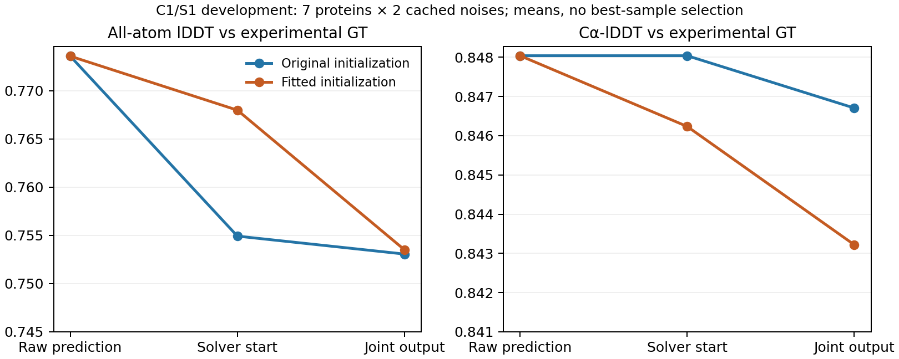

# 更保真的初始化未保住联合修正后的精度：本版收口

2026-09-30，DiamondHill CPU。**只更换为局部拟合参数初始化，没有解决当前联合
几何修正的精度取舍。** 初始化时AA-lDDT优势约0.01306，最终只剩0.00044；
联合通过数13/14→12/14，Cα-lDDT下降。本批不支持继续推进这个初始化版本。

## 比较条件与验收范围

沿用953b40fe锁定的8条开发来源；7条可运行，3CR6链—非蛋白共价连接仍不支持。
两枚缓存噪声12345/54321，每份预测两种初始化：共32个计划槽位，28次求解完成，
4个来源不支持槽位保留，无进程错误。来源为**历史原生ESM2 Mini C1/S1预测**，
不是C4，不是实验GT，也不是新独立验证集。实验GT仅用于输出评分。

两个分支都从原始raw构建同一PoseVariables坐标系和TailObjective；拟合分支仅
复制保存的参数。14对的raw、原局部投影、目标GT、坐标系缓冲量及目标缓冲量均
精确相同，拟合开始坐标重放通过。没有在拟合坐标上重新建立零变量或重置正则锚。
原求解器与top16尾部目标相对冻结2aa87043未改代码；两个分支都使用新L-BFGS状态、
rho1/10/100，每阶段max_iter60/max_eval90，最终迭代验收，无额外阶段或重启。

这是**相同联合求解预算上限**，不是相同总计算量：拟合分支还需此前60次局部
拟合。原有几何、链连接、手性、位移与评分定义均未改变。保留32条验证集未重跑。

## 实验精度与几何结果

下表质量是7条可运行蛋白的两噪声均值再平均；不是最佳噪声，也不是8条完整验证。
几何分母为14份可运行输入；包含不支持来源时，两分支均为16个计划输入。

| 指标 | 原预测 | 旧初始化＋联合求解 | 拟合初始化＋联合求解 |
|---|---:|---:|---:|
| 实验全原子lDDT | **0.773584** | 0.753066 | 0.753510 |
| 实验Cα-lDDT | **0.848037** | 0.846704 | 0.843219 |
| 联合几何与位移通过 | 0/14 | **13/14** | 12/14 |
| 两噪声均联合通过的蛋白 | 0/7 | 6/7 | 6/7 |
| 链连接通过 | 0/14 | 13/14 | **14/14** |
| 全部被检查手性正确 | 8/14 | 14/14 | 14/14 |
| 零严重原子对 | 4/14 | 14/14 | 14/14 |
| 整体位移要求通过 | 14/14 | 14/14 | 14/14 |

拟合初始化的AA-lDDT从0.767987降到0.753510，而旧初始化从0.754925变为0.753066。
两种终点对raw仍分别损失约0.02007、0.02052。**更好的初始投影并没有转化为
同等量级的终点优势；不能继续把主要质量损失解释成仅仅初始化没有拟合好。**
这没有证明所有联合求解或附近可行输出都必然损失精度，只限定本次固定目标与预算。

| 蛋白 | 原预测AA-lDDT | 旧初始化终点 | 拟合初始化终点 | 联合通过数：旧→拟合 |
|---|---:|---:|---:|---:|
| 3IE9 | 0.753157 | 0.734377 | 0.730378 | 2→2 |
| 4A02 | 0.746726 | 0.728986 | 0.729149 | 2→2 |
| 5GU9 | 0.846602 | 0.820330 | 0.822528 | 2→2 |
| 2FC3 | 0.838536 | 0.814237 | 0.815089 | 2→2 |
| 4B9P | 0.751775 | 0.734917 | 0.736762 | **2→0** |
| 3D8L | 0.602532 | 0.590141 | 0.592617 | 1→2 |
| 1J7B | 0.875763 | 0.848473 | 0.848048 | 2→2 |
| 3CR6 | — | 来源不支持 | 来源不支持 | 保留失败 |

逐预测的联合转变为1个失败→通过、2个通过→失败。拟合分支的两个4B9P失败均为
最大穿透超标，虽然已无距离小于1 Å的严重原子对；两者不是同一个指标。
旧初始化3D8L/12345同时存在连接和最大穿透失败，拟合初始化纠正了该个案。
不能只展示这个改善，而忽略两个新增失败。7条中5条AA均值略改善、2条下降，
但6条Cα均值下降，1条改善。这里是开发描述，不是总体统计优势。

两组Cα相对raw的平均RMS位移为0.334/0.404 Å；最大单原子位移为9.00/9.72 Å。
整体位移合格不代表所有局部原子只小幅调整。所有修正实例的严重碰撞清零，也
不等于所有范德华重叠、化学问题或设计任务都已解决。

## 预算、审计与限制

- 28/28保存参数及坐标独立重放、指标复算通过；14/14配对输入与缓冲量一致。
  最大坐标重放差1.77e−10 Å，最大指标差4.45e−16。
- 两项初始化不换坐标系/目标、错误参数拒绝测试，在本地及DiamondHill各通过。
- 旧/拟合分支联合求解中位时间17.34/16.62秒，平均20.34/20.15秒。拟合分支
  另需已记录的局部拟合阶段平均2.80秒；缓存重用不意味着部署中这部分计算免费。
- 13个旧初始化实例使用180次联合迭代，一个3D8L实例仅39次；拟合分支14个均180次。
  旧3D8L各阶段实际迭代30/7/2、closure91/89/18。停止与低迭代数不代表达到约束
  可行或收敛，不能据此悄悄增加预算。其失败按原规则保留。
- 两分支最大进程RSS约0.87 GiB。无GPU推理、训练、求解器输入梯度或部署延迟声明。

事前条件要求：拟合分支提高配对AA均值，且不减少联合通过数，才考虑新的有界
C4开发。前者微幅达到，后者未达到，**本版不进入该下一关，不追加同一批预算。**

现在要区分局部投影的保真性与联合目标的保真性：前一轮证明局部拟合确能改善
实验GT自投影；本轮证明把这些参数直接接入原联合目标，仍未保住收益。下一步
应先审计联合几何约束相对真实实验构型的残差及取舍，再决定输出函数如何修改。
前一轮7份实验GT本身也未通过当前严格理想连接标准；这值得校准，但不是改判
本批或事后放宽门槛的理由。当前没有依据启动修正器蒸馏、LoRA或恢复突变搜索。

[冻结协议](mini_projection_joint_start_v1.md) ·
[配对汇总](../reports/mini_projection_joint_start_2026-09-30/summary.json) ·
[独立审计](../reports/mini_projection_joint_start_2026-09-30/audit.json)

远端归档：`/media/PM982/onestepfold/joint_start_dev_v1_20260930`；控制器194335已结束。
