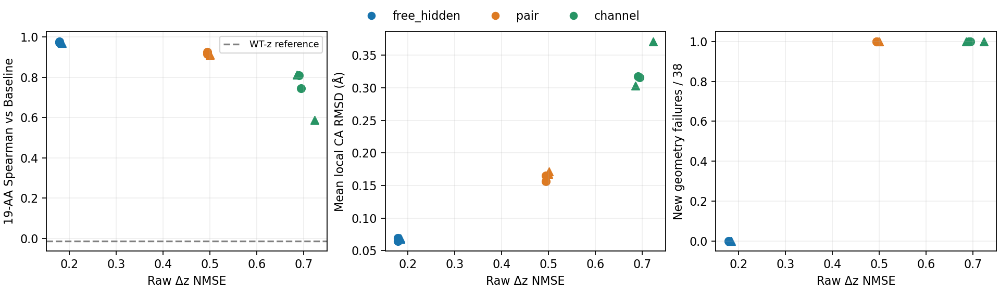

# 12个固定读出终点的 S1 审计：latent 未过门槛，但功能信息并未消失

**本批已完成并收口。** 没有新训练、checkpoint选择或新ESM/C4。原 e301abae 的
12个8192终点全部完成同位点解码，不能继续把它们描述为“功能尚未测”。

最重要的结果是：**共享pair读出虽然raw NMSE约0.49–0.50，仍明显恢复了这个已训练位点
的19-AA排序；它并不接近WT-z的功能基线。** 但所有pair/channel终点都出现1例相对Baseline
新增的所检手性失败。因此，充分latent拟合、排序保真、几何安全仍需分别判断。
本批没有晋升模型，没有启动容量网格或多上下文训练。

[预先锁定协议](mini_readout_endpoint_decode_v1.md) ·
[完整逐例数据与审计](../reports/mini_readout_endpoint_decode_2026-10-02) ·
[原读出训练报告](mini_response_readout_findings_2026-10-02.md)

## 比较对象与参照

固定1W53 T37，长度84；19种non-WT hard替换；旧噪声230201、230211。
全部3种架构×2种训练标签×2种初始化种子，共12个终点。每个终点38份输出、2组19-AA排序。
这些是同一训练位点的相关重复，**不是12个位点或456条独立蛋白**。

所有干预仍使用 **oracle target s、WT s_inputs、原生target原子图和参考化学**。
学生仅替换 z 为 WT z＋预测Δz。Exact保留target s_inputs/s/z；Baseline使用WT s_inputs和
完整target s/z。压缩误差主参照为Baseline，同时完整保留对Exact的结果。
Free-hidden是候选×残基的自由参数表，只是诊断，不能作为迁移模型。

| 参照 | ρ / Baseline | Top1 | regret | local最大偏移 / Å | 新增几何失败 | 绝对通过 |
|---|---:|---:|---:|---:|---:|---:|
| Baseline | 1.000000 | 2/2 | 0 | ~0 | 0/38 | 9/38 |
| Exact | 0.995614 | 2/2 | 0 | 0.019807 | 0/38 | 9/38 |
| WT-z | −0.012281 | 0/2 | 0.133382 | 1.419157 | 1/38 | 21/38 |
| Oracle R32 | 0.978947 | 2/2 | 0 | 0.050172 | 0/38 | 9/38 |

WT-z绝对几何通过较多，仍几乎没有排序保真；“几何通过更多”不能单独代表响应预测更好。

## 全部终点：排序恢复与 latent 门槛分离

| 读出 | 标签 | 种子 | raw NMSE | ρ / Baseline | ρ / Exact | Top1 / Baseline | regret / Baseline |
|---|---|---:|---:|---:|---:|---:|---:|
| free_hidden | raw | 231301 | 0.179299 | 0.977193 | 0.976316 | 2/2 | 0.000000 |
| free_hidden | raw | 231303 | 0.179100 | 0.971053 | 0.976316 | 2/2 | 0.000000 |
| free_hidden | r32 | 231301 | 0.184286 | 0.970175 | 0.971930 | 2/2 | 0.000000 |
| free_hidden | r32 | 231303 | 0.184106 | 0.971930 | 0.976316 | 2/2 | 0.000000 |
| pair | raw | 231301 | 0.494478 | 0.914035 | 0.911404 | 2/2 | 0.000000 |
| pair | raw | 231303 | 0.494479 | 0.924561 | 0.918421 | 2/2 | 0.000000 |
| pair | r32 | 231301 | 0.499949 | 0.909649 | 0.902632 | 1/2 | 0.015849 |
| pair | r32 | 231303 | 0.500397 | 0.911404 | 0.909649 | 2/2 | 0.000000 |
| channel | raw | 231301 | 0.694234 | 0.743860 | 0.730702 | 1/2 | 0.015849 |
| channel | raw | 231303 | 0.690423 | 0.809649 | 0.811404 | 1/2 | 0.015849 |
| channel | r32 | 231301 | 0.685443 | 0.813158 | 0.800877 | 1/2 | 0.015849 |
| channel | r32 | 231303 | 0.722888 | 0.586842 | 0.567544 | 0/2 | 0.133382 |

ρ为每个终点两枚噪声的Spearman均值。Top1逐噪声判定，regret是在参照任务上评价学生所选AA
相对参照最优AA的差，越低越好；没有根据结果改成新门槛。
[逐噪声表](../reports/mini_readout_endpoint_decode_2026-10-02/per_noise_rankings.csv)还保留
Top3/5 recall、normalized regret和task MAE；完整functional_report.json.gz另保留包含WT的辅助排序。

- **Free-hidden**：ρ=0.9702–0.9772，四个终点均Top1 2/2、regret=0；比WT-z明显恢复，
  接近本位点Oracle R32的排序，但仍是表式记忆诊断。
- **Pair共享读出**：ρ=0.9096–0.9246。raw标签的两个终点均Top1 2/2、regret=0；
  R32标签seed231301在noise230211选择C而Baseline最优为M，产生均值regret0.015849。
  另一个R32终点为2/2。不能把这组结果写成“latent失败所以功能也等于WT-z”。
- **Channel共享因子读出**：ρ=0.5868–0.8132，明显弱于pair且种子差异较大；
  R32 seed231303的Top1为0/2、regret0.133382，与WT-z的regret相同。
  不能只展示另外三个较好终点。

Baseline两枚噪声的最优替换分别为S和M。因此Top1保真是相对各自噪声的参照，不是证明
存在一个跨噪声最优突变，更不是硬设计验收。

## 结构尾部与几何转换

以下local Cα RMSD均在全局Cα刚体对齐后，相对Baseline、使用原协议固定邻域计算，单位Å。

| 读出 / 标签 / 种子 | local均值 | P95 | P99 | 最大 | 新增失败 | 绝对通过 |
|---|---:|---:|---:|---:|---:|---:|
| free_hidden / raw / 231301 | 0.069654 | 0.112601 | 0.149800 | 0.166142 | 0/38 | 10/38 |
| free_hidden / raw / 231303 | 0.064952 | 0.103617 | 0.124664 | 0.127968 | 0/38 | 10/38 |
| free_hidden / r32 / 231301 | 0.068318 | 0.114920 | 0.129717 | 0.136145 | 0/38 | 11/38 |
| free_hidden / r32 / 231303 | 0.068094 | 0.106229 | 0.107841 | 0.108022 | 0/38 | 12/38 |
| pair / raw / 231301 | 0.156428 | 0.235896 | 0.304364 | 0.305389 | 1/38 | 17/38 |
| pair / raw / 231303 | 0.164921 | 0.284176 | 0.347142 | 0.349867 | 1/38 | 15/38 |
| pair / r32 / 231301 | 0.167907 | 0.284122 | 0.336718 | 0.346526 | 1/38 | 17/38 |
| pair / r32 / 231303 | 0.171434 | 0.309573 | 0.374846 | 0.375393 | 1/38 | 18/38 |
| channel / raw / 231301 | 0.315579 | 0.598744 | 0.689410 | 0.704905 | 1/38 | 18/38 |
| channel / raw / 231303 | 0.317787 | 0.618005 | 0.688361 | 0.710030 | 1/38 | 19/38 |
| channel / r32 / 231301 | 0.303345 | 0.586028 | 0.655203 | 0.683676 | 1/38 | 20/38 |
| channel / r32 / 231303 | 0.370954 | 0.688084 | 0.802291 | 0.817623 | 1/38 | 20/38 |

**12个终点全部没有local RMSD>1Å的实例，但不等于没有几何退化。**
Free-hidden四个终点均保留全部9个Baseline通过实例，另恢复1–3例。
Pair四个终点恢复7–10例，同时各丢失1例；channel恢复10–12例，也各丢失1例。
每个终点的新增失败都是 **T37N / noise230211**：Baseline所检手性错误数为0，学生为1；
严重非键合碰撞数仍为0。这里定位的是候选/噪声，不把它直接归因到突变残基本身的手性中心。
WT-z也在这一候选/噪声出现相同检查类别的失败，但这不足以证明共享的微观机制。

八个pair/channel终点各1例，是同一候选/噪声在不同模型下的八份输出，**不是八个独立失败案例**。
所有通过→失败、失败→通过的候选身份与前后几何值均保存在summary.json。
“通过”只指零严重碰撞＋严格所检查中心手性，不能扩大为全部键长、连接、侧链化学都正确。
绝对通过仅10–20/38；即便没有新增失败的free-hidden，也没有得到全面化学有效输出。

AA-lDDT相对Baseline：free-hidden约0.9987–0.9989，pair约0.9853–0.9870，channel约
0.9560–0.9675。CA/all-atom lDDT、全局RMSD、pair距离RMSE、contact/distogram差异及逐例
极值保留在[逐候选表](../reports/mini_readout_endpoint_decode_2026-10-02/per_candidate_metrics.csv)。

## NMSE还有信息，但0.10不能独自决定是否值得解码

12个固定终点中，raw NMSE与Baseline Spearman的描述性相关为−0.9650，
与平均local RMSD的相关为+0.9720。总体上矩阵误差更低对应更好的功能保真，
**这不是推翻NMSE的价值**。但pair在约0.49 NMSE下已经恢复相当多的排序信息，
证明“没有充分拟合”和“没有功能价值”不能直接等同。
这些跨架构、标签和种子的相关仅描述此位点；没有独立样本量、显著性或因果解释。



圆点=raw标签，三角=R32矩阵标签。图中几何失败的离散计数也说明均方误差/平均结构偏移
不能替代逐例化学检查。本批保留原NMSE≤0.10的“充分拟合未通过”结论，没有追溯改判训练。

## 执行与独立审计

456次学生mutant/noise解码＋152次四组参照解码＋2次共享WT=**610次S1**。
统计表640行包括跨16个arm重复使用的WT，不是640次预测。C4 hook计数0；未运行ESM；
参数更新0。控制器墙钟194.43秒，其中解码阶段131.21秒，包含加载、矩阵准备、原生化学重建
和存储，并非纯S1延迟或端到端加速基准。

- 12个checkpoint哈希在运行前后相同；12个raw/label终点NMSE重放最大差为0。
- 20个坐标包的旧参照逐位重放通过；160行旧参照评分及24项旧参照排序完全一致。
- 独立复算120项排序、96项lDDT；16个arm的38例几何转换分母核对通过。
- 20个下载坐标包SHA256通过；8项读出、功能指标和资源策略相关测试通过。

冻结代码、checkpoint/source哈希、逐例结果及执行终态均保留；本次没有接触旧训练产物。
脚本只适用于本锁定面板，并不声称通用评测器。

```text
本机：/home/husrcf/Code/onestepfold_runtime/readout_endpoint_decode_v1_20261002
DiamondHill：/media/IntelSSD/onestepfold/hpc3_mirror_20261001/Folding/readout_endpoint_decode_v1_20261002
```

## 本批决定

1. 结束本次终点审计，保留旧latent失败与新的功能正面证据；不追加训练、不选新checkpoint。
2. 不再把pair共享读出描述为“功能仍接近WT-z”。它在已训练位点恢复排序，但未通过独立
   泛化、全部conditioning替代或几何安全验收。
3. 下一项更有依据的是**另立有界的多上下文联合拟合与功能检查**，而不是仅为NMSE过0.10
   自动扩大读出。训练位点、未训练位点、未训练蛋白需分别报告；建议不等于本批已启动。
4. 继续保留oracle target s限定、N/230211回归失败，以及6UFE-92旧stress case。
   本批未覆盖6UFE-92，不能把1W53的小尾部推广为高增益位点已安全。

已有整场dense的同位点近精确解码仍成立，本批没有重跑或晋升它。当前任务分数仍是固定
父序列实验骨架的Cα距离代理，不是突变实验效应、序列设计收益或binder性能。
