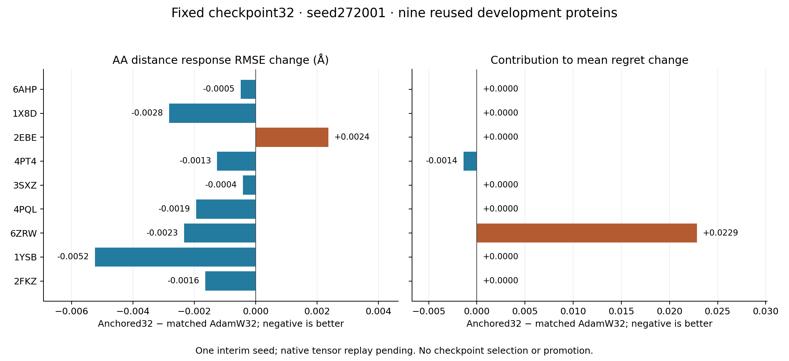

# Reference-anchor trial: first fixed checkpoint, no terminal decision

Seed272001 has completed the pre-specified32-update checkpoint and all1,824
candidate/noise S1 outputs. Training continues to128. The second seed is still
running. The latent comparison below now has a coordinate-scoring follow-up.
This remains an interim checkpoint, not the selected main result, independent
confirmation or promotion. Both terminal128 results are still required.

The comparison uses the already closed unanchored AdamW272001 checkpoint32:
same initialization, training data, candidate exposures, objective and optimizer.
The anchor branch adds reference work, so computation and wall time differ.
The residual target remains target_C4_pair minus unadapted candidate pair; zero
correction has NMSE1. Values below are site-normalized then protein weighted.

| Panel | Old AdamW AA residual NMSE | Anchored AA residual NMSE | Parents improving |
|---|---:|---:|---:|
| TRAIN |0.996782|0.956188|14/15|
| Same-protein new site |0.999969|0.990952|2/3|
| New-protein development |0.999279|0.986352|6/9|

Descriptive protein-paired bootstrap intervals for anchored-minus-control AA
NMSE are[-0.06361,-0.02119] on TRAIN and[-0.02352,-0.00151] on the nine-protein
development panel. The three-protein new-site interval crosses zero. These are
the original fixed resampling rules, not new thresholds; repeated development
use and a single interim seed limit interpretation.

The learning signal is stronger than the unanchored same-budget checkpoint,
but recovery remains small: about4.38% of TRAIN and1.36% of new-protein AA
residual NMSE relative to zero correction. This does not resolve the large
oracle gap. On new proteins the predicted AA energy ratio is0.02316 and cosine
0.11075, versus0.000155 and0.04262 in the control. Producing more AA variation
is not sufficient; final decoded structure, regret and geometry remain required.

The predicted common-energy fraction decreases from0.9893 to0.5582 on TRAIN,
and0.9907 to0.5163 on new proteins. Some reduction follows directly from the
reference subtraction; it must not be treated as independent evidence of
correct response recovery. The AA error comparison above measures a different
quantity. The training graph, not a post-hoc substitution, generated this state.

Evidence: `reports/mini_reference_anchor_training_2026-10-10/interim_32_seed272001`.
Evaluation SHA256:
`c6c6fbf28675ad5f7bc27ec79619b514e57e4057ae33d82ee061a57bd0c4babc`.
Remote checkpoint hash was independently checked against the saved evaluation:
`76c83765f301da161c9c2e71f1500f592c3da6218377ed46a2e69701e896db41`.
The local comparison recomputes aggregation and intervals from saved moments.
Full checkpoint re-forward is still pending in the locked controller. Hash
equality alone is not a tensor replay. The coordinate follow-up below used the
unchanged scorer on the already generated outputs in an isolated CPU directory.

## Coordinate follow-up: small response gain, greater selection loss

The fixed32 checkpoint's1,824 structures were scored using the original rules,
without another model forward. The scorer checked their source hashes. Local
recomputation reproduced the summary, every old-choice/new-noise regret and the
geometry transition accounting. All Exact, unadapted and oracle rows match the
closed historical comparison row for row. The actual training directories were
not modified; terminal scoring will recompute this node independently.

On the nine reused development proteins (18 sites,684 candidate/noise outputs):

| Metric | Unadapted | Old AdamW32 | Anchored32 |
|---|---:|---:|---:|
| Spearman, two-noise mean scores |0.541423|0.545322|0.565107|
| Centered AA distance response RMSE (Å) |0.448182|0.448327|0.446796|
| Old-choice/new-noise regret |0.046314|0.046314|0.067788|
| Top1, mean scores |6/18|6/18|6/18|
| Geometry passes |432/684|434/684|429/684|
| All-atom lDDT fidelity to Exact |0.927049|0.927063|0.926914|
| Local deviation >1 Å versus Exact |141|138|150|
| Local deviation P95 (Å) |3.43950|3.42854|3.38749|
| Local deviation P99 (Å) |5.76091|5.74007|5.74749|
| Maximum local deviation (Å) |6.93855|6.93498|7.00774|
| Severe collision pairs |2282|2306|2264|
| Wrong checked chirality centres |324|342|339|

Relative to matched AdamW32, the descriptive protein-paired intervals are
[0.000585,0.037427] for Spearman change and[-0.002774,-0.000253] Å for response
RMSE change. The latter is a0.34% improvement in this aggregate error. This is
a small decoded response signal, not merely a latent comparison. Response RMSE
improves on8/9 development proteins, with2EBE worsening. Regret changes
by+0.021473, with interval[-0.004145,0.068565]; one interim seed and nine reused
proteins do not establish a reliable selection effect in either direction.

Only two old-noise choices differ from the matched control; the other16 remain
unchanged. All evaluation keeps the selected candidate fixed on new noise.

| Site | Old → anchored choice | New-noise regret before → after | Contribution to mean change |
|---|---|---:|---:|
|4PT4 L10|P → Q|0.046766 →0.021896|−0.001382|
|6ZRW P80|C → S|0.155223 →0.566614|+0.022855|

Thus the6ZRW loss more than offsets the4PT4 benefit. No candidate was reselected
on new noise, and these are reference-backbone proxy costs, not experimental
mutation utility. Regret median is unchanged; the worst protein mean rises
from0.19607 to0.31655. Correct mean-score Top1 is a different aggregation and
remains6/18.

Relative to old AdamW32, anchored32 breaks8 previously passing outputs and
repairs3. Relative to the unadapted path, it breaks6 and repairs3. Collision
counts improve while other geometry and tail measures do not, so neither a net
pass count nor a single tail percentile represents the entire result.

TRAIN Spearman improves by0.01971 and response RMSE by0.002689 Å relative to the
matched control. TRAIN regret improves by0.008567, almost entirely through
2ED6 V137 (Y → F);1QVC D95 also improves. On the three same-protein new sites,
Spearman drops by0.02222, response RMSE changes little and all choices stay the
same. These strata remain separate.

The evidence and recomputation script are in the `coordinates_scored` subfolder
of the interim report. Its README distinguishes the retained bulk score file
from the published summaries. This follow-up does not justify a recipe change,
an intermediate winner, or a speed claim. The locked128-update experiment,
second seed and native tensor verification continue unchanged.

No training, evaluation rule, budget, source or checkpoint-selection policy was
changed in response to these numbers. The primary result remains128 for both
seeds, evaluated against unadapted, matched control, oracle-pair and fixed wrong
AA assignment. Do not infer useful folding acceleration from this interim gain.
