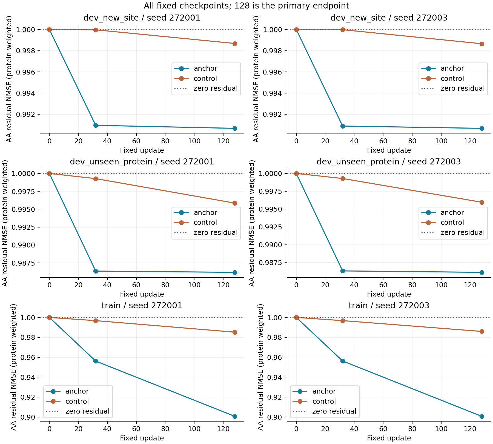
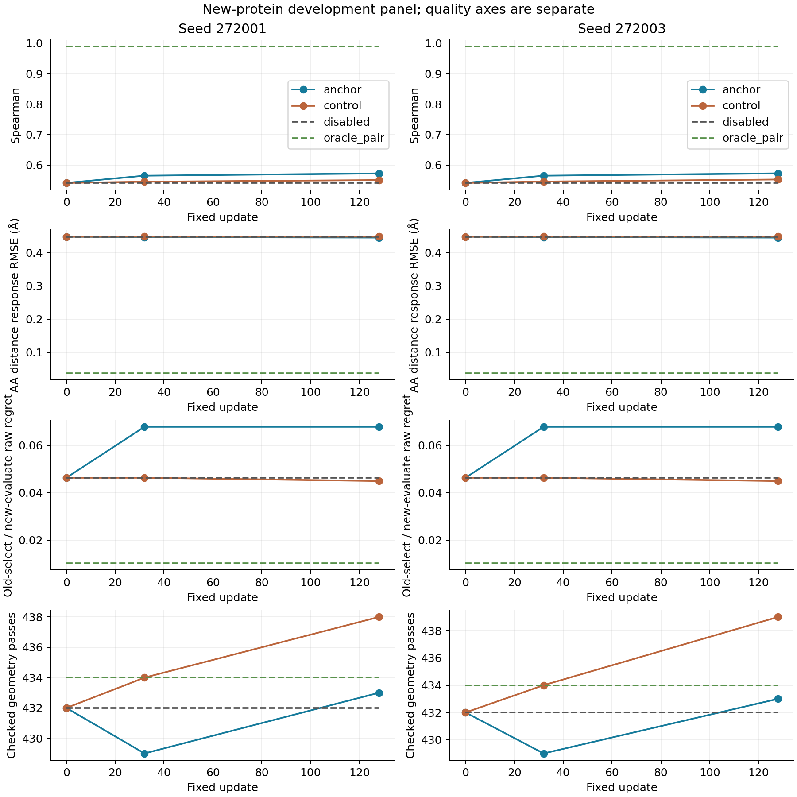

# Mini reference-anchor training: terminal paired results

Both locked runs completed and passed independent tensor replay. The reference
anchor substantially improves TRAIN AA residual recovery and produces a small,
reproducible decoded-response improvement on the reused development panel.
It also reproduces a costly selection error and does not qualify for promotion.
This closes the fixed-budget comparison; neither seed nor an earlier checkpoint
is selected as a winner.

The [protocol](mini_reference_anchor_training_v1.md) fixes 15 TRAIN references,
27 sites, 513 mutants, two seeds and 128 full-gradient AdamW updates. The model
has the same 1,315,332 parameters as the closed unanchored controls. The change is
`U(candidate) - [U(WT, site) - native_WT_C4_pair]`, with gradients through both
branches. Candidate native inputs and single remain unchanged. Target pair is
supervision only. No S1 loss, new teacher, ESM/MSA preparation or native recycle
was added to training.

At fixed parameters the common subtraction does not change centered AA outputs
in real arithmetic. It changes the common-objective gradient and subsequent
optimization, not the centered-AA function class. This is not a postprocessing
demonstration that subtracting a common drift recovers candidate responses.

## Learning improved, with a large remaining gap

Residual NMSE is normalized at each site and averaged within protein, then
across proteins; zero correction is 1. The table is not the site-weighted
optimization objective.

| Terminal metric | Old 272001 | Anchor 272001 | Old 272003 | Anchor 272003 |
|---|---:|---:|---:|---:|
| TRAIN AA residual NMSE | 0.985223 | **0.900734** | 0.985946 | **0.900649** |
| New-protein AA residual NMSE | 0.995856 | **0.986180** | 0.995959 | **0.986105** |
| Same-protein new-site AA residual NMSE | 0.998680 | **0.990665** | 0.998656 | **0.990674** |
| TRAIN decoded response RMSE, Å | 0.408581 | **0.397019** | 0.408865 | **0.397014** |
| TRAIN Spearman | 0.583392 | **0.637193** | 0.581287 | **0.637427** |

TRAIN AA NMSE improves on 14/15 proteins in each run. The paired mean
differences from the old heads are -0.08449/-0.08530, with descriptive intervals
[-0.12135,-0.05142]/[-0.12228,-0.05206]. Roughly 90% of the normalized TRAIN AA
residual remains. Neither convergence nor a capacity limit has been established.

On new proteins, AA NMSE improves on 6/9 proteins in each run; the paired
intervals versus the old controls cross zero. It changes very little between
32 and 128 updates, while TRAIN continues improving. The predicted AA energy
is only about 5.5% of the required residual energy on that panel. The fraction
of predicted correction energy in the common component is about 54% on TRAIN
and 51% on new proteins; the anchor does not force all common corrections away.

The independently evaluated full TRAIN objectives at 128 are
0.7440514031/0.7440000385, from the common initial value 0.8683360245.
The final training-log losses describe the state before update 128 and are
not substituted for these post-update measurements.

## Decoder benefit is real but insufficient

The new-protein panel has nine repeatedly used development proteins, 18 sites
and 684 candidate/noise outputs. Spearman ranks noise-averaged candidate scores;
regret selects on the old noise and evaluates that same candidate on new-noise
Exact scores. Regret is the parent-backbone-distance proxy, not biological
mutation utility. All structural fidelity here is relative to Mini C4.

| Method | Spearman | AA response RMSE, Å | Raw regret | Geometry passes |
|---|---:|---:|---:|---:|
| Unadapted WT3→candidate final recycle | 0.541423 | 0.448182 | **0.046314** | 432/684 |
| Old full-batch 272001 | 0.550682 | 0.448367 | **0.044933** | 438/684 |
| Old full-batch 272003 | 0.552632 | 0.448365 | **0.044933** | 439/684 |
| Anchor 272001 | 0.572515 | **0.445450** | 0.067788 | 433/684 |
| Anchor 272003 | 0.572710 | **0.445408** | 0.067788 | 433/684 |
| Fixed-single, oracle target pair | 0.988986 | 0.037607 | 0.010270 | 434/684 |
| Exact C4 | 1.000000 | 0 | 0.008366 | 438/684 |

Both anchor endpoints improve decoded response on 9/9 proteins relative to
their old controls. Mean paired RMSE differences are -0.002917/-0.002957 Å;
both descriptive intervals lie below zero. Relative to unadapted continuation,
the reduction is only 0.610%/0.619%. Spearman improves over unadapted continuation
with intervals above zero, but its comparison with the matched old controls
still crosses zero. These are small development-panel benefits, not independent
confirmation of reliable mutation folding.

Correct candidate assignment also matters: its response RMSE is lower than
the pre-fixed wrong assignment (0.450842/0.450839 Å), with both paired intervals
below zero. Yet the wrong assignment has lower mean regret (0.060319).
Correct response information and reliable final selection are still distinct.

## The same high-cost choice defeats both runs

Both seeds make identical old-noise choices at all 18 development sites.
Compared with the old 128-update controls, the only changed choice is
**6ZRW P80: C→S**, increasing its regret from 0.155223 to 0.566614.
The difference divided by 18 is 0.022855, exactly the aggregate degradation
relative to the old controls. All other 17 choices are unchanged.

Relative to unadapted continuation, 4PT4 L10 also changes P→Q and improves
regret from 0.046766 to 0.021896; that benefit already existed in the old
128-update controls. It does not offset P80. Overall regret is 46.4% above
unadapted continuation, while its protein median stays 0.008972 and the worst
protein mean rises from 0.196070 to 0.316549. Top1 stays 6/18.

P80's Exact old and new noises both select Q. The anchor's own old-noise top-two
margin is about 0.00288, whereas Exact's is about 0.15877. A small student
margin is not evidence of a teacher tie or negligible true proxy cost. The
failure cannot be assigned to teacher best-candidate noise switching.

Geometry also remains mixed. Each anchor breaks nine unadapted passes and
repairs ten, producing a net gain of one. Severe clash pairs rise 2282→2331,
wrong chiral-center instances 324→343, and local displacements above 1 Å
141→157. P95 decreases 3.4395→3.3947/3.3917 Å, while the maximum increases
6.9385→7.0623/7.0660 Å. Net pass count does not describe these tails.
Same-protein new-site response is slightly worse than the old controls, and
its choices/regret are unchanged. TRAIN structure gains also do not produce
a uniform geometry improvement.

## Execution and audit

All six original train/score/verify jobs exited successfully. No run was
restarted, extended, migrated to the parallel prototype or selected by its
intermediate score. Both independent verifiers checked 144 site/checkpoint
combinations, 2,736 candidate forwards and 144 reference forwards each.
Initialization reproduces archived unadapted coordinates exactly.

Per seed, optimization used 65,664 candidate forwards/backwards and 3,456
additional reference forwards/backwards. Fixed evaluation used 7,296 S1 calls,
including the locked terminal mismatch. No candidate C4/input-encoder/recycle
ran in training. The preceding WT-boundary preparation and candidate native
work remain part of a future deployment cost; cached training is not free
folding. The 128 updates match candidate exposure and optimizer settings to
the controls, **not total computation or wall time**.

Worker durations were 4,259/7,523 seconds, including cache loading and
evaluation, with 25,864,205,312 peak allocated GPU bytes each. These concurrent
execution records are not an isolated speed benchmark; the unequal duration
has not been assigned a causal explanation. This trial makes no new acceleration
claim and does not inherit the earlier approximately 2.7× timing unchanged.

The 247,838,833-byte archive passed SHA256 validation. Local verification
checked 76 manifest files, 3,744 correlations, 1,248 regrets and 47,424 output
records. The local optimization ledger and complete paired analysis match the
remote versions exactly. Local verification recomputes score arithmetic, not
geometry from coordinates; coordinate scoring and tensor replay ran remotely.
All three generated figures were inspected. See the
[evidence index](../reports/mini_reference_anchor_training_2026-10-10/terminal/README.md)
for hashes, tables and the complete-archive location.

The fixed-budget hypothesis has a partial positive answer: changing the
reference-dependent training graph improves feature learning and a small
amount of decoded response. It does not establish satisfactory fitting,
reliable selection, geometry, or a deployable accelerated model. Preserve this
as a completed comparison. Do not search anchor scales, pick a seed, or extend
these runs on the same development panel. Native multi-GPU equivalence remains
a separate, unexecuted acceptance gate for the existing CPU infrastructure
prototype; it is not evidence about model quality.
