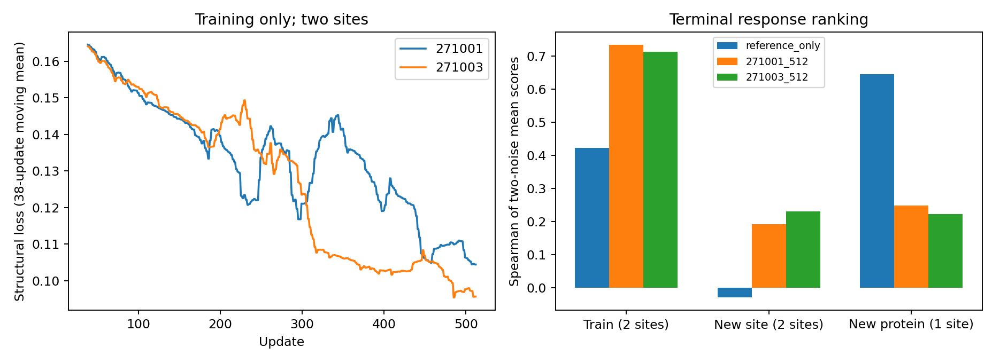

# Mini 参考记忆编辑原型：完整 conditioning 与 S1 试跑

**本批已完成。共享参考缓存、候选隔离、完整 conditioning 写出和冻结 S1 反传均已跑通；训练位点出现功能收益，但尚未建立跨蛋白迁移，不能晋升为折叠加速器。** 使用 Mini，不使用 Base。没有新增数据下载、ESM/C4 teacher、实验 mutant 标签或模型搜索。

[锁定协议及训练前执行修订](mini_reference_editor_v1.md)；[结果与复核归档](../reports/mini_reference_editor_2026-10-07/README.md)。成功运行目录 `reference_editor_v1a_20261007`。

## 模型与数据边界

参考和 decoder 初始化为官方 `protenix_mini_esm_v0.5.0`（135.22M参数），与现有 factor teacher 归档匹配。没有混用此前 fixed／retained512 或 Base 权重。Mini 全部冻结。参考是既有原生 ESM+C4 的 `s_inputs[ L,449 ]、s[ L,384 ]、z[ L,L,128 ]`，由三份父蛋白缓存复用。

新模型9,352,387参数，width256、32个工作 token、4个编辑 block、8 heads。每层依次读取参考记忆、读取候选残基状态、工作区自交互、写回所有残基；末端非线性 pair 写出读取完整 WT pair 内容及左右残基状态。输出候选自己的 **s_inputs、s、z 全部三项**，连同目标硬序列的原生原子图和化学交给 Mini S1。无 target ESM/C4、无 oracle target s、无 AA或空间 rank 截断、无 Differential attention。

可训练投影及各层参考 K/V 在同一更新内共享；更新后旧缓存按参数版本拒绝。空编辑 workspace 缓存并用于锚定；末端空编辑 pair 写出仍会重算，已包含在计时中。本版候选采用相同形状的逐个执行，共享参考计算，**没有实现或宣称20候选并行加速**。

训练两个位点：1W53 T37、1JHG A2，各19个非WT替换。保留1W53 Y84、1JHG N25作同蛋白新位点；4PT4 L10作本批未训练蛋白。它们都曾用于开发，不能当独立确认。仅两条训练蛋白、38个不同 mutant 标签。

两个初始化271001/271003各512次更新；每步同一父蛋白两个候选，两个训练位点交替，合计每位点512次候选曝光（每AA约26–27次）。结构标签是旧噪声230201下的 exact native Mini C4/S1输出；230211在本批只评测，但它是历史开发噪声，不是首次独立确认。父实验骨架仅用于沿用的任务评分，不进入编辑分支，也不是 mutant 实验真值。

训练损失为对齐后的全原子坐标MSE、Cα距离MSE、既有碰撞与所检手性惩罚。没有 latent NMSE监督、排序loss或数据扩展。终点512为主结论，0/128固定评测保留。

## 完整性与两次中断记录

第一次启动后，DiamondHill 在2026-10-07 15:41:38 HKT重启。原进程消失，无终态或 checkpoint，原目录保留；没有把 SSH超时本身解释为失败。

第一次重启执行通过全部95个 mutant ×两噪声的 exact S1重放，但在训练前的候选重排检查失败。真实参考 single 最大绝对值1768.336，最大重排差异0.0001220703125，约一个该尺度FP32 ULP；各编辑 block差异约1e-6，固定顺序重复逐位一致。这支持浮点批处理布局差异的解释，不是发现候选注意力互相连接。该次没有参数更新，386次S1与失败终态单独留档。

训练前修订v1a保留原1e-4阈值，改成候选逐个执行、共享参考投影和空编辑workspace。模型结构、loss、初始化和预算不变。成功批次全部缓存重建、无编辑、候选顺序／子集检查逐位一致（最大误差0）；CPU测试另覆盖多编辑顺序、非法编辑、跨位置响应和旧缓存拒绝。

真实S1结构loss对参考投影、AA query、第一层读取、pair记忆、三项conditioning写出均给出非零有限梯度；Mini参数无梯度。两枚种子都正常完成，0次候选C4、0次输入编码器调用、**1024次更新、3808次S1**。worker486.33秒，控制器494.94秒。独立重载6份checkpoint，另运行12次S1，保存坐标全部逐位重放一致。8项本地聚焦测试通过。

全部源码/teacher清单/原权重和参考缓存哈希通过核验。独立评分从保存坐标计算1520条逐候选、逐噪声、逐方法记录；8种方法包括Exact、reference-only、两个种子的0/128/512终点。完整坐标和checkpoint留在远端，报告记录哈希。

## 功能结果：训练信息提高，不等于选择风险下降

基线 `reference_only` 使用完整WT conditioning及目标化学；它**不是**以前含oracle target s的WT-z。下表ρ先对两噪声任务分数求均值，再对19AA排序，最后按位点等权汇总；不能与逐噪声ρ均值混用。Top1也按两噪声均分选择。Regret沿用旧噪声选择、在新噪声Exact上评价，保持原任务单位。

| 分层 | 方法 | 均分ρ | Top1 | 旧选新评regret | AA-lDDT保真度 |
|---|---|---:|---:|---:|---:|
| 训练2位点 | reference_only | 0.4228 | 0/2 | 0.12610 | 0.95924 |
| 训练2位点 | 271001/512 | 0.7342 | 0/2 | 0.06055 | 0.96940 |
| 训练2位点 | 271003/512 | 0.7132 | 0/2 | 0.14417 | 0.97090 |
| 同蛋白新2位点 | reference_only | −0.0289 | 0/2 | 0.15787 | 0.95125 |
| 同蛋白新2位点 | 271001/512 | 0.1921 | 0/2 | 0.15787 | 0.95029 |
| 同蛋白新2位点 | 271003/512 | 0.2316 | 0/2 | 0.15787 | 0.94867 |
| 新蛋白1位点 | reference_only | 0.6456 | 0/1 | 0.03368 | 0.99573 |
| 新蛋白1位点 | 271001/512 | 0.2491 | 0/1 | 0.03962 | 0.99554 |
| 新蛋白1位点 | 271003/512 | 0.2228 | 0/1 | 0.03962 | 0.99480 |

训练位点两枚种子旧噪声ρ为0.3763/0.3719，确认噪声为0.6044/0.6000；对应基线为0.1535/0.2982。均分ρ更高是不同聚合定义的结果，不能写成“每枚噪声都达到0.73”。

训练收益主要来自T37：均分ρ从0.0316提高到0.6193/0.6035。但两个学生都选择I，旧选新评regret从基线C的0.03251升到0.06864。A2本来基线ρ已0.8140，学生为0.8491/0.8228；第一枚种子选Y、regret0.05245，第二枚仍选W、regret0.21970。因此训练平均regret的收益没有跨种子稳定成立。

同蛋白新位点的ρ改善主要来自Y84（−0.3667→0.0684/0.2684）；两者仍选W，regret不变。N25也没有稳定增益。4PT4 L10两枚学生均从基线选择T改为E，排序与regret均变差。不能将这一条蛋白推广成所有新蛋白失败，但本批没有跨蛋白正面证据。

训练loss最初/最后38更新均值分别为0.16453→0.10441、0.16409→0.09565。这些窗口覆盖相同循环候选日程，下降成立；末段仍波动，512步不是收敛证明，也不能由本批否定架构可拟合性。

## 结构尾部和几何

下面偏移均相对同噪声Exact模型输出，不是对实验mutant坐标的准确率。通过仅指零严重碰撞与严格所检手性，不是完整化学正确。另存键长极值与肽键C–N对1.33Å的描述性RMSE，不把它们追加为事后判定阈值。

| 分层 | 方法 | 平均局部RMSD Å | 最大 Å | >1Å输出数 | 几何通过 | Exact通过→失败 |
|---|---|---:|---:|---:|---:|---:|
| 训练 | reference_only | 0.4579 | 1.4691 | 4 | 36/76 | 4 |
| 训练 | 271001 | 0.3757 | 1.0211 | 1 | 37/76 | 4 |
| 训练 | 271003 | 0.3493 | 0.7780 | 0 | 36/76 | 4 |
| 同蛋白新位点 | reference_only | 1.1926 | 6.2685 | 37 | 34/76 | 8 |
| 同蛋白新位点 | 271001 | 1.1869 | 6.2843 | 35 | 32/76 | 9 |
| 同蛋白新位点 | 271003 | 1.2110 | 5.9580 | 34 | 35/76 | 6 |
| 新蛋白 | reference_only | 0.3148 | 0.4777 | 0 | 38/38 | 0 |
| 新蛋白 | 271001 | 0.2958 | 0.4747 | 0 | 38/38 | 0 |
| 新蛋白 | 271003 | 0.2918 | 0.4675 | 0 | 38/38 | 0 |

新蛋白整体结构保真仍很高、几何没有新增失败，却丢失排序信息，再次说明小结构误差不保证候选差异正确。Y84的约6Å尾部依旧存在。本批没有6UFE-92、多点结构标签、不同参考到同一序列的一致性或实验配对验证。

Exact本身在训练/同蛋白新位点仅20/76、39/76通过所检几何；高于Exact的通过数不能解释为更准确预测了突变。逐例同时保留相对Exact和reference-only的转换，不能只看净通过数。

## 模型内成本与共享范围

计时只覆盖1W53、准备好的原始参考latent与候选化学。6次记录中首项作为预热展示保留，以下为后5次中位数。逐候选执行，19个非WT替换；没有测20候选并行。

| 时间项 | 271001 | 271003 |
|---|---:|---:|
| 参考可训练投影＋空编辑workspace | 11.73ms | 11.16ms |
| 19候选编辑／dense写出 | 239.10ms | 222.78ms |
| 19次S1及候选decoder缓存 | 428.47ms | 413.03ms |
| 一次投影后逐候选读出（另组实测） | 251.31ms | 238.64ms |
| 每候选重做同一投影（另组实测） | 434.36ms | 442.66ms |

最后两行比较相同新模型的参考投影复用，不含S1；约1.73/1.85倍只是这一组件的实测比例，不能称为完整folding加速。完整参考ESM+C4产生缓存的成本未重新测量，也没有匹配的19次原生C4+S1计时。

最大记录设备allocation约2.723GB，仅代表本批缓存latent的执行边界，不包含重新计算参考ESM/C4所需显存。候选图和decoder缓存每次按预测conditioning生成；没有错误复用WT原子cache。

## 本批决策

工程原型通过：Mini参考记忆可复用，编辑分支能产生全部conditioning，真实S1梯度连通，无编辑和候选隔离得到回放验证。它比旧oracle-target-s组件实验形成了更完整的计算路径。

功能仍不充分：训练结构保真及部分排序改善，Top1未恢复，选择风险未稳定降低；同蛋白新位点有限改善，新蛋白排序退化。两训练位点和固定512步仅支持有界工程试验，不支持宣称新架构已经解决迁移，也不足以判定大规模结构训练必然无效。

本批收口、不晋升、不自动延长。普通cross-attention、固定参考Mini及冻结S1都保持锁定；未测试差分读取、参考编码器适配、实验配对结构训练或独立家族泛化。后续若扩大，应作为新的结构学习协议，而不是将本批工程通过直接改写成“一次WT替代全部mutant C4”已成立。
