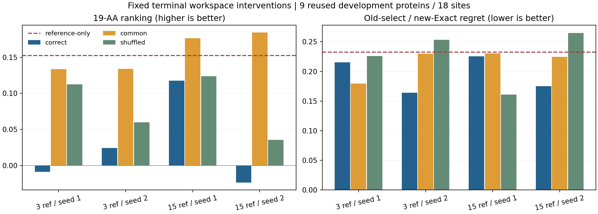

# Mini编辑器AA对应干预：排序与响应未受益，选择收益依赖少数实例

**四个终点的固定干预全部完成；本批收口、不晋升。** 去掉学生conditioning中的AA特异偏差，在四个模型上都改善了平均排序和中心化结构响应误差。固定打乱AA对应后，排序也都高于原学生。但正确对应在两枚第二种子上保留了更低的regret，不能说候选特异计算完全无用，也不能把此前全部收益归于共同修正。

[锁定协议](mini_reference_editor_intervention_v1.md)；[结果、逐位点分解与校验](../reports/mini_reference_editor_intervention_2026-10-07/README.md)。来源为d2da9617封存终点，实施协议提交141570e0；原多参考训练批次仍保持收口。

## 方法与完整性

固定四个Workspace终点：n3/n15×272001/272003。只评共同保留的九蛋白、十八位点、342个non-WT候选，两枚旧噪声230201/230211。全部是反复使用的开发数据，不是独立确认。未加入训练位点或另选有利checkpoint。

预测conditioning三块一起干预：`s_inputs/s/z`。设学生输出为C_a、原WT缓存为C0，mu=mean_19(C_a-C0)，r_a=C_a-C0-mu：

| 条件 | 实际送S1的token conditioning |
|---|---|
| Correct | C_a，原学生正确AA输出 |
| Common | C0+mu，十九个AA共用一份学生平均conditioning |
| Shuffled | C_pi(a)，另一个AA的完整学生conditioning |

每个条件仍用**实际接收候选自己的化学图、原子inventory、reference chemistry及identity noise**。Common没有删除decoder的全部AA信息：候选化学仍然区分AA。没有oracle target s，也没有读取teacher conditioning来求均值或决定置换。

每个位点只有一个预先锁定的hash排序单环置换，无候选映射到自身；同一映射用于四个模型、两枚噪声及所有三块。没有抽多次再挑结果。Correct与Shuffled直接取原张量，避免通过mu+r重建产生浮点差异；Common在CPU FP64求差、求均值再一次转FP32。

四条解码和CPU评分都正常结束，控制器wall time260.05秒。共**8,208次S1、零训练更新、零C4、零输入编码器调用**。**2,736个Correct输出全部与旧终点逐位一致，四份Correct完整汇总也与旧独立评分完全一致。** 六项聚焦测试通过，29份收集文件通过SHA-256及大小校验；另行从分数数组重算全部逐位点Spearman和旧选新评regret。模型、checkpoint、冻结源码及Mini权重完整性检查通过。

## 平均排序：正确AA对应没有胜过两个干预

ρ沿用两枚噪声任务分数先取均值、再排十九AA，最后按蛋白等权。Regret仍在230201选候选，在230211 Exact评价同一个AA；值越低越好。单位仍是父参考Cα距离代理，不是实验突变效用。

Reference-only为**全部WT conditioning＋候选化学＋S1**，不是旧oracle-s WT-z。其ρ=0.152437、regret=0.232504；Exact自身跨噪声regret=0.008366。

| 模型／种子 | Correct ρ | Common ρ | Shuffled ρ | Correct regret | Common regret | Shuffled regret |
|---|---:|---:|---:|---:|---:|---:|
| n3／272001 | −0.0089 | 0.1337 | 0.1127 | 0.21517 | **0.17941** | 0.22583 |
| n3／272003 | 0.0245 | 0.1340 | 0.0599 | **0.16406** | 0.22982 | 0.25321 |
| n15／272001 | 0.1176 | 0.1763 | 0.1238 | 0.22558 | 0.23044 | **0.16113** |
| n15／272003 | −0.0235 | 0.1843 | 0.0357 | **0.17488** | 0.22478 | 0.26496 |

四个Correct的ρ均低于Common，也均低于固定Shuffled。**这是四个相关开发模型的点估计，不是四次独立统计确认。** 九蛋白配对bootstrap中，Correct−Common的ρ区间只有n15/272003完全低于零：[−0.33383,−0.07739]；其余均跨零。Correct−Shuffled的ρ区间全部跨零。

n15的两个Common在ρ上高于reference-only，但这种干预要先生成十九个学生输出，也没有通过完整质量验收，不能晋升成新加速方法。

## Regret：共同修正能保留一部分收益，但不能解释全部

四个Common的平均regret都低于reference-only，说明一些收益不要求保留正确AA对应的学生偏差。尤其n3/272001，Common比Correct还低0.03576。

但n3/272003和n15/272003中，Correct同时优于Common和Shuffled，去掉或打乱AA偏差会失去部分选择收益。n15/272001则是Shuffled最好。这不是“所有收益来自均值”，也不是“正确AA对应稳定有用”。**四个Correct−Common及Correct−Shuffled的regret描述性区间全部跨零。** 这与旧Correct−reference-only在n15/272003不跨零并不矛盾，比较对象不同。

逐位点分解进一步说明平均数由什么推动。九蛋白各有两位点，下列单个位点差值除以18即为对总体regret差的贡献：

- **n3/272003，Correct对Common：**6ZRW T45从Common选择Y（regret1.17931）变成V（0.06648），贡献−0.06182；总差为−0.06576。这一个位点解释了约94%的净改善，没有据此删掉其他位点。
- **n15/272003，Correct对Common：**2EBE A30从M变Q、E47从G变A，两位点合计贡献−0.04826；总差−0.04991。6ZRW T45改善约0.607、P80恶化约0.578，两者几乎抵消。不能把净改善描述成普遍恢复了该蛋白的编辑规律。
- **n15/272001，Shuffled优于Correct：**6ZRW T45从Correct的Y变成Shuffled的D，regret从1.17931降到0.19424。它单独贡献0.05473，占Correct−Shuffled总差0.06446的约85%。打乱没有学到新知识，只是该固定干预改变了选择。
- **n15/272003，Correct对Shuffled：**2EBE E47的A对应0.06772，而打乱后选V对应2.07054；但在6ZRW T45，Shuffled选择Q（0.01513）又优于Correct的W（0.58624）。两个蛋白的变化方向相反。

完整蛋白和位点贡献、实际被选AA、逐噪声十九候选分数均留档。n15/272003的Shuffled虽有3/18 Top1，高于Correct的1/18，regret却更差；不能用命中次数替代错误代价。

## AA特异结构响应：Common更接近teacher，但仍未超过基线

| 模型／种子 | Correct中心化距离RMSE Å | Common | Shuffled |
|---|---:|---:|---:|
| n3／272001 | 0.52608 | **0.47830** | 0.52965 |
| n3／272003 | 0.52901 | **0.47806** | 0.52185 |
| n15／272001 | 0.48624 | **0.47839** | 0.48510 |
| n15／272003 | 0.49274 | **0.47835** | 0.48983 |

Reference-only为0.47805。四个Common都明显好于Correct，Correct−Common差值的九蛋白bootstrap区间均大于零；Common自身仍略差于reference-only。三个Shuffled甚至比Correct误差更低，只有n3/272001例外。

Common虽然token conditioning相同，候选化学不同，仍能产生不同结构。因此表中不是“没有任何突变信息也能恢复响应”。它表明：**在当前完整decoder输入边界下，加入学习到的AA特异conditioning偏差没有改善平均响应保真。** 不应推广成候选响应不需要学习，或其他数据／模型也必然如此。

这也不是学生没有输出AA差异。n15两种子的AA中心化能量占学生总修正能量的逐位点平均，s约38.8%／41.0%，s_inputs约39.8%／45.2%，z约41.3%／41.5%。这是学生修正内部的能量比例，不是teacher响应解释度；偏差有幅度，尚不等于方向正确。

## 几何与尾部没有随去均值或打乱而统一改善

每行684个候选／噪声输出，Exact通过438、reference-only通过423。这里只检查既定严重碰撞与所检手性，不能称为完整化学有效性保证。

| n15模型／条件 | 几何通过 | 相对reference通过→失败 | 失败→通过 | >1Å数 | 最大局部RMSD Å |
|---|---:|---:|---:|---:|---:|
| 272001 Correct | 430 | 19 | 26 | 178 | 6.136 |
| 272001 Common | 418 | 20 | 15 | 180 | 6.191 |
| 272001 Shuffled | 431 | 18 | 26 | 175 | 6.103 |
| 272003 Correct | 387 | 65 | 29 | 176 | 6.235 |
| 272003 Common | 388 | 51 | 16 | 180 | 6.140 |
| 272003 Shuffled | 389 | 60 | 26 | 179 | 6.043 |

Common的AA-lDDT在四模型上都高于Correct，但都低于reference-only的0.92333。n3/272001 Shuffled最大局部偏移7.14974 Å；其余条件仍约6 Å。完整P95/P99、双向转换、连续手性体积和失败身份保存在结果中。平均响应误差下降，不等于结构尾部或几何已安全。

## 判读与边界

本批回答了一个更具体的问题：**此前的regret正面结果，尚不足以证明模型学会了可迁移的AA对应规则。** Common能保留部分收益，正确对应也在部分种子和高代价位点上提供收益；但没有稳定胜过两个固定干预，排序和中心化结构响应反而更差。

不把Common或本次Shuffled作为新部署方案，不继续搜索置换、幅度或均值混合比例。均值和固定置换都可能引入分布外conditioning／化学组合，退化或改善都不是生物机制证明。这里也没有重新比较Direct或训练位点，不能推断相同干预在那些模型上会怎样。

工程缓存、完整无oracle候选结构路径、旧训练改善仍成立。现有证据没有唯一指定错误来自读取接口、共享表示、训练目标或容量，不启动新的架构网格或自动延长训练。本轮没有原生C4对照计时，260秒是审计执行时间，不是folding加速结果。
