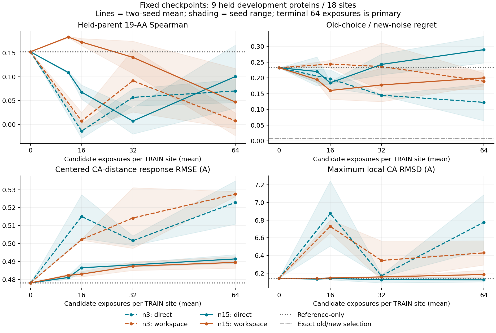

# Mini 多参考结构学习：训练可学，工作区尚未建立迁移优势

**本批八条运行、独立评分和 checkpoint 重放全部完成；收口、不晋升。** 完整候选路径在训练环境中提高了结构与候选排序保真，但没有在共同保留的九条蛋白上同时建立响应、选择和几何优势。工作区的平均跨噪声 regret 有正面结果，不能把本批概括成“所有指标都失败”；它也不足以证明多轮工作区的额外成本已经值得。

[锁定协议](mini_reference_editor_multiref_v1.md)；[数据划分](../reports/mini_reference_editor_multiref_plan_2026-10-07/README.md)；[完整结果与校验记录](../reports/mini_reference_editor_multiref_2026-10-07/README.md)。运行根目录 `reference_multiref_v1_20261007`。没有追加训练、重选种子或按中途结果挑选终点。

## 执行与边界

仍使用 public Mini `protenix_mini_esm_v0.5.0`。参考编码器和 S1 冻结，编辑分支预测全部 `s_inputs/s/z`，候选自己的原子图与化学进入 S1。没有 oracle target s，没有候选 C4／输入编码器调用，也没有新增 MSA／ESM teacher。训练监督是旧噪声230201下的原生 Mini 坐标与既定几何损失，不是实验 mutant 坐标。230211仅在本批评测，但两枚噪声和全部面板都有开发历史。

比较原工作区（9,352,387参数）与直接全局写出（9,320,643参数）。后者保留同样的参考投影和末端完整 pair 写出，用全局编辑广播及四层逐节点 MLP 替代工作区迭代。相同种子的公共权重初值逐位相同；不是等FLOPs对照，也不是只改变一个注意力算子的实验。

3参考组有5个位点／95个mutant；15参考组有27个位点／513个mutant。每候选均曝光64次，每运行分别3,040／16,416更新。所有4个架构／种子组合在两档数据上从头训练，共 **77,824更新**。整条4PT4及Y84/N25/S34的保留边界没有改变。共同跨蛋白评测为 **9蛋白／18位点／342候选／684个候选-噪声输出**。

全部运行正常完成，没有替换失败种子。预检3,708次S1，训练worker共222,260次S1（其中155,648次训练解码，另含固定评测和计时），独立checkpoint重放72次，共226,040次。C4和输入编码器计数均为零。36份checkpoint各在固定T37A、两枚噪声下重载重放，坐标逐位一致；这不是声称每份checkpoint的全部候选都重新解码了一次。

预检覆盖24份WT及912个mutant的双噪声Exact回放。14项聚焦测试通过。收集的81份结果／历史文件全部通过大小和SHA-256校验；重新计算逐位点Spearman和旧选新评regret，与独立评分一致。原始大坐标、checkpoint、完整逐输出评分和训练日志留在远端，仓库保存其清单／哈希、分层汇总和派生表。

## 主终点：训练改善，跨蛋白排序没有稳定改善

下表ρ为“先对两枚噪声的分数取均值，再排19AA”，位点指标先在蛋白内平均，再对蛋白等权。Regret是在旧噪声下选一个候选，到新噪声Exact上评价，保留原任务单位。它仍是父参考Cα距离代理，不是实验突变效用。

`reference_only`使用全部WT conditioning加候选化学和S1；不是过去包含oracle target s的WT-z。不能搬用其他队列的历史基线。

| 15参考终点 | TRAIN ρ | 九保留蛋白ρ | Top1／18 | 旧选新评regret |
|---|---:|---:|---:|---:|
| reference_only | 0.3501 | 0.1524 | 1 | 0.23250 |
| Direct／272001 | 0.7371 | 0.0344 | 0 | 0.24737 |
| Direct／272003 | 0.7195 | 0.1667 | 2 | 0.33220 |
| Workspace／272001 | 0.5774 | 0.1176 | 2 | 0.22558 |
| Workspace／272003 | 0.6720 | −0.0235 | 1 | 0.17488 |

Direct在两枚种子上的训练ρ都高于Workspace。训练regret则是Workspace略好：0.03694／0.03949，Direct为0.04455／0.04564，基线0.15548。因此不能把训练“谁更好”压成一个指标。

保留蛋白上，Direct第二枚种子的ρ略高于基线，但regret更差；Workspace两枚种子的平均regret均改善，排序却均低于基线。Exact自己旧选新评regret仅0.00837，不能把学生与Exact之间的差距都归因于采样噪声。

**Regret的正面观察需要明确保留。** 连同3参考组，四个Workspace终点的平均regret都低于reference_only。15参考种子272003相对基线的regret差为−0.05763，九蛋白配对重采样的描述性区间为[−0.15529, −0.00116]；同一模型ρ差为−0.17593，区间[−0.27778, −0.07164]。这显示选择指标与整体排序可以朝不同方向变化，不是同时改善的迁移。

另一个Workspace种子的regret差区间跨零。15参考两枚Workspace的蛋白regret中位数为0.02817／0.02963，基线0.02755，未同步改善。面板只有九条反复使用的开发蛋白，两枚种子；这些区间是描述性的，不是新的独立确认。

高代价错误集中于2EBE和6ZRW等环境。例如Direct／272003选2EBE E47I和A30Y，单个位点regret分别2.0123和1.9978；Workspace／272001选2EBE A30M，regret1.9538。保留逐位点及最坏蛋白结果，不能只用Top1命中次数判断筛选可靠性。

## 学习曲线没有给出单调的规模收益

| 模型／种子 | n3终点ρ | n15同更新数3,040步ρ | n15终点ρ | n3终点regret | n15终点regret |
|---|---:|---:|---:|---:|---:|
| Direct／272001 | 0.0459 | 0.1109 | 0.0344 | 0.06416 | 0.24737 |
| Direct／272003 | 0.0946 | 0.1071 | 0.1667 | 0.18092 | 0.33220 |
| Workspace／272001 | −0.0089 | 0.1821 | 0.1176 | 0.21517 | 0.22558 |
| Workspace／272003 | 0.0245 | 0.1852 | −0.0235 | 0.16406 | 0.17488 |

同更新数检查中，n15的保留蛋白ρ在四个配对里都高于n3终点；但regret改善与否不一致。n15 Workspace在3,040步时两枚ρ都略高于基线，之后的主终点都下降。固定64次候选曝光的终点比较，没有两枚种子一致的排序增益。**这些是不同预算口径，不应合并成“扩大数据绝对没有用”，也不能事后选择3,040步晋升。**

还有一个联合学习代价：只看两档共同训练的原五个位点，在相同每候选曝光下，Direct的ρ从n3的0.7602／0.7807降到n15的0.6295／0.5711；Workspace从0.4971／0.6316降到0.2015／0.4839。这是一个明确的拟合差距，但训练上下文、优化器历史和更新交错同时变化，不能唯一归因于容量或某个结构模块。

按覆盖完整AA循环的窗口计算，n15 Direct损失从1.611／1.561降到0.287／0.298，Workspace从1.648／1.670降到0.391／0.328。它们有优化进展；本批没有证明收敛，也没有据此延长预算。裁剪触发比例约23%–25%，日志和完整固定checkpoint曲线保留。

曲线为两种子均值，阴影是种子范围，不是置信区间；最大RMSD先逐运行取最大，再画种子均值／范围。所有点预先指定，64次曝光终点为主结论。

## AA-specific结构响应及几何没有共同通过

中心化响应误差在共同可映射CA距离上计算：每个位点分别减去19候选均值，再比较学生与Exact；不是latent NMSE，也不参与训练。九保留蛋白上，基线的中心化距离响应RMSE为 **0.47805 Å**。n15 Direct为0.49385／0.48900，Workspace为0.48624／0.49274，四个都更大。

n15相对n3的这一误差有所降低（n3约0.511–0.535），但尚未超过不编辑conditioning的reference_only。完整AA-lDDT保真度也都低于基线：n15约0.9178–0.9212，基线0.9233。这些都是对同噪声Mini输出的保真度，不是实验结构准确率。

| 九保留蛋白／684输出 | >1Å数 | P95局部RMSD Å | P99 Å | 最大 Å | 几何通过 | Exact通过→失败 | Exact失败→通过 |
|---|---:|---:|---:|---:|---:|---:|---:|
| Exact | 0 | 0 | 0 | 0 | 438 | 0 | 0 |
| reference_only | 169 | 3.654 | 5.621 | 6.143 | 423 | 60 | 45 |
| n15 Direct／272001 | 177 | 3.866 | 5.593 | 6.148 | 400 | 71 | 33 |
| n15 Direct／272003 | 175 | 4.047 | 5.545 | 6.101 | 411 | 67 | 40 |
| n15 Workspace／272001 | 178 | 3.965 | 5.541 | 6.136 | 430 | 55 | 47 |
| n15 Workspace／272003 | 176 | 4.006 | 5.621 | 6.235 | 387 | 88 | 37 |

Workspace第一枚种子在绝对通过数及Exact通过→失败数上改善，第二枚明显恶化。相对reference_only，两者另有19／65次通过→失败和26／29次失败→通过，不能只看净通过数。Exact本身438/684通过当前检查，不是化学真值。

三个同蛋白保留位点没有形成一致的排序／选择优势，Y84仍有约6.2–6.4 Å尾部。n3 Workspace／272003还在**扩展面板2ARC G112R、noise230211**出现18.0388 Å局部偏移。该蛋白在n3不参与训练，在n15参与训练；不能把它说成n15共同九蛋白的最坏值。该输出有10对严重碰撞和10个所检错误手性中心；Exact和reference_only原本也未通过检查，因此它没有被新增失败数捕捉。

固定T37N/noise230211的Thr25 Cβ连续量也保留：Exact有符号体积0.03150 ų，reference_only为−0.03393，参考化学为2.38556。n15 Workspace／272001恢复为+0.06529并通过所检几何，另一枚为−0.26250且有7对严重碰撞。两枚Direct仍为负值并各有2对严重碰撞。不能用一枚恢复解释为普遍修复。

6ZRW P80L两噪声在固定保留面板中；6UFE-92不在此归档，仍未覆盖。全部终点和中间输出的几何转换、连续有符号体积与结构尾部均留档。

## 成本：直接分支更便宜，但没有完整加速结论

以下仅为n15终点、1W53、已准备好参考latent及候选化学的19候选工作量。各时间项分别取预热后五次中位数，不能要求各列中位数相加严格等于总列。

| 模型 | 参考投影／空编辑 ms | 19候选编辑／写出 ms | 19次S1 ms | 合计 ms |
|---|---:|---:|---:|---:|
| Direct／272001 | 3.32 | 83.80 | 450.42 | 538.25 |
| Direct／272003 | 3.12 | 82.41 | 472.31 | 557.87 |
| Workspace／272001 | 12.37 | 248.82 | 445.73 | 702.92 |
| Workspace／272003 | 12.13 | 249.06 | 449.16 | 709.38 |

工作区在这里的编辑部分约多花0.16秒，完整这段缓存边界内的收益差距较小，因为S1占很大部分。计时发生在并发worker环境，作为描述性成本记录，不是隔离硬件的严格速度基准。设备峰值allocation约2.62–2.84 GB，不包含参考ESM/C4准备及全部主机缓存；串行候选仍收集dense输出，不是候选数无关的流式显存。

本批没有匹配的原生19次C4+S1计时，不能宣称完整folding加速。更低成本也不能替代质量验收。

## 本批决策

1. 完整参考条件结构路径可以在多个训练环境中学习，且不依赖oracle target s；这一工程与训练证据成立。
2. 当前多轮工作区没有建立跨蛋白响应与整体质量的稳定增益，也没有证明其额外成本优于直接对照。平均regret的正面观察保留，不能与完整结构替代合并。
3. 不晋升任何终点为可用突变筛选器或C4替代，不事后晋升中间checkpoint，不追加本批训练。也不由本批断言所有缓存架构、最终状态学习或WT信息都不可能有效。
4. 若继续，必须另立明确干预；本批不自动加入差分注意力、pair注入、响应差分损失、更多数据或Mini解冻。当前证据没有唯一定位迁移瓶颈。
