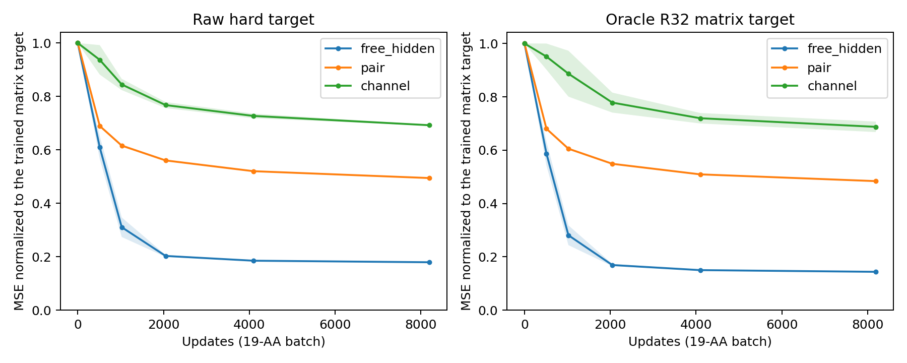

# Shared readout v1：自由 hidden 仍有缺口；新增共享读出未晋升

本批12条训练与同位点S1闭环完成。三个读出均未满足两种子raw NMSE≤0.10，因此没有
启动多上下文训练。停止原因是训练位点拟合不足，**不是新位点零样本迁移失败**。
没有继续增加步数、采集teacher、训练blockwise模型或晋升任何新模型。

[锁定协议](mini_response_readout_v1.md)；[全部结果](../reports/mini_response_readout_2026-10-02)。

## 1. 实际比较范围

沿用1W53 T37，长度84，19种non-WT hard替换。同一已归档WT/target conditioning。
每个读出分别拟合原始Δz和oracle逐channel R32重建矩阵，两枚种子231301/231303，
共3×2×2=12条连续训练。LR固定1e-3（来自上一批网格，不在本批重新选择），
AdamW wd1e-4、eps1e-8、clip1，8192次完整19-AA更新，保存512/1024/2048/4096/8192。

| 对照 | 输入/读出 | 参数量 |
|---|---|---:|
| Free hidden | 可训练20×84×256节点表＋原共享仿射U/V | 2,535,424 |
| Pair nonlinear | 原large WT encoder＋共享非线性逐pair读出 | 3,627,904 |
| Channel nonlinear | 同encoder＋channel query非线性U/V读出 | 3,586,624 |

后两者保留width256、4block encoder，读出内部width128；相同参数用于不同长度。
Pair读出使用左右节点、AA query及完整WT pair内容，不生成固定长度整行表；
Channel读出使用节点、AA、channel embedding生成2×R32。两者输出层V或dense输出零初始化。
Free hidden从同一个encoder节点状态初始化，随后只优化节点表和共享U/V头；encoder移除。
它是单site诊断，不能部署或测试跨蛋白迁移。

参数量并不完全匹配，也不是上一批约30M整场dense的等容量对照。
所有训练只使用矩阵NMSE，没有target条件作为生成器输入、canonical因子标签、S1或几何loss。
R32目标用FP64 SVD重建后保存为FP32矩阵；分别按各自标签能量归一化，同时记录raw误差。

## 2. 终点与 raw/R32 标签分离

两枚种子均值：

| 读出 | 训练标签 | 对训练标签NMSE | 对原始hard Δz NMSE |
|---|---|---:|---:|
| Free hidden | raw | **0.179199** | **0.179199** |
| Free hidden | oracle R32 | **0.143646** | 0.184196 |
| Pair nonlinear | raw | 0.494479 | 0.494479 |
| Pair nonlinear | oracle R32 | 0.483760 | 0.500173 |
| Channel nonlinear | raw | 0.692328 | 0.692328 |
| Channel nonlinear | oracle R32 | 0.687386 | 0.704166 |

原始raw目标的oracle R32下界为0.05513569。对R32重建矩阵本身，允许的表示误差可以接近零；
因此右侧缺口不能全部解释为“R32丢弃的尾部”。但不同标签归一化不同，不能直接将两列相减
当作严格误差分解。

对raw标签，free hidden在512/1024/2048/4096/8192的均值约为
0.60909 / 0.31047 / 0.20279 / 0.18498 / 0.17920。
末段仍有下降，**这是固定预算结果，不是已证明的全局最优或数学下界**。
它与上一批large-bias网络约0.17788接近，说明移除encoder后并未解除主要拟合缺口。
与完全自由U/V约0.05515对照，共享读出施加的耦合更值得调查；
但自由U/V使用不同参数量和LR=.01，不能据此唯一排除优化设置。

两个非线性改造也没有解决问题：Pair/channel raw标签下的centered AA-specific NMSE
分别约0.53043/0.72337；总响应能量约teacher的0.498/0.303。
没有出现“仅raw均值学好，AA-specific也成功”的结果。
这只否定本批具体小读出与固定预算，不能推广为所有非线性共享读出不可学。



单site门槛未满足，多上下文分支未执行。协议已移除新site零样本的推进否决权；
本批没有产生新site/新protein泛化结果，也没有使用已有八蛋白开发面板选择模型。

## 3. 已有整场dense的同位点S1闭环

使用上一批LR1e-3的两个8192终点，不训练、不改变checkpoint。
19AA×既有两枚噪声230201/230211=38实例/arm；每个候选重新构造其原生原子图/参考化学。
六个arm：Exact、Baseline、WT-z、oracle R32、dense seed1、dense seed2。
所有预测保留oracle target `s`；Baseline及干预使用WT `s_inputs`。
Exact=target `s_inputs/s/z`。区分两种参照，避免把输入替换效应归给student。

| arm | 对Baseline的19-AA Spearman | Top1 | regret | local RMSD最大值 / Å | 新增几何失败 |
|---|---:|---:|---:|---:|---:|
| WT-z | −0.01228 | 0/2 | 0.13338 | 1.41916 | 1/38 |
| oracle R32 | 0.97895 | 2/2 | 0 | 0.05017 | 0/38 |
| dense seed1 | **1.0** | **2/2** | **0** | **0.001503** | **0/38** |
| dense seed2 | **1.0** | **2/2** | **0** | **0.000327** | **0/38** |

dense seed1相对Baseline的local RMSD均值/P95/P99为0.000501/0.001057/0.001348Å；
seed2为0.000146/0.000272/0.000307Å。AA-lDDT均为1.0（阈值化距离分数，不表示坐标逐位相同）。
相对Exact，两模型Spearman均0.995614，与Baseline对Exact的值相同；不能写成所有参考下ρ=1。

这补足了**同一已记忆位点、旧噪声、oracle target s 条件下的decoder保真**。
但Baseline及dense的零严重碰撞＋严格所检手性通过都只有**9/38**。
新增失败为零不等于输出几何合格，更不是设计收益或可用加速器。
任务排序沿用固定父序列GT的CA距离代理；没有mutant实验GT，也不是binder效用。
新共享模型未通过latent门槛，没有进入这个S1面板。

## 4. 成本、审计与收口

每条run的训练墙钟（不含开始加载/SVD目标准备）均值约：free hidden43–46s、
pair125–127s、channel135–142s。20-AA完整响应forward中位数约1.08/4.65–4.70/4.77–5.20ms。
Free hidden没有encoder成本，不可作为可部署student速度对照；所有数值均不含WT ESM/C4、
target化学重建及S1。这些是共享开发环境中的诊断计时，不支持无干扰的端到端加速声明。

主控制器墙钟513.36s；训练0次C4、0次S1，closure另外230次S1、0次C4。
训练固定预算完成，未根据结果改LR、扩大模型或追加更新。
独立审计：60份checkpoint哈希、24次512/8192 checkpoint重放、40项排序复算、
12项独立lDDT复算通过；NMSE重放最大差3.33e-16，NumPy独立R32重建最大差1.14e-13。
16项相关测试通过。原协议与运行锁保留。

当前主线仍是寻找能够拟合且能共享到新上下文的生成方式。
本批没有找到该生成器；也没有推翻整场dense的单点可记忆性。
结论不能升级为“只能做blockwise”或“factor表示不可用”，更不能因输出生成几毫秒就宣称已省下C4。

```text
本机：/home/husrcf/Code/onestepfold_runtime/response_readout_v1_20261002
DiamondHill：/media/IntelSSD/onestepfold/hpc3_mirror_20261001/Folding/response_readout_v1_20261002
```

仓库保存协议、终态、逐AA/逐checkpoint指标、functional逐例结果及哈希清单；
完整checkpoint在DiamondHill，坐标包另有本机副本。冻结执行代码保留在远端`code/`，
提交中的启动脚本带有当前设备检查；具体运行版本以冻结源码及哈希为准。
