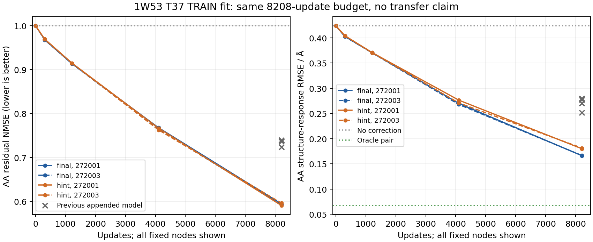

# 原生阶段对齐的 pair 恢复：单点拟合与多参考学习

**当前为单点完成报告，多参考部分尚未完成。** 单点四条运行及独立复核已完成；多参考三条已完成训练，一条发生异常长更新，完整配对评分仍待完成。本报告不收口整个实验、不宣布迁移改善或方法晋升。科学设置见[锁定协议](mini_stage_pair_recovery_v1.md)，没有依据中期质量改变预算或选择种子。

**改变了什么。** 旧恢复器将复制的 Mini 最后两个 pair block 接在已经完成的 B_z 后面，再用新的 LayerNorm 和线性层输出残差。本次先完成同一个无适配 WT3→candidate1，保留它的 B_inputs、B_s、B_z，以及第13块结束的 pair；编号均为代码的0基编号。可训练的第14、15块从这个真实候选边界开始，直接输出最终 pair。新节点注入的行列投影初始化为零，没有末端新 LayerNorm 或线性读出，初始函数必须逐位恢复 B_z。

节点仍读取实际候选 B_inputs/B_s、WT3 的突变行列、位置与源/目标AA。训练后的中间状态允许利用已经算出的 B_s，这不是声称重建了与原生完全相同的因果执行过程。阶段对应明确指监督位置：学生第14块对齐真实 target C4 第14块，最后输出对齐 target 最终 z。两个 teacher 张量只用于标签，均不进入预测器。B_inputs 和 B_s 原样进入冻结 S1。

参数共1,315,332，旧模型1,331,972。模型参数没有增加，但输入阶段、直接输出路径、初始化同时改变，因此与旧模型比较的是一个完整实现方案，不能单独归因为删除 LayerNorm、去掉读出或某一种初始化。

**两项目标与两档数据预先锁定。** Final 只监督最终 pair；Hint 使用最终与第14块误差的等权平均，同一个旧位点尺度 q，不重新调权重。二者均更新两个完整 pair block 和节点分支，无 S1 反向、几何、排序或额外中心化训练损失。AdamW、学习率、clip=1、两候选 batch 与旧批相同。种子272001/272003只使新节点分支不同，复制的原生块权重和初始预测函数相同；同种子的两目标初始参数哈希相同。这不是两个随机初始化的完整 folding backbone。

n1 固定历史TRAIN位点1W53 T37，19个非WT候选，每条8208更新、每候选864次曝光；节点0/304/1216/4104/8208全部评测。n15 固定旧15条TRAIN蛋白、27个位点、513个候选，每条8208更新、每候选32次曝光；节点0/4104/8208全部评测旧48个位点，分训练、同蛋白新位点与九条开发蛋白。两档都在看结果之前决定执行，不由n1结果决定是否运行n15。终点始终为主结果，不选中途赢家。跨档曝光不同，不能作为等曝光的纯数据规模对照。

**单点：表示形成方式影响可学习性，尚未充分恢复。** 在相同32次本候选曝光的304步，四条新运行的AA残差NMSE为.96834/.96778/.96962/.96896；旧附加恢复器为.99808/.99807/.99995/.99996。到8208步，结果如下，零修正为1。

| 目标／种子 | 完整残差NMSE | AA残差NMSE | AA方向余弦 | 错配AA残差NMSE | 第14块AA残差NMSE |
|---|---:|---:|---:|---:|---:|
| Final／272001 | .509841 | .593802 | .638098 | 1.358742 | .863244 |
| Final／272003 | .515113 | .592038 | .639568 | 1.363221 | .861572 |
| Hint／272001 | .503608 | .590240 | .641131 | 1.364643 | .781022 |
| Hint／272003 | .507177 | .595565 | .637224 | 1.354561 | .785948 |

旧单点四个终点AA残差NMSE为.72335–.73938；新方案消去约40.4%–41.0%的AA残差，仍未恢复约59%。固定把下一AA的残差加给当前候选，保留接收者自己的B、化学和噪声，误差明显增大，支持训练位点上的正确身份对应。预测AA能量约为目标AA能量的35.6%–36.8%，方向也尚未充分恢复。

Hint确实改善了对应中间状态：第14块AA残差由Final约.862降到.781–.786，完整中间残差由约.983–.988降到.695–.700。但最终AA残差两组接近，一枚略好、一枚略差。由中间状态拟合更好，不能推出最终功能一定更好。

**单点功能：选择终于变化，几何代价仍在。** Spearman按两噪声任务分数先均值再排序；regret按旧噪声选择、同一候选的新噪声Exact评价。

| 条件 | Spearman | AA结构响应RMSE / Å | 旧噪声选择 | regret | 几何通过 / 38 | 严重碰撞对 |
|---|---:|---:|---|---:|---:|---:|
| 无修正B | .442105 | .423960 | R | .167167 | 19 | 10 |
| Exact | 1 | 0 | S | .092423 | 9 | 100 |
| 固定B_s＋oracle pair | .964912 | .067371 | S | .092423 | 10 | 67 |
| Final／272001 | .877193 | .166355 | S | .092423 | 12 | 68 |
| Final／272003 | .877193 | .166679 | S | .092423 | 12 | 60 |
| Hint／272001 | .845614 | .180139 | I | .068644 | 12 | 61 |
| Hint／272003 | .871930 | .181505 | I | .068644 | 13 | 68 |

AA结构响应误差相对B下降约57%–61%，旧单点模型为34%–41%。Final选中了Exact旧噪声选择的S，Hint选择I，新噪声regret更低；后者不是超过Exact的生物学正确率，仅是这一训练位点的跨噪声选择结果。四个新终点的两噪声均分Top1仍都没有命中，不能将旧噪声选择一致与均分Top1混用。

错配的结构响应RMSE为.565–.568 Å、Spearman为.218–.277，全部明显差于正确对应，也差于B；全部退回选择R。正确AA信息已经具有解码价值。

四个正确终点相对Exact的最大局部偏移由B的1.054 Å降到.297–.354 Å，>1 Å由2份降为0。但相对B分别新增7/7/7/6份几何失败，没有修复，严重碰撞增加；错误手性为16–17，对比B的19略少。Exact和oracle本身碰撞较多，贴近teacher与更好的化学并不一致。不能从偏移降低宣布整体结构质量通过。

单点末三个304步窗口loss仍下降，没有充分收敛证据。Final共有6962/6704步触发clip，Hint为5007/5067步；明显高于旧附加恢复器的裁剪频率。设置相同不意味着实际梯度或有效更新相同，也不能把尚未拟合的部分唯一归因于clip、容量或监督不足。本批不据此追加步数或搜索阈值。

**多参考与开发结果尚待完成。** 本次归档时Final/272001、Hint/272001、Hint/272003已到8208步并完成训练端评测，CPU评分和复核仍在进行；Final/272003停在第1420条已写入更新，后续更新耗时异常。controller仍是n15、complete=false。不能用已完成的三个模型替代完整两种子配对，也不能将未完成的运行计为质量失败。

只读运行诊断保留于日志：空闲HIP4用Final/272001的4104 checkpoint重放同一个p18_s179/M,N batch，两个候选前向和反向成功、梯度有限，参数不更新；该检查使用不同checkpoint及设备，不能据此排除当前权重状态或某个运行时调用的问题。另一个独立16元素GPU运算在HIP2正常完成，也不能证明原worker已经恢复。py-spy的非阻塞栈读取因proot加载器没有BSS信息失败，未能定位卡顿调用，不能声称已找到根因。所有科学worker原样保留，未为结果重跑或追加预算。

这两候选诊断额外执行2次恢复器前向和反向、0次参数更新、0次原生recycle/S1；它不属于新的训练或性能基准。原生边界缓存与两档训练仍按原协议记录，完整结果将另行补齐。

**计算边界。** 部署需要先完成候选自己的原生末轮，得到固定B_s，再额外运行两个适配pair块。不能将后两个原生块从时间账本中直接删除，因为原B_s仍依赖它们。本次没有新的完整折叠速度测量，不继承旧LoRA的约2.7倍速度。

候选ESM/MSA准备不在本轮；原生recycle内部的MSA更新保留。912个候选中间边界用了912次原生末轮，513个TRAIN候选的第14块标签用了2052次完整target原生recycle，合计2964次；所有归档final s/z逐位回放。未为保留蛋白生成teacher中间标签。八条新训练合计65664更新、131328训练候选前向；准备1824次S1，主评测30096次S1，合计31920次。所有固定节点都解码，没有NMSE准入门槛。独立核算的额外前向与时间另记，不冒充免费读取。

**已完成部分的复核。** 六项本地与六项远端相关测试通过。准备阶段912候选×2初始化的原生suffix逐位检查通过，1824份双噪声B结构回放通过。825份冻结源码哈希在导出时重新核对；本地独立检查115份导出证据哈希、4条完整曝光序列、20个checkpoint的张量重放、252项相关性、84项regret、60项历史对照和3192条含重复对照的结构记录。单点32832次更新、912次S1已经完成；2736次S1的已核算总数还包含前置缓存的1824次，不能误写成整批31920次已全部完成。

单点四条worker为519.09–560.84秒、峰值分配1.757–1.760 GiB。独立重放还增加440次恢复器前向，不更新参数、不调用原生recycle或S1。多参考运行有明显时间异常，所有时间都是实验执行记录，不是隔离部署基准。

协议、源代码、输入及标签哈希冻结。已完成部分的[分析](../reports/mini_stage_pair_recovery_2026-10-10/analysis_interim.json)、[核验](../reports/mini_stage_pair_recovery_2026-10-10/verification_interim.json)、[哈希清单](../reports/mini_stage_pair_recovery_2026-10-10/interim_manifest.json)和[证据说明](../reports/mini_stage_pair_recovery_2026-10-10/README.md)均明确标记scientific_experiment_complete=false。全部面板仍为训练或开发数据，本批不引入新的独立确认或实验突变真值。
