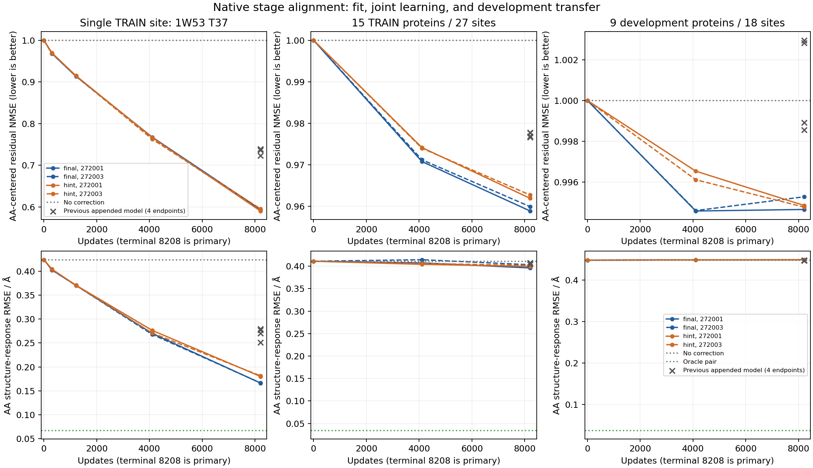

# 原生阶段对齐的 pair 恢复：完整终态报告

**八条预先锁定运行、全部固定节点及独立复核已完成；本批收口，不晋升。** 阶段对齐明显改善了一个训练位点的可学习性，但多参考组仍只恢复约4%的训练AA残差、不到0.6%的开发集AA残差。候选共同偏移较大，完整残差误差反而增加。开发集几何通过数提高，但候选选择风险与平均结构响应没有改善。中间监督改善对应阶段，没有建立最终质量优势。[科学协议](mini_stage_pair_recovery_v1.md)未按质量改动；一条运行的操作恢复单独记账，原失败记录保留。

**改变了什么。** 旧恢复器将复制的 Mini 最后两个 pair block 接在已经完成的 B_z 后面，再用新的 LayerNorm 和线性层输出残差。本次先完成同一个无适配 WT3→candidate1，保留它的 B_inputs、B_s、B_z，以及第13块结束的 pair；编号均为代码的0基编号。可训练的第14、15块从这个真实候选边界开始，直接输出最终 pair。新节点注入的行列投影初始化为零，没有末端新 LayerNorm 或线性读出，初始函数必须逐位恢复 B_z。

节点仍读取实际候选 B_inputs/B_s、WT3 的突变行列、位置与源/目标AA。训练后的中间状态允许利用已经算出的 B_s，这不是声称重建了与原生完全相同的因果执行过程。阶段对应明确指监督位置：学生第14块对齐真实 target C4 第14块，最后输出对齐 target 最终 z。两个 teacher 张量只用于标签，均不进入预测器。B_inputs 和 B_s 原样进入冻结 S1。

参数共1,315,332，旧模型1,331,972。模型参数没有增加，但输入阶段、直接输出路径、初始化同时改变，因此与旧模型比较的是一个完整实现方案，不能单独归因为删除 LayerNorm、去掉读出或某一种初始化。

**两项目标与两档数据预先锁定。** Final 只监督最终 pair；Hint 使用最终与第14块误差的等权平均，同一个旧位点尺度 q，不重新调权重。二者均更新两个完整 pair block 和节点分支，无 S1 反向、几何、排序或额外中心化训练损失。AdamW、学习率、clip=1、两候选 batch 与旧批相同。种子272001/272003只使新节点分支不同，复制的原生块权重和初始预测函数相同；同种子的两目标初始参数哈希相同。这不是两个随机初始化的完整 folding backbone。

n1 固定历史TRAIN位点1W53 T37，19个非WT候选，每条8208更新、每候选864次曝光；节点0/304/1216/4104/8208全部评测。n15 固定旧15条TRAIN蛋白、27个位点、513个候选，每条8208更新、每候选32次曝光；节点0/4104/8208全部评测旧48个位点，分训练、同蛋白新位点与九条开发蛋白。两档都在看结果之前决定执行，不由n1结果决定是否运行n15。终点始终为主结果，不选中途赢家。跨档曝光不同，不能作为等曝光的纯数据规模对照。

**单点：表示形成方式影响可学习性，尚未充分恢复。** 在相同32次本候选曝光的304步，四条新运行的AA残差NMSE为.96834/.96778/.96962/.96896；旧附加恢复器为.99808/.99807/.99995/.99996。到8208步，结果如下，零修正为1。

| 目标／种子 | 完整残差NMSE | AA残差NMSE | AA方向余弦 | 错配AA残差NMSE | 第14块AA残差NMSE |
|---|---:|---:|---:|---:|---:|
| Final／272001 | .509841 | .593802 | .638098 | 1.358742 | .863244 |
| Final／272003 | .515113 | .592038 | .639568 | 1.363221 | .861572 |
| Hint／272001 | .503608 | .590240 | .641131 | 1.364643 | .781022 |
| Hint／272003 | .507177 | .595565 | .637224 | 1.354561 | .785948 |

旧单点四个终点AA残差NMSE为.72335–.73938；新方案消去约40.4%–41.0%的AA残差，仍未恢复约59%。固定把下一AA的残差加给当前候选，保留接收者自己的B、化学和噪声，误差明显增大，支持训练位点上的正确身份对应。预测AA能量约为目标AA能量的35.6%–36.8%，方向也尚未充分恢复。

[单点全部固定节点曲线](../reports/mini_stage_pair_recovery_2026-10-10/single_site_curve.png)。

Hint确实改善了对应中间状态：第14块AA残差由Final约.862降到.781–.786，完整中间残差由约.983–.988降到.695–.700。但最终AA残差两组接近，一枚略好、一枚略差。由中间状态拟合更好，不能推出最终功能一定更好。

**单点功能：选择终于变化，几何代价仍在。** Spearman按两噪声任务分数先均值再排序；regret按旧噪声选择、同一候选的新噪声Exact评价。

| 条件 | Spearman | AA结构响应RMSE / Å | 旧噪声选择 | regret | 几何通过 / 38 | 严重碰撞对 |
|---|---:|---:|---|---:|---:|---:|
| 无修正B | .442105 | .423960 | R | .167167 | 19 | 10 |
| Exact | 1 | 0 | S | .092423 | 9 | 100 |
| 固定B_s＋oracle pair | .964912 | .067371 | S | .092423 | 10 | 67 |
| Final／272001 | .877193 | .166355 | S | .092423 | 12 | 68 |
| Final／272003 | .877193 | .166679 | S | .092423 | 12 | 60 |
| Hint／272001 | .845614 | .180139 | I | .068644 | 12 | 61 |
| Hint／272003 | .871930 | .181505 | I | .068644 | 13 | 68 |

AA结构响应误差相对B下降约57%–61%，旧单点模型为34%–41%。Final选中了Exact旧噪声选择的S，Hint选择I，新噪声regret更低；后者不是超过Exact的生物学正确率，仅是这一训练位点的跨噪声选择结果。四个新终点的两噪声均分Top1仍都没有命中，不能将旧噪声选择一致与均分Top1混用。

错配的结构响应RMSE为.565–.568 Å、Spearman为.218–.277，全部明显差于正确对应，也差于B；全部退回选择R。正确AA信息已经具有解码价值。

四个正确终点相对Exact的最大局部偏移由B的1.054 Å降到.297–.354 Å，>1 Å由2份降为0。但相对B分别新增7/7/7/6份几何失败，没有修复，严重碰撞增加；错误手性为16–17，对比B的19略少。Exact和oracle本身碰撞较多，贴近teacher与更好的化学并不一致。不能从偏移降低宣布整体结构质量通过。

单点末三个304步窗口loss仍下降，没有充分收敛证据。Final共有6962/6704步触发clip，Hint为5007/5067步；明显高于旧附加恢复器的裁剪频率。设置相同不意味着实际梯度或有效更新相同，也不能把尚未拟合的部分唯一归因于clip、容量或监督不足。本批不据此追加步数或搜索阈值。

**多参考：AA拟合有小幅进展，完整pair恢复仍不足。** 以下逐位点计算后按蛋白等权；零修正的残差NMSE为1。原生single始终固定。这里的目标是target C4 pair减去候选无适配末轮pair，不能与target减WT的旧NMSE混用。

| 目标／种子 | TRAIN完整残差NMSE | TRAIN AA残差NMSE | 开发完整残差NMSE | 开发AA残差NMSE |
|---|---:|---:|---:|---:|
| Final／272001 | 1.224310 | 0.958871 | 1.263196 | 0.994646 |
| Final／272003 | 1.238025 | 0.959912 | 1.270496 | 0.995269 |
| Hint／272001 | 1.243050 | 0.961915 | 1.260196 | 0.994846 |
| Hint／272003 | 1.155287 | 0.962720 | 1.202104 | 0.994763 |

四个模型的训练AA误差均在15/15条蛋白上小幅改善，开发集均为8/9条。对应开发AA方向余弦只有.075–.079，预测AA能量只为目标的约0.48%–0.65%。不能说它没有学到任何对应，也不能说方向已经充分正确。

预测修正自身的共同项能量占比，在TRAIN约95.5%–96.3%，开发集约98.1%–98.3%。这不是说98%的参数无用，也不是同一标量加给全部pair；它是同一位点跨十九AA的均值分解。共同项在decoder中可能产生候选相关效果，本批没有将它删除。实际共同残差NMSE在TRAIN为1.49–1.72、开发为1.55–1.72，因此不能将较小的AA改善表述成整个pair更接近teacher。

与旧附加模型在同一n15数据和曝光下约.977的训练AA残差相比，新版约.959–.963有所改善；但旧版完整训练残差约.933–.938，新版1.155–1.243反而更差。阶段对齐不是所有指标一致进步。数据、计算图和输出路径的边界见前文，不把这个方案对比拆成未经检验的单模块因果结论。

**固定终点的训练目标也没有一致改善。** 另用保存的全场误差能量、原始长度及q，重新计算固定checkpoint遍历全部TRAIN的原目标。它不是训练过程中、参数不断变化时的loss移动平均。Full/AA NMSE按蛋白等权，这里的原目标按原采样规则对位点等权，并保留原q下限；两者不是同一种汇总。

| 目标／种子 | 初始化的原目标 | 8208步固定原目标 | TRAIN完整残差NMSE>1的位点 / 27 |
|---|---:|---:|---:|
| Final／272001 | 0.868336 | 0.847477 | 11 |
| Final／272003 | 0.868336 | 0.890758 | 12 |
| Hint／272001 | 0.787521 | 0.791734 | 12 |
| Hint／272003 | 0.787521 | 0.774481 | 10 |

两条略好、两条略差于初始化。这不能证明所有训练过程都无效，因为AA指标和训练功能有所改善；但不足以宣布原目标已充分优化。Final有7911／7917步触发clip，Hint有7416／7433步，即约90%–96%的更新。旧附加模型只有很少更新被裁剪。这个差异说明相同优化超参数在新的参数化下产生了不同训练行为，**不单独证明clip或学习率是原因**。本批没有因此调clip、延长运行或挑中途checkpoint。

**单点与多参考不能只比较8208步终点。** 单点每候选864次曝光，多参考只有32次。共同位点T37在相同32次曝光时如下；两档的优化器历史和上下文交错仍不同，不是严格的单因素数据规模实验。

| 目标／种子 | 单点304步AA残差NMSE | 多参考8208步T37 AA残差NMSE |
|---|---:|---:|
| Final／272001 | 0.968343 | 0.968258 |
| Final／272003 | 0.967779 | 0.968711 |
| Hint／272001 | 0.969621 | 0.971789 |
| Hint／272003 | 0.968959 | 0.972855 |

Final几乎相同；Hint多参考略差。不能把单点终点约.59与多参考约.96的全部差距归因于联合学习冲突，也不能据此保证增加曝光就能迁移。该单点仍未充分拟合，且它只代表一个训练环境。

**中间监督没有建立最终优势。** 单点Hint明显改善第14块，但最终AA残差与Final接近。多参考第14块AA残差仅从Final约.9873降到Hint约.9853；最终AA残差在两枚种子上反而略差。训练排序两枚Hint都略低；训练结构响应一枚较差、一枚较好。开发集Hint的regret比Final少退化，但仍高于无修正。两枚种子的Hint减Final开发regret描述性区间均为[-.03131, 0]，包括0，不能作为稳定总体优越性。

**训练功能有收益，尚不能等同于充分残差恢复。** 训练组共27个位点／1026份双噪声结构。

| 条件 | Spearman | AA结构响应RMSE / Å | regret | 均分Top1 / 27 | 几何通过 / 1026 |
|---|---:|---:|---:|---:|---:|
| 无修正B | 0.563626 | 0.411146 | 0.247898 | 8 | 427 |
| Final／272001 | 0.671170 | 0.396182 | 0.172171 | 10 | 423 |
| Final／272003 | 0.665088 | 0.403272 | 0.172171 | 11 | 423 |
| Hint／272001 | 0.654269 | 0.399652 | 0.172596 | 11 | 425 |
| Hint／272003 | 0.651404 | 0.401721 | 0.172596 | 10 | 426 |

训练排序、平均选择损失和多数结构保真指标改善，不能说全盘未学习。但训练严重碰撞从10360对增加到12783–13116，错误手性中心从853增加到1105–1145。拟合teacher与改善几何不是相同目标。

**新蛋白：几何通过数提高，响应与选择没有一起获益。** 九条开发蛋白／18个位点／684份结构一直是反复使用的开发面板，不是独立确认。所有方法都使用实际候选自己的化学和两个固定噪声。

| 条件 | Spearman | AA响应RMSE / Å | 跨噪声regret | Top1 / 18 | 几何通过 / 684 |
|---|---:|---:|---:|---:|---:|
| 无修正B | 0.541423 | 0.448182 | 0.046314 | 6 | 432 |
| Exact C4 | 1.000000 | 0.000000 | 0.008366 | 18 | 438 |
| 固定B_s＋oracle pair | 0.988986 | 0.037607 | 0.010270 | 16 | 434 |
| Final／272001 | 0.528363 | 0.449221 | 0.088710 | 6 | 465 |
| Final／272003 | 0.532164 | 0.448927 | 0.088710 | 6 | 471 |
| Hint／272001 | 0.538889 | 0.449273 | 0.075122 | 6 | 477 |
| Hint／272003 | 0.539571 | 0.449024 | 0.075122 | 6 | 474 |

四个终点的Spearman都略低于B，AA结构响应RMSE都略高。相对B的蛋白级描述性区间均跨零，不能外推成所有新蛋白都必然退化；本批也没有建立净改善。Final的平均regret增加约91.5%，Hint增加约62.2%。蛋白regret中位数均保持.008972，而最坏蛋白均值由B的.19607升至Final的.38437、Hint的.33252。C4自身跨噪声regret非零，不能把它假定成绝对真值。

两枚Final在18个位点上选择完全一致，两枚Hint也一致；不同目标之间有差异。每个终点只有三个旧噪声选择不同于B：

| 位点 | B选择／regret | Final选择／regret | Hint选择／regret |
|---|---:|---:|---:|
| 2EBE E47 | D／.392140 | L／.768741 | C／.665033 |
| 4PT4 L10 | P／.046766 | Q／.021896 | Q／.021896 |
| 6ZRW P80 | C／.155223 | S／.566614 | V／.425737 |

4PT4局部收益真实存在，但被另外两个高代价变化超过。其余十五个位点的最终选择不变。两组各自的regret增量，正好由表中三个差值之和除以18得到。不能把“种子选择一致”当成“选择正确”，也不能删除困难位点。

**正确AA信息有微弱解码价值，但未形成净增益。** 四个模型的正确对应都比固定donor错配得到更低的开发AA结构响应误差；四个蛋白配对描述性区间均低于0，改善幅度约.00157–.00275 Å。与此同时，正确对应仍没有超过无修正B。这个干预保留接收候选自己的B、输入、化学和噪声，只换残差；它既不是删除候选全部信息，也不能证明生物机制。只用了一次预先固定的置换，未搜索更有利的错配。

**几何正面结果不应被删掉，但也不够晋升。** 相对B，Final分别修复41／48份、破坏8／9份；Hint分别修复51／48份、破坏6／6份。净通过数增加主要来自1X8D和4PQL：各终点两者合计增加35–39份，1YSB另增4–9份，2EBE则净减少2–6份。这不是上一批集中于2FKZ的修复，2FKZ本批净通过数不变。

| 条件 | 严重碰撞对 | 错误手性中心实例 | 局部偏移>1 Å | 局部P95 / Å | 最大偏移 / Å |
|---|---:|---:|---:|---:|---:|
| 无修正B | 2282 | 324 | 141 | 3.4395 | 6.9385 |
| Final／272001 | 2622 | 391 | 172 | 3.2578 | 7.1434 |
| Final／272003 | 2432 | 385 | 173 | 3.2541 | 7.1979 |
| Hint／272001 | 2173 | 360 | 167 | 3.2947 | 7.0598 |
| Hint／272003 | 2151 | 370 | 167 | 3.3081 | 7.0553 |

Hint减少严重碰撞总数，Final增加；四个终点的错误手性总数都增加。局部P95下降，但>1 Å输出增多、最大值变大；四个最大偏移均为2EBE E47K／noise230201。全原子lDDT保真度由B的.92705降到.92395–.92453。所有偏移均相对同噪声C4，不是实验mutant结构误差。净通过数、绝对几何严重程度和保真尾部必须分开看。完整逐蛋白分解与最坏案例保存在tail_decomposition.json。

同蛋白新位点只有三条蛋白各一个位置。四个终点Spearman为.65146–.68363，低于B的.68830；AA响应误差约.47478–.47555，对比B的.47523没有一致改善。旧选新评regret全部不变为.11885。Hint几何通过61→64，但不能据此称为新位点响应迁移成功。

**运行故障与科学结果分开保存。** 原Final/272003在写入1420步后发生异常长更新。限定1421步的独立重放复现了全部4260个已记录loss／梯度标量，并通过下一步。随后只作一次[锁定的运行恢复](mini_stage_pair_runtime_recovery_v1.md)：同825份科学源码、种子、初始参数、数据、优化器、精度、8208步预算和评测节点，独立目录从头执行，仍受原六小时绝对期限约束，没有续用诊断权重或按质量挑选。

原proot在SIGTERM后返回0，旧控制器一度误记完成；缺少checkpoint的评分实际失败，原controller最终failed且保持原记录。原进程确认退出后才启动恢复。恢复前1420步再次逐项一致；最后训练、评分和NumPy复核都实际完成且相关进程消失。execution_recovery为closed／complete=true，不能把原controller改写成成功。source_provider_map明确指出八条正式结果中唯一来自runtime_retry_v1的一条。操作复现不等于证明原卡顿的唯一根因，也没有证明未观测的原参数状态逐位相同。

**计算与核验账本。** 仍是Mini model-only：无ESM/MSA准备；原生recycle内部MSA保留。部署必须先完成候选自己的末轮以保留B_s，再额外运行两个适配pair块，本批没有新的完整折叠速度结论，不继承旧LoRA的约2.7倍倍率。

准备912个候选边界用了912次原生recycle，513个TRAIN中间标签用了2052次，合计2964次；全部旧final s/z回放、912×2初始化suffix及1824份B结构回放通过。正式八条合计65664次更新／131328次训练候选前向；主评测30096次S1，加准备1824次，共31920次。

另外有1421次诊断更新和1420条原失败尝试的已记录更新，因此全部已记录更新为68505。原下一步可能有未记录的部分工作，最多一次更新／两个前向，不能声称精确已知。失败尝试初始评测另有1824次S1，总计33744。独立checkpoint复核另有11420次恢复器前向；另一个两候选探针只有2次前向和反向，无参数更新。诊断、准备、失败尝试与部署成本不混用。

八条正式worker单点为519–561秒，多参考为1287–1769秒（不含被终止尝试和额外诊断），峰值分配分别约1.76与4.28–4.30 GiB。这些是并发训练及评测工作记录，不是隔离推理速度基准。

六项本地／远端模型测试和三项运行恢复工具测试已通过。最后复核212份导出文件哈希、32个固定checkpoint节点、596个位点×checkpoint重放、7740项相关性、2580项regret、1788项历史对照、98040条含重复对照的输出记录；固定曝光、候选顺序隔离、标签仅用于监督、single不变、几何转换计数均检查。恢复原始前缀4260标量独立复算相同，所有额外计数单列。没有NMSE准入门槛，全部预定节点都已解码。

完整[分析](../reports/mini_stage_pair_recovery_2026-10-10/analysis.json)、[原目标重建](../reports/mini_stage_pair_recovery_2026-10-10/objective_diagnostic.json)、[几何尾部分解](../reports/mini_stage_pair_recovery_2026-10-10/tail_decomposition.json)、[独立核验](../reports/mini_stage_pair_recovery_2026-10-10/verification.json)、[哈希与来源清单](../reports/mini_stage_pair_recovery_2026-10-10/manifest.json)和[证据说明](../reports/mini_stage_pair_recovery_2026-10-10/README.md)可复查。早期interim文件对应2c63ad13，运行快照对应fa187177，均为历史时点；完整记录不追溯改判旧运行。

**路线判断。** 原生阶段对齐比旧末端附加读出更容易拟合这个单点，参数并没有增加；这支持特征形成方式值得重视，不能唯一归因为容量不足。增加对应阶段标签没有在本配置中稳定改善最终质量，也不能把监督缺少一个中间标签当成充分解释。多参考的完整原训练目标尚未一致下降，AA拟合也很有限，不能称为“训练已解决、只剩泛化”。

本批不追加训练、不默认采用Hint，也不搜索中间节点、均值缩放或新的小输出头。若继续，优先弄清实际参数更新如何影响同一份完整TRAIN目标，再单独锁定干预；高clip率只是观察，不是已确认原因。冻结single、pair恢复的oracle接口继续保留，当前两个版本作为完整负基线。真正可迁移且质量合格的候选修正与实用加速仍未建立，项目目标未完成。
