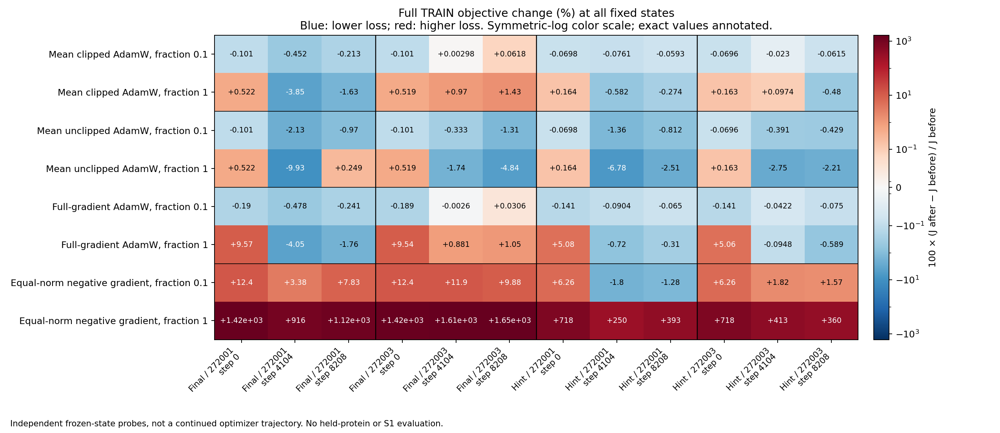

# 固定TRAIN状态的更新诊断：完整结果

**12个预定状态全部完成并通过独立核验；本批收口，不晋升任何优化配方。** 已经测到真实的局部优化问题：一阶下降方向可能因有限步过大而提高训练目标；在一个终态，给Adam完整TRAIN梯度仍会得到一阶上升更新。当前结果不支持立即把拟合不足归为容量上限，也不证明改好优化就能迁移。它没有训练新模型、没有运行S1，也没有新的结构或选择收益。

本轮沿用[锁定协议](mini_stage_update_audit_v1.md)，承接[阶段对齐实验](mini_stage_pair_recovery_findings_2026-10-10.md)。固定Mini、候选原生B_inputs/B_s、两个可训练pair块、已有513个TRAIN候选及27个位点、原尺度q与Final/Hint目标。检查两目标、两种子的0/4104/8208，共12个参数与Adam历史状态。所有target信息仅作TRAIN监督，不进入预测器；不读取开发集标签，不生成新teacher、ESM/MSA或native recycle。

**测量的是独立反事实更新，不是一条新训练轨迹。** 记完整TRAIN原目标为J、其梯度为G。每个位点的十九AA先平均，再对27个位点平均。逐位点梯度由原FP32反向得到，再用CPU FP64汇总。J同时用全场FP64误差矩核对，12个状态相对旧报告重建值的最大差仅1.42×10⁻¹¹。

每个状态又计算接下来一个27位点轮次中各两AA batch的梯度；每次都重置到同一个参数与Adam历史，分别计算该步clip=1和不裁剪的位移。不是连续执行27步。8208后的轮次只是预定假想索引，不延长旧训练。两AA仅覆盖该排程相位，不代表十九AA的全部采样相位。

之后固定比较四个方向：27个裁剪Adam位移的均值；27个未裁剪位移的均值；给完整G的一步Adam位移；与第一个方向等欧氏范数的负G。每个方向均在原参数处执行0.1和1两个固定分数，再遍历全部TRAIN计算真实J。均值位移不是现成可部署优化器；0.1不是从开发集选出的学习率，也不据此直接指定下一轮学习率。

**平均采样梯度没有普遍背离完整梯度。** 十二状态中，27个两AA梯度均值与G的余弦为0.99380–0.99992；先逐batch裁剪再平均，与G的余弦为0.97162–0.99911。至少在这些固定状态与排程相位，不能简单解释成“平均训练梯度已经完全指错方向”。这不保证单个batch正确，也不证明AA特异梯度采样充分；共同误差可能主导总梯度。

位点之间的梯度关系也并非统一。一些状态存在负的两两内积；Hint/272001终态27个位点之间的702个有向非自身比较却全部非负。不能用某个checkpoint的冲突比例反推整个历史，更不能把所有拟合不足统一叫作梯度冲突。

**初始化：一阶下降不保证当前有限步下降。** 下面给出均值裁剪Adam方向，G·Δθ小于零意味着一阶下降；ΔJ则来自真实全TRAIN前向。两枚种子分别保留。

| 目标／种子，step0 | G·Δθ | ΔJ，分数0.1 | ΔJ，分数1 |
|---|---:|---:|---:|
| Final／272001 | -0.01024222 | -0.00087609 | +0.00453366 |
| Final／272003 | -0.01021813 | -0.00087418 | +0.00450825 |
| Hint／272001 | -0.00625001 | -0.00054946 | +0.00129135 |
| Hint／272003 | -0.00623202 | -0.00054794 | +0.00128027 |

四个初始化状态均出现：一阶方向向下，十分之一步降低J，整步提高J。换成完整梯度Adam，初始化整步反而使J增加约0.040–0.083，十分之一步仍下降。这说明本参数化存在有限步与局部下降范围不匹配的证据；不能仅以“Adam方向是梯度下降”保证实际目标下降。

这里两种子的原生初始函数相同，仅新节点分支初始化不同；这些不是四个独立蛋白或四次独立泛化确认。也不能把初始化的现象推广成“整个训练都只需把学习率缩小十倍”。

**中后期：方向与步幅都要看，不能只有一个解释。** 四个终点的均值裁剪Adam结果如下。最后一列是最终pair的AA中心化、原q加权MSE变化，不是逐蛋白残差NMSE，也不是结构RMSE。

| 目标／种子，step8208 | G·Δθ | ΔJ，0.1 | ΔJ，1 | 最终AA误差变化，1 |
|---|---:|---:|---:|---:|
| Final／272001 | -0.01854784 | -0.00180787 | -0.01384154 | +0.00006872 |
| Final／272003 | +0.00469834 | +0.00055054 | +0.01277620 | -0.00007294 |
| Hint／272001 | -0.00497672 | -0.00046965 | -0.00217074 | +0.00005872 |
| Hint／272003 | -0.00487929 | -0.00047630 | -0.00372039 | +0.00002638 |

Final/272003终态更具体：27个batch的裁剪Adam位移中，23个对完整J是一阶上升；其中只有16个对自己的batch是一阶下降。使用完整G、保留同一Adam历史并裁剪后，G·Δθ仍为+0.00199208，实际ΔJ为+0.00027266／+0.00933656。因此这个状态的上升不能只归因于当前两个候选的采样误差。保存的优化器历史、预条件与衰减共同参与实际位移；本批没有将它们进一步因果拆开，不能直接指定某个动量超参数为唯一根因。

其他终点并非如此：三个均值更新可降低J，部分中期也明显下降。四个终点的原目标并没有被证明充分优化；同时也不能宣布当前配方每一步都会上升。

**取消当前步裁剪有混合效果，不是已验证的修复。** 这里不裁剪分支仍保留原来裁剪训练形成的Adam历史，只改变当前一步；不是一条从零开始的无裁剪训练。

| 终点 | 均值裁剪Adam整步ΔJ | 均值未裁剪Adam整步ΔJ |
|---|---:|---:|
| Final／272001 | -0.01384154 | +0.00210804 |
| Final／272003 | +0.01277620 | -0.04310121 |
| Hint／272001 | -0.00217074 | -0.01986486 |
| Hint／272003 | -0.00372039 | -0.01710639 |

三个终态在这一局部反事实中改善，Final/272001却由下降变成上升。初始化时裁剪与未裁剪位移几乎相同，两者整步都上升。因而既不能把高clip率当成无关，也不能直接移除clip并宣称优化问题已解决。

**参数等范数不等于函数等幅度。** 负G在数学的一阶内积上当然下降，但将它放大到均值Adam位移的参数欧氏范数后，整步在12/12状态都提高J，幅度约2.07–14.69；十分之一步仅2/12下降。该对照不是一个经过调参的SGD优化器。它说明这个范数匹配不能保证进入函数的局部下降区间，不证明负梯度错误、输入没有信息或所有SGD训练都失败。

图中为相对各自原目标的百分比变化，颜色使用明确标出的对称对数尺度，数字保留实际幅度。所有12状态、4方向、2分数均显示；不取局部赢家。

**总目标下降仍不等于AA响应学习改善。** 终态表里，三个均值裁剪Adam的J下降案例，最终AA中心化误差都微增；J上升的Final/272003，AA误差却微降。更大的变化主要出现在共同误差中。Hint的J还含第14块，不能把最终pair的单一分量直接等同于其完整目标。

这不是损失“算错了”，也不意味着共同项应该删除。目标依然要求共同部分和AA部分都恢复；本批没有测两部分各自的梯度，不能从有限位移下的误差变化宣称多少梯度百分比来自共同项。它再次要求后续训练同时记录原目标和AA特异恢复，不能用更单调的总loss替代候选响应指标。

**执行与复核。** 本地和DiamondHill实际运行环境各通过两项针对性测试：Adam状态隔离、原参数恢复及原生Adam步骤一致；位点加权与已知二次函数的有符号导数一致。GPU审计在0和4104还逐项复现原历史中下一步的两个loss与裁剪前范数，八次均逐位相同。原参数在每次探针后恢复，原生模型权重未变。

第一次安装把pytest缓存误计入源码清单，四个worker在模型构造前因缓存变化停止；没有候选前向、反向或虚拟更新。失败完整保留。修正版仅复制原825份声明源码和相同6文件诊断补充，共831份；算法、数据、模型、分数与原六小时绝对期限不变。四个worker在HIP0–3完成，实际运行约1273–1981秒，峰值分配约3.93–3.95 GiB；这是诊断账本，不是推理性能基准。

实际共56052次候选前向、6804次反向、660次相互独立的内存中Adam步骤。没有被接受的新训练更新，没有native C4/recycle/input/S1调用，没有新ESM/MSA准备。独立NumPy FP64检查2112个导数/范数/分组内积记录与2916个位点目标记录，12节点全部通过。完整导出含41份哈希核验后的标量、日志与来源文件，另存分析、图和不完整历史快照；大参数向量留在运行归档，不进入Git。原生输入和参考记忆的读取不等于新折叠计算。

**下一步的优先级。** 当前已有直接证据说明：在讨论容量上限或增加监督之前，必须先让候选表示的实际优化过程得到充分检验。下一项应保持模型、标签、pair-only接口和AA分解，检验以完整TRAIN目标核对实际下降的优化方式；若采用曲率信息或线搜索，应另行锁定预算与对照，不把本批某个分数直接变成“最佳学习率”。这是一项新的特征学习优化实验，不能继续在固定H上换读出。

本批不继续搜索步长、关闭clip、清空某个种子的动量或拼接探针参数，也不把这些虚拟状态用于开发集挑选。没有S1结果，不能主张几何、筛选或迁移改善。固定single、oracle pair可恢复功能的证据仍然成立；真正可迁移、质量合格的pair修正与实用加速仍未建立，整体目标保持未完成。

[完整分析](../reports/mini_stage_update_audit_2026-10-10/analysis.json)、[独立复核](../reports/mini_stage_update_audit_2026-10-10/verification.json)、[来源清单](../reports/mini_stage_update_audit_2026-10-10/manifest.json)和[证据说明](../reports/mini_stage_update_audit_2026-10-10/README.md)保留全部对照。
