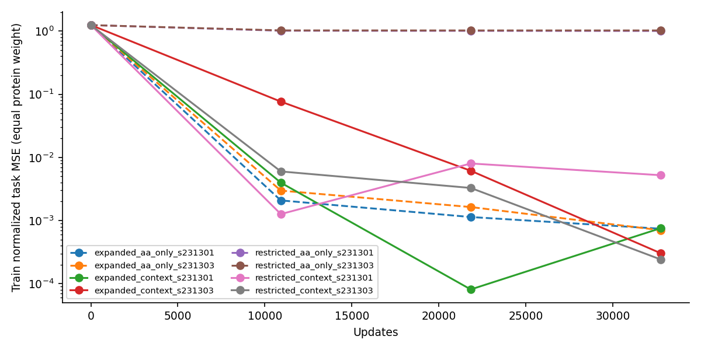
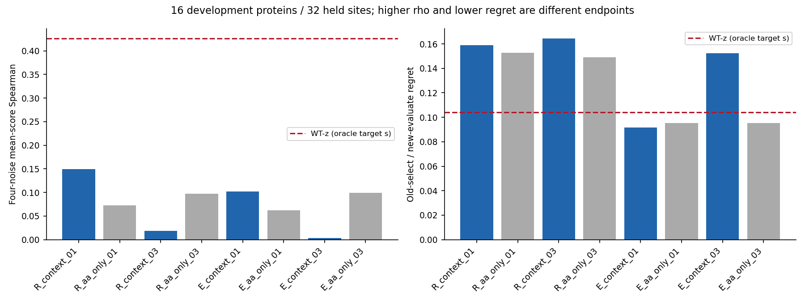

# Direct task readout: training scores fit, cross-protein selection does not transfer reliably

**Complete and closed.** The requested read-only collapse audit and bounded direct
score comparison both finished. No model is promoted; no additional training,
teacher generation, architecture search or backward debugging was started.

The collapse audit localizes the failed old student's candidate-invariant output
to its second readout GELU. The new task heads remove Δz reconstruction and S1
from prediction, but still do not establish reliable selection on new proteins.
This does not prove that WT inputs are intrinsically insufficient or that all
direct scorers are unlearnable.

- [Collapse findings](mini_student_collapse_findings_2026-10-03.md),
  [read-only protocol](mini_student_collapse_v1.md).
- [Direct-score protocol](mini_task_readout_v1.md),
  [machine-readable results](../reports/mini_task_readout_2026-10-03/analysis.json),
  [all group summaries](../reports/mini_task_readout_2026-10-03/groups.csv),
  [all candidate predictions](../reports/mini_task_readout_2026-10-03/predictions.csv).

## What was tested

Reuse the previous two matched ten-site/eight-protein lists, restricted TYAN and
expanded TYANDLVI. Each arm has two fresh seeds, 231301 and 231303, for each of:

1. **Context head, 3,780,994 parameters:** WT s/z, mutation position, source and
   candidate AA, and an explicitly supplied parent experimental backbone/mask.
   The reference contributes invariant distance summaries. A shared WT node
   encoder and reference-aware pooling predict one scalar task change per AA.
2. **AA-only head, 21,377 parameters:** only source and candidate AA. No protein,
   position, WT tensors or reference input. This is a preference control, not a
   parameter-matched architecture ablation.

Train 32760 updates per run, 3276 full 19-AA exposures per context; eight runs,
all completed. Checkpoints 10920/21840/32760 retain TRAIN curves. Only the locked
terminal checkpoint is evaluated on held contexts. No checkpoint or seed was
selected from held performance.

The label is **Exact native mutant task minus Exact native WT task**, averaged
over the two old noises 230201/230211. The task is the existing parent-reference
Cα distance Huber proxy, not experimental mutant utility. One TRAIN-only RMS
normalizer per arm is fixed: restricted 0.4240670726, expanded 0.5759913631.
The predictor is deterministic and has no noise input. WT score is exactly zero
by construction; non-WT scores are evaluated on old, new and four-noise means.

All 48 archived sites are evaluated; the common held panel contains two new
sites on training proteins and 32 sites on **16 unseen-in-update proteins**.
These proteins and the new noises 270101/270103 have development history. They
are not an independent confirmation set. Protein means weight sites within a
protein first, then proteins equally. Top1 counts are site counts, not protein
replications.

**No oracle target s is an input to either new score head.** By contrast, the
archived WT-z/Δz-student comparators retain oracle target s and target chemistry
in their S1 paths. They are useful functional references, not equally informed
cheap scorers. The new head requires a given reference backbone; it cannot
predict a score against an unknown reference. This change also introduces a
different readout/pooling and explicit reference features, so it is not a pure
one-variable proof that output dimensionality causes or solves transfer failure.

## Training fit and noise transfer

`MSE/scale²` below is the mean of training-context losses using the **global arm
scale**; it is not a per-site response NMSE. A small global loss can coexist with
ranking errors in low-amplitude contexts. Four-noise ranking includes new-noise
teacher responses not fitted by the training loss.

| Arm / model / seed suffix | Terminal MSE/scale² | Train old-noise rho | Train new-noise rho | Train four-noise rho |
|---|---:|---:|---:|---:|
| Restricted context 01 | 0.004424 | 0.9444 | 0.7357 | 0.8883 |
| Restricted context 03 | 0.000209 | 0.9880 | 0.7364 | 0.9101 |
| Expanded context 01 | 0.000613 | 0.9852 | 0.6850 | 0.9056 |
| Expanded context 03 | 0.000300 | 0.8763 | 0.5862 | 0.8042 |
| Restricted AA-only 01 | 0.812244 | 0.5225 | 0.4471 | 0.5123 |
| Restricted AA-only 03 | 0.826008 | 0.5259 | 0.4400 | 0.5123 |
| Expanded AA-only 01 | 0.001027 | 0.8740 | 0.6478 | 0.8241 |
| Expanded AA-only 03 | 0.000995 | 0.8743 | 0.6477 | 0.8253 |

All four context heads distinguish candidates and fit the global scalar loss;
the old Δz seed's all-zero candidate response is not reproduced here. This is a
different architecture and task, not a causal repair of that old failure.

Expanded AA-only's strong training fit is a warning against reading training
scores as contextual understanding: eight source-AA types cover only ten sites,
many source types identify a single training context. The repeated types and
their score scales still constrain the fit. This head has no access to context
at all, yet global training loss is small. Neither its training success nor the
context head's success demonstrates a transferable mutation law.

## Main held-protein result

All rows below use **Exact** as the ranking target. This is different from the
previous Δz report's main Baseline target; for example WT-z rho here is 0.42615,
not the previous 0.42813. Do not attribute that reference change to a model gain.

Top1 compares four-noise mean scores. Cross-noise regret chooses once from old
scores and evaluates that candidate under the new teacher mean. Because a score
head produces only one vector, its choice does not change with noise. The Exact
old-choice reference also has nonzero new-noise regret; this isolates teacher
noise disagreement from additional selection mistakes.

| Model | Four-noise rho | Top1 /32 | Old-select/new-eval regret | Protein median regret | Worst protein mean regret | Δtask MAE |
|---|---:|---:|---:|---:|---:|---:|
| Exact reference | 1.0000 | 32 | 0.002067 | 0.000541 | 0.010128 | 0 |
| WT-z, privileged target s | 0.4262 | 8 | 0.104064 | 0.013191 | 0.802413 | 0.130491 |
| Restricted context 01 | 0.1497 | 1 | 0.159085 | 0.024411 | 2.006229 | 0.410345 |
| Restricted context 03 | 0.0183 | 0 | 0.164436 | 0.033388 | 2.006229 | 0.496124 |
| Restricted AA-only 01 | 0.0721 | 1 | 0.152700 | 0.035737 | 1.826134 | 0.186733 |
| Restricted AA-only 03 | 0.0971 | 1 | 0.149064 | 0.021084 | 1.826134 | 0.201475 |
| Expanded context 01 | 0.1021 | 3 | 0.091772 | 0.021568 | 1.135661 | 0.381596 |
| Expanded context 03 | 0.0033 | 1 | 0.152274 | 0.025874 | 1.826134 | 0.188023 |
| Expanded AA-only 01 | 0.0622 | 2 | 0.095246 | 0.023995 | 1.015893 | 0.399583 |
| Expanded AA-only 03 | 0.0995 | 1 | 0.095289 | 0.026481 | 0.790764 | 0.429774 |

Expanded context 01 has a positive observation: mean cross-noise regret is below
WT-z and its paired AA-only head. But the second seed does not reproduce it;
all context heads have much lower rho and Top1 than WT-z. Context-minus-AA-only
rho changes are +0.0776, -0.0788, +0.0400, -0.0962 in table order. There is no
consistent benefit from reading WT context under this configuration.

Descriptive paired protein-resampling intervals are retained in `analysis.json`.
All four context-vs-AA-only rho intervals cross zero; the context-vs-WT-z rho
intervals are negative. All cross-noise regret contrast intervals cross zero,
reflecting few proteins and heavy tails. These intervals condition on fixed
trained models and this repeatedly used development panel; they are not a
generalization certificate or a substitute for seed replication.

The worst protein is **2EBE** for every context head: mean regret 2.00623 for both
restricted seeds, 1.13566 and 1.82613 for expanded seeds. 6ZRW is another large
contributor. Expanded context 01 improves over WT-z substantially on 6ZRW while
remaining worse on 2EBE. The complete per-protein data are retained; no outlier
is removed. Even that seed's median regret remains above WT-z's median.

## Same-protein new sites and source-AA strata

The two shared held sites, 1JHG N25 and 1A7G S34, give context rho
0.2158/-0.2219 (restricted) and 0.3132/-0.1605 (expanded), versus WT-z 0.5588.
None of the four context heads selects the four-noise best candidate at either
site. Cross-noise regret is 0.02984/0.09223 and 0.04881/0.06558, versus WT-z
0.01787. These are only two contexts, not an independent generalization study.

The fixed source-AA strata, every archived Δz student comparator, all old/new
noise summaries, score errors, top3/5 overlap and selection identities are in
`groups.csv`, `selection.csv`, `predictions.csv` and `analysis.json`. No post-hoc
source subset is used to select a model. No additional coverage training is
launched on the basis of these results.

## Geometry and cost are separate endpoints

The heads produce scores, **not coordinates**. For the selected candidate we
retrieve its archived native Exact geometry in both new noises. On the 32 held
sites, selected candidates passing zero severe collisions plus strict checked
chirality in both noises number:

- WT-z choice: 13; Exact old-noise choice: 11.
- Restricted context: 12/11; restricted AA-only: 12/12.
- Expanded context: 12/11; expanded AA-only: 9/10.

These are selection outcomes on native teacher structures, not geometry
improvements produced by a scorer. No new structural RMSD tail can be measured
for a head that generates no structure. The earlier R32 6ZRW P80L tail remains
an unresolved representation limitation; this experiment does not repair it.

All context runs use 689,572,864 bytes peak allocated GPU memory in this setup;
training takes 496.6–513.4 seconds per run. AA-only training runs on CPU and takes
45.9–46.3 seconds. The bounded controller, including preparation/evaluation,
finishes in **615.12 seconds** with at most four workers.

On the first locked timing context (6AHP Y48, length 110), 20-query warm GPU head
latency medians are **3.66–3.71 ms** for context and **0.278–0.282 ms** for AA-only
(4 warmups, 20 measurements). This excludes WT C4, reference preparation, file
loading and subsequent hard validation. It is not an end-to-end speedup and
does not demonstrate that 20 C4 calls can safely be replaced.

## Integrity, execution correction and limits

The first preparation accidentally hashed mutable controller status as a label
file. It failed **before initialization or an optimizer update**. Its source,
lock and failure logs are preserved under `attempt_preinit_failure`. The fix
explicitly hashes the three immutable label files, then uses a new run root.
Those three label hashes are identical across attempts. No scientific outcome,
seed, optimizer or budget was changed; no failed-learning run was retried.

Independent CPU audit verified 3840 label values against the previous native
outputs, eight fresh initializations, four matched arm initialization pairs,
24 checkpoint/optimizer states and exposure counts, 1152 aggregate selection
checks and 1536 selected native-geometry records. TRAIN prediction replay has
maximum absolute error 8.3447e-7, including CPU-trained AA-only replay on GPU.
Local copies match the 737 frozen source/protocol files in the run manifest.
Thirteen focused tests passed. This batch made **zero new ESM/C4/S1 calls** and
no coordinate predictions. Frozen old results were not changed.

Runtime archive:
`/media/IntelSSD/onestepfold/hpc3_mirror_20261001/Folding/task_readout_v1a_20261003`.
Local metadata mirror:
`/home/husrcf/Code/onestepfold_runtime/task_readout_v1a_20261003`.
Checkpoints remain in the runtime archive; committed artifacts include hashes,
labels, every score, run logs, audits and fixed-checkpoint training summaries.

## Decision

1. The failed Δz seed's candidate collapse is localized, without assigning an
   untested optimizer cause or reopening Mini backward.
2. Direct reference-conditioned scores can fit training contexts, but removing
   full-field reconstruction **did not establish cross-protein selection**.
3. Neither direct head nor old Δz generator is promoted. The positive regret of
   one expanded score seed and all negative seeds remain reported together.
4. This closes the two requested diagnostics. It does not establish that more
   data can never help, that WT information is insufficient, or that a shared
   scorer is impossible. A future shared-prior or data-scale study would require
   a new question and protocol; it is not automatically launched on this panel.
