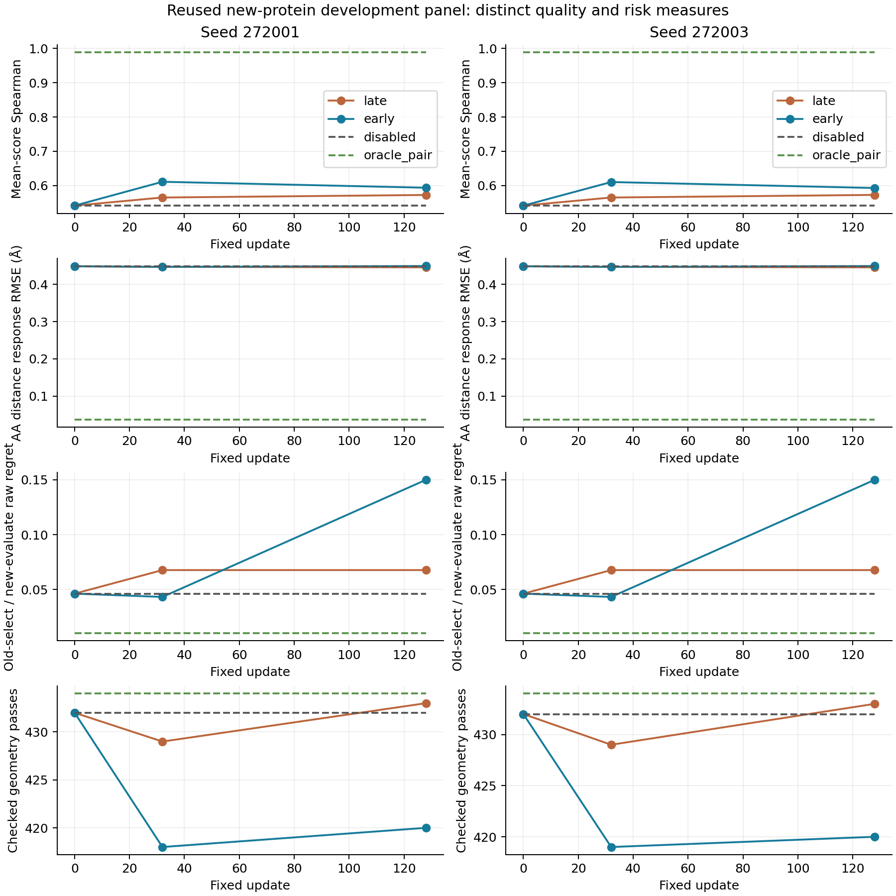

# Mini pair adaptation placement — two-seed terminal report

Status: **complete, independently replayed, not promoted**. Primary endpoint:128 updates.
Seeds:272001 and272003. This comparison is closed; no endpoint extension, position
search, retrospective checkpoint selection or seed selection is authorized by this result.

Early placement substantially improves training AA residual fitting and decoded training
response. It does not establish a better transferable recovery function: both early endpoints
have held-protein residual NMSE above the zero-correction baseline, greater selection regret,
and fewer geometry passes. Late placement retains small decoded-response gains, but its
selection risk also exceeds the unadapted baseline. The interface's previously demonstrated
oracle recovery space remains valid; this experiment does not establish a capacity bound.

## What was compared

The [locked protocol](../../docs/mini_pair_placement_v1.md) compares the same1,315,332
trainable parameters at their native positions within the candidate's last Mini recycle:

- **Late:** adapt pair blocks14/15, starting at the actual candidate block13 boundary.
- **Early:** adapt pair blocks0/1, then execute frozen pair blocks2..15, including their
  input gradients during training. Indices are zero based.

Both have the same node/edit injection and reference subtraction, matched per-seed new
initialization, original weights from their own native positions, same full-TRAIN objective,
128 full-gradient AdamW updates, and fixed0/32/128 evaluations. Candidate `B_inputs` and
final `B_s` are passed unchanged to S1. Teacher pair states are labels, not prediction inputs.
S1 is evaluated but is not in the training backward path. No new upstream ESM/MSA preparation,
structure loss, rank restriction or decoder training was introduced.

The15 training references contain27 sites and513 mutants. Three same-protein new sites and
nine held development proteins/18 sites are reported separately. Every evaluated site has
19 non-WT candidates and two decoder noises230201/230211. These are reused development
panels, not independent confirmation. The parent-reference distance score is a computational
proxy; native C4 is the model reference, not experimental mutant truth.

## Primary endpoint:128 updates

Latent metrics below concern the **remaining residual** `target_z - B_z`; zero correction
has NMSE1. They are not the NMSE of the full final pair state. Site metrics are aggregated
with equal parent weight. Structural AA response is the centered Cα distance response.
Spearman uses the two-noise mean candidate scores. Regret selects with old-noise scores
and evaluates that same candidate with new-noise Exact scores.

| TRAIN metric | Late272001 | Late272003 | Early272001 | Early272003 |
|---|---:|---:|---:|---:|
| Full pair residual NMSE |0.85514|0.85507|0.69510|0.69476|
| AA-centered residual NMSE |0.90073|0.90065|0.74725|0.74693|
| Candidate Spearman |0.63719|0.63743|0.77532|0.77579|
| AA structure response RMSE, Å |0.39702|0.39701|0.31366|0.31614|
| Raw cross-noise regret |0.23753|0.23753|0.05437|0.05437|
| Mean-score Top1 |12/27|12/27|14/27|14/27|
| Geometry passes |424/1026|425/1026|414/1026|414/1026|

Early learns about25.3% of the training AA residual under this aggregation, versus9.9% for
late. This is a genuine training improvement, not near-complete recovery. Early-minus-late
training AA NMSE is−0.15348/−0.15372; descriptive parent-bootstrap95% intervals are
[−0.21348,−0.10036]/[−0.21344,−0.10091]. Training structure RMSE differences are also
negative in both intervals. Training geometry, however, does not improve with that fit:
early severe collision counts are12,962/12,593 versus late10,687/10,688; wrong chirality
instances are1,140/1,152 versus857/856. Fitting and chemistry remain separate outcomes.

| Held development metric | Unadapted | Late272001 | Late272003 | Early272001 | Early272003 |
|---|---:|---:|---:|---:|---:|
| Full residual NMSE |1|0.96598|0.96579|1.12277|1.12349|
| AA residual NMSE |1|0.98618|0.98611|1.07766|1.07726|
| Candidate Spearman |0.54142|0.57251|0.57271|0.59366|0.59288|
| AA structure response RMSE, Å |0.44818|0.44545|0.44541|0.44899|0.44901|
| Raw cross-noise regret |0.04631|0.06779|0.06779|0.15004|0.15004|
| Mean-score Top1 |6/18|6/18|6/18|6/18|6/18|
| Geometry passes |432/684|433/684|433/684|420/684|420/684|
| Unadapted pass→fail |0|9|9|27|26|
| Unadapted fail→pass |0|10|10|15|14|
| Local RMSD P95, Å |3.4395|3.3947|3.3917|3.7082|3.7083|
| Maximum local RMSD, Å |6.9386|7.0623|7.0660|6.8050|6.8255|
| Local RMSD>1 Å outputs |141|157|157|162|162|
| Severe collision pairs |2282|2331|2331|2314|2309|
| Wrong chirality instances |324|343|343|331|330|

Local deviations are against same-noise Exact coordinates. Early has a smaller maximum
than late but a worse P95 and more outputs above1 Å. It has fewer severe collision pairs
and wrong centres than late, yet fewer completely passing outputs. No single count or
quantile supports a blanket claim that all geometry worsened or improved.

Early-minus-late held differences are not precise enough for a universal claim: Spearman
+0.02115/+0.02018, response RMSE+0.00354/+0.00360 Å and regret+0.08225 all have descriptive
nine-parent95% bootstrap intervals crossing zero. For example, regret's interval is
[−0.04856,+0.29864]. Both seeds nevertheless fail the locked requirement for consistent
quality benefit. The same panel and training recipe make them paired runs, not independent
replications of broad generalization.

Late-minus-unadapted structure RMSE is−0.00273/−0.00277 Å and Spearman+0.03109/+0.03129;
these descriptive intervals support their directions. Its regret increase+0.02147 has an
interval crossing zero. Preserve this small response benefit without promoting late.

## Which selections changed

Both seeds within each placement choose the same18 AAs at the primary endpoint. Their
weights, latent metrics and structures are not identical; identical Top1 selections do
not establish collapse.

Late changes only two selections relative to unadapted:4PT4 L10 P→Q reduces regret from
0.046766 to0.021896, but6ZRW P80 C→S increases it from0.155223 to0.566614. The latter
outweighs the former.

Early changes eight selections. In particular:

| Site | Unadapted→early selection | Unadapted regret | Early regret |
|---|---|---:|---:|
|2EBE E47|D→N|0.392140|0|
|6ZRW T45|V→I|0.066483|2.001953|
|6ZRW P80|C→V|0.155223|0.425737|
|2EBE A30|D→G|0|0.084197|
|1YSB V110|R→D|0.064787|0.013375|

The6ZRW T45 change contributes+0.107526 to the early-minus-late overall regret difference
of+0.082250. The contribution exceeds the net change because other sites offset part of
it, including2EBE E47 (−0.021786) and6ZRW P80 (−0.007827). This is an arithmetic
contribution, not a causal mechanism. No site is removed. All selections and contributions
are in [selection_details.csv](terminal/figures/selection_details.csv) and
[regret_contributions.csv](terminal/figures/regret_contributions.csv).

Correct candidate assignment remains meaningful: on held proteins early Correct beats the
locked Mismatched intervention by about0.1074/0.1080 Spearman and0.01666/0.01668 Å response
RMSE, with directional intervals. That does not imply Correct beats unadapted. Mismatching
reassigns predicted pair outputs while retaining the receiver's real inputs, single,
chemistry and noise; it is an intervention, not an alternative deployment method.

## Fit, amplitude and the fixed intermediate node

Early's held AA correction has more energy relative to the needed residual than late
(0.31184/0.31229 versus0.05471/0.05486), and higher direction cosine
(0.24443/0.24509 versus0.13820/0.13838). Yet its NMSE is worse. More amplitude and a higher
average cosine are not sufficient for correct per-candidate recovery; the report does not
infer an optimal rescaling from averages or fit one on development labels.

At the fixed32-update node, early held Spearman is0.61101/0.61023, regret0.043339,
and response RMSE0.44661/0.44657 Å. Its geometry passes are only418/419 versus baseline432.
These intermediate observations are retained in the [full fixed-node table](terminal/figures/fixed_node_metrics.csv).
They do not replace the preregistered128-update endpoint or establish that early stopping
alone solves quality. No checkpoint was chosen by development results.

On the three same-protein new sites, early AA residual NMSE improves to0.91019/0.91016
versus late0.99067/0.99067, but Spearman is0.65673 versus0.68947. Regret is unchanged
at0.118852 and geometry passes remain62/114. This is another mixed outcome.

## Execution and independent verification

All four fits, all12 fixed-node scoring jobs and the optimization ledger completed. The
separate verifier reconstructed frozen native weights, replayed all saved checkpoints,
and verified prediction tensors. Late0/32/128 model parameters and complete AdamW states
match the historical control byte for byte. Initial native/no-edit, candidate isolation,
reference-gradient and serial/six-rank equivalence gates remain recorded with the protocol.

The local result verification independently recomputed score arithmetic and aggregations:
7,488 correlations,2,496 regrets and94,848 output-record accounting checks over12 nodes.
These counts include repeated controls and are not counts of unique learned predictions.
All976 exported source/result file hashes passed. Local verification did not re-run
coordinate scoring; that was performed remotely, and native tensor replay is a separate
completed check. [verification.json](terminal/verification.json) states this boundary.
The historical `native_checkpoint_replay_pending` field in the original training controller
is preserved; completion is established by the separate verification records, not by editing
that historical field.

The ledger records262,656 candidate forward and262,656 backward calls,13,824 reference
forward/backward calls each,29,184 S1 evaluations, and a further10,944 candidate and576
reference verification forwards. Early suffix computation is included; it is not a cache
lookup or a detached/free continuation. All four fits recorded zero clipped updates.

Observed sums of per-update wall time were1,674/1,321 s for late and4,462/4,292 s for early.
These are execution records with first-call and concurrent-work effects, not a controlled
speed comparison. Matched parameter count and exposure do not match FLOPs. No new inference
speedup was measured, and previous2.7× folding or4.16× training results do not transfer to
this different graph. [optimization_ledger.json](terminal/optimization_ledger.json) retains
the work and timing records.

The [publication receipt](terminal/publication_receipt.json) identifies the281,922,574-byte
full metadata/scoring/source archive on DiamondHill, SHA256
`e1a9697631199359ea0d4cbb97d846a14895aa04ce6ab231a3fa043e0a1ef57b`.
The compact repository copy contains analysis, CSVs, figures, locks and verification records;
checkpoints and bulk prediction tensors remain at the experiment source. The archive contains
all scored outputs and the locked scientific source, not model-weight tensors.

## Decision

Keep both placements as completed baselines. Early placement establishes that changing
where trainable candidate processing occurs can improve training features and AA correspondence.
It does not establish reliable cross-protein selection or structural quality. Neither seed,
neither placement, nor the intermediate node is promoted. The separately locked candidate-first
WT trajectory audit is a different experiment and is reported separately; it is not an
extension of these four fits or evidence that their failure has been repaired.
