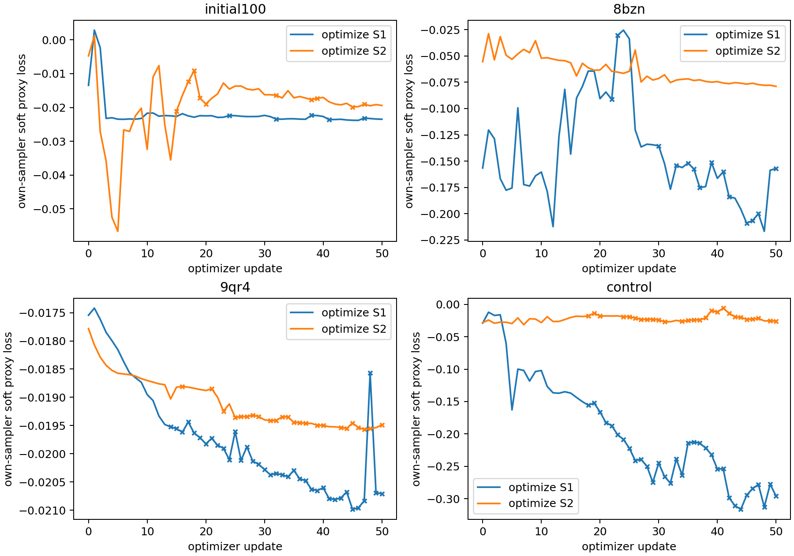

# Four-stage sequence gate results

All reported gates are implementation/diagnostic evidence, not binder-design acceptance.
The input map recomputes ESM and chemistry from20-way sequence probabilities but
uses a piecewise native atom inventory. It is not globally smooth. The objective
is monomer nonlocal Cα contacts plus chain/clash guards; it does not measure affinity.

Negative hard-loss deltas mean improvement relative to the original hard sequence.
Seed103 is the optimization noise;107 is held out. Finite differences require a
plateau at two adjacent h values in each of3directions. Failed gates are retained.

| Target | Optimization | Native replay | FD S1 / S2 | Soft loss | Hard Δ seed103 | Hard Δ seed107 | Maximum chart jump Å |
|---|---|---|---|---|---:|---:|---:|
| initial100 | s1 | pass | pass / pass | down | -0.000856 | +0.003703 | unmeasured |
| initial100 | s2 | pass | pass / pass | down | +0.008609 | +0.001496 | unmeasured |
| 8bzn | s1 | pass | fail / pass | down | -0.102460 | -0.145079 | 0.922 |
| 8bzn | s2 | pass | fail / pass | down | +0.000000 | +0.000000 | unmeasured |
| 9qr4 | s1 | pass | pass / pass | down | +0.001966 | +0.003380 | 0.318 |
| 9qr4 | s2 | pass | pass / pass | down | -0.000591 | -0.000692 | 0.239 |
| control | s1 | pass | fail / fail | down | -0.060014 | -0.046911 | 2.860 |
| control | s2 | pass | fail / fail | not down | +0.014657 | +0.007197 | 2.913 |

Cross marks indicate hard-sequence/atom-inventory changes. A decreasing soft loss
alone is insufficient: the rebuilt hard sequence must retain its benefit under
independent noise, and all-atom geometry must be checked separately. The full JSON
includes matched S1/S2 cross-scores, bond errors, peptide C–N errors, chirality,
sub-Angstrom clashes, hard-replay errors and file hashes.

The selected targets are diagnostics, not a prevalence sample. The chart-boundary
measurements are finite observed jumps, not a proof of global continuity. No model
weights were trained and no frozen test set was used. Deployment remains rejected.

## All-atom geometry after hardening

Proxy improvement is not necessarily a useful design improvement. Values below are initial → optimized; no post-hoc geometry threshold was used to select sequences.

| Run | Bond RMSE seed103 Å | C–N MAE seed103 Å | Severe atom clashes seed103 | Severe atom clashes seed107 |
|---|---:|---:|---:|---:|
| gate_v1_s1 | 0.248 → 0.256 | 0.118 → 0.119 | 13 → 14 | 25 → 33 |
| gate_v1_s2 | 0.219 → 0.290 | 0.070 → 0.136 | 25 → 21 | 12 → 36 |
| gate_v2_8bzn_s1 | 0.285 → 0.427 | 0.177 → 0.318 | 27 → 248 | 41 → 240 |
| gate_v2_8bzn_s2 | 0.279 → 0.279 | 0.126 → 0.126 | 68 → 68 | 41 → 41 |
| gate_v2_9qr4_s1 | 0.190 → 0.267 | 0.076 → 0.157 | 31 → 123 | 26 → 71 |
| gate_v2_9qr4_s2 | 0.166 → 0.166 | 0.037 → 0.039 | 21 → 22 | 22 → 23 |
| gate_v2_control_s1 | 0.245 → 0.407 | 0.136 → 0.271 | 40 → 451 | 52 → 372 |
| gate_v2_control_s2 | 0.231 → 0.286 | 0.107 → 0.156 | 24 → 71 | 48 → 36 |

In particular, S1 contact-proxy gains on8BZN and the neutral control accompany severe all-atom clash increases. They must not be counted as validated design successes. The current contact/CA guard objective is insufficient.

## Actual atom-inventory boundary probe

On the first argmax crossing along the saved100-residue S1 optimization displacement:

| h | Max probability difference | Aligned Cα RMSD Å | Atom inventories |
|---:|---:|---:|---|
| 1e-03 | 0.0010477 | 0.182533 | 805 → 810 |
| 1e-04 | 0.0001048 | 0.183646 | 805 → 810 |
| 1e-05 | 0.0000105 | 0.183780 | 805 → 810 |

The output difference remains about0.184A while the input difference shrinks100-fold. This observed nonvanishing boundary jump rejects a globally smooth-oracle claim for the current chart implementation. It does not implicate diffusion step count alone.
