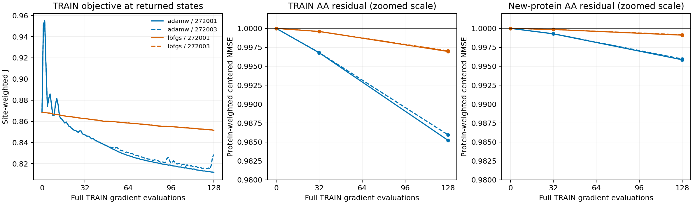

# Full-TRAIN stage optimization comparison

**Closed, independently verified; not promoted.** All four runs finished the
locked128 full-gradient evaluations. Total TRAIN loss improved; AA-specific
residual recovery remained weak and decoded new-protein response did not improve.

Read the [scientific findings](../../docs/mini_stage_fullbatch_findings_2026-10-10.md),
[original protocol](../../docs/mini_stage_fullbatch_v1.md), and
[verification-recovery protocol](../../docs/mini_stage_fullbatch_verification_recovery_2026-10-10.md).

| Recipe / seed | Final independently replayed J | TRAIN AA NMSE | New-protein AA NMSE |
|---|---:|---:|---:|
| AdamW /272001 | 0.811865 | 0.985223 | 0.995856 |
| AdamW /272003 | 0.828601 | 0.985946 | 0.995959 |
| L-BFGS /272001 | 0.851563 | 0.996951 | 0.999107 |
| L-BFGS /272003 | 0.851790 | 0.997032 | 0.999155 |

Initial J=0.868336. J is site-weighted; displayed NMSE is protein-weighted.
L-BFGS uses61/60 changed updates versus128/128 AdamW updates. Work is matched
by gradient evaluations, not wall time or accepted steps. No seed/checkpoint
selection. All four final models change only one held-site selection,4PT4 L10
P→Q; the shared mean regret benefit is a local observation, not broad recovery.



The AA panels deliberately label their zoomed scales. A zero correction has
residual NMSE1; a small reduction near1 is not close to complete recovery.
[Vector figure](optimization_and_aa_response.pdf).

## Evidence and operational recovery

`training_lock.json` SHA256:
`ed09b10002eaa7d04a4f2ea5843bf33657188a64cfd04836934aa47679993eed`.
The original832-file scientific source remains unchanged.

Original training/scoring succeeded; four tensor verifiers failed at import
because the deployed package omitted `verify_stage_pair_recovery.py`.
`controller.json` remains `closed_with_failures`. The original failed follower
and logs remain intact. No failed attempt executed a model forward.

`verification_recovery/` contains a separate lock, original committed dependency,
controller, logs and four successful unchanged-verifier replays on HIP4.
It adds10,944 verification-only forwards, with no training or numerical-rule
change. The manifest explicitly records `operational_recovery=true`.
The source checkpoint hashes are bound in protected evaluation records and
rechecked during tensor replay and export. Training/scoring are not restarted.

`verification.json` records locally reproduced arithmetic for12 nodes,
576 site-node tensor checks,7,488 correlations,2,496 regrets and94,848 scored
output records. The last count includes repeated controls; it is not a count
of new teacher labels or new decoding calls. Actual S1 calls total29,184.
`optimization_ledger.json` distinguishes rejected trials from returned states;
`analysis.json` includes all fixed nodes, parent-level intervals and choices.

`runs/` contains reports, full logs, summaries and scored candidate records.
`scientific_code/` is the executed source selection; the missing dependency is
separately identified in the recovery lock. `result_recovery/` records result-only
processing; `postprocess_manifest.json` binds generated analysis artifacts.
Bulk checkpoints/coordinates remain on DiamondHill and are SHA-bound, not copied
into this repository. `collection_receipt.json` binds the downloaded archive.

The old launch/startup JSONs are dated observations, not current status.
`future_import_preflight.json` demonstrates that the repository's new import gate
rejects the old incomplete package before training and accepts the completed one.
Nine focused reporting/recovery tests pass. No new folding speed result is claimed.

## Reproduce the lightweight analysis

From the repository root, with NumPy/SciPy and Matplotlib available:

```bash
PYTHONPATH=src python reports/mini_stage_fullbatch_2026-10-10/verify_results.py
PYTHONPATH=src python reports/mini_stage_fullbatch_2026-10-10/analyze_results.py
python reports/mini_stage_fullbatch_2026-10-10/plot_results.py
```

These commands do not reconstruct coordinates or run a model. Full checkpoint
replay is separately recorded. The nine new-protein contexts remain repeatedly
used development data; neither transfer nor an end-to-end accelerator is established.
